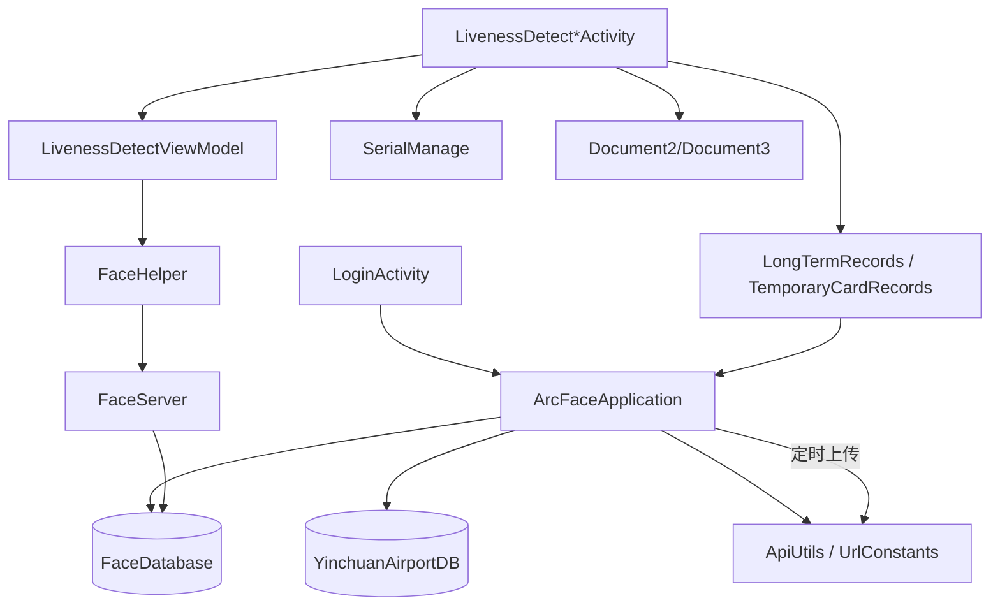

# 整体架构

## 分层结构

```
┌─────────────────────────────────────────────────┐
│  UI 层                                          │
│  Activity / Fragment / ViewModel / Adapter      │
├─────────────────────────────────────────────────┤
│  业务逻辑层                                      │
│  FaceServer / SerialManage / 各 Utils           │
├─────────────────────────────────────────────────┤
│  数据层                                          │
│  FaceRepository / CheckUnitRepository           │
│  YinchuanAirportDB / FaceDatabase               │
├─────────────────────────────────────────────────┤
│  网络层                                          │
│  ApiUtils / UrlConstants / OkGo Callbacks       │
├─────────────────────────────────────────────────┤
│  基础设施                                        │
│  ArcFace SDK / 相机 / 串口 / Glide / XUpdate    │
└─────────────────────────────────────────────────┘
```

## 核心模块关系



## 双数据库设计

| 数据库 | 类 | 文件路径 | 用途 |
|--------|-----|----------|------|
| 业务库 | `YinchuanAirportDB` | `{externalFilesDir}/db/airportDb.db` | 通行证档案、通行记录 |
| 人脸库 | `FaceDatabase` | `{externalFilesDir}/database/faceDB.db` | 人脸特征向量 |

业务库当前 Schema 版本 **19**，人脸库版本 **1**。Schema 导出在 `app/schemas/`。

## Application 职责

`ArcFaceApplication` 在 `onCreate` 中完成：

1. Room 数据库初始化
2. OkGo / 日志 / Bugly / XUpdate 初始化
3. 网络 Ping 检测与离线标志
4. 定时任务：心跳、通行证增量同步、记录上传、凌晨重启、日志上传

详见 [18-background-jobs.md](./18-background-jobs.md)。

## 网络请求规范

所有业务请求需携带：

| Header | 值 |
|--------|-----|
| `tenant-id` | `UrlConstants.TENANT_ID`（来自渠道 `ChannelConfig`） |
| `Authorization` | `Bearer {accessToken}`（登录后，部分接口可选） |

封装入口：`ApiUtils.get()` / `ApiUtils.post()`，以及各 Activity 中 OkGo 直接调用处。

## 目录与职责映射

| 包路径 | 职责 | 文档 |
|--------|------|------|
| `ui/` | 界面与状态管理 | [06](./06-check-modes.md) ~ [11](./11-construction-workers.md) |
| `network/` | URL 常量、HTTP 工具 | [16-api-reference.md](./16-api-reference.md) |
| `data/` | 人脸仓库、HTTP 回调 | [15-face-database.md](./15-face-database.md) |
| `db/` | 业务 Room | [17-entity-models.md](./17-entity-models.md) |
| `facedb/` | 人脸 Room | [15-face-database.md](./15-face-database.md) |
| `faceserver/` | ArcFace 引擎 | [15-face-database.md](./15-face-database.md) |
| `util/face/` | 识别辅助 | [14-recognize-settings.md](./14-recognize-settings.md) |
| `util/camera/` | 相机预览 | [14-recognize-settings.md](./14-recognize-settings.md) |
| `util/glide/` | 加密图片 | [09-pass-card-ui.md](./09-pass-card-ui.md) |
| `Serial/` | 串口通信 | [12-serial-port-config.md](./12-serial-port-config.md) |
| `widget/dialog/` | 弹窗与运维抽屉 | [13-settings-and-ops-drawer.md](./13-settings-and-ops-drawer.md) |
| `entity/` | 数据模型 | [17-entity-models.md](./17-entity-models.md) |
| `preference/` | 识别参数 UI | [14-recognize-settings.md](./14-recognize-settings.md) |
