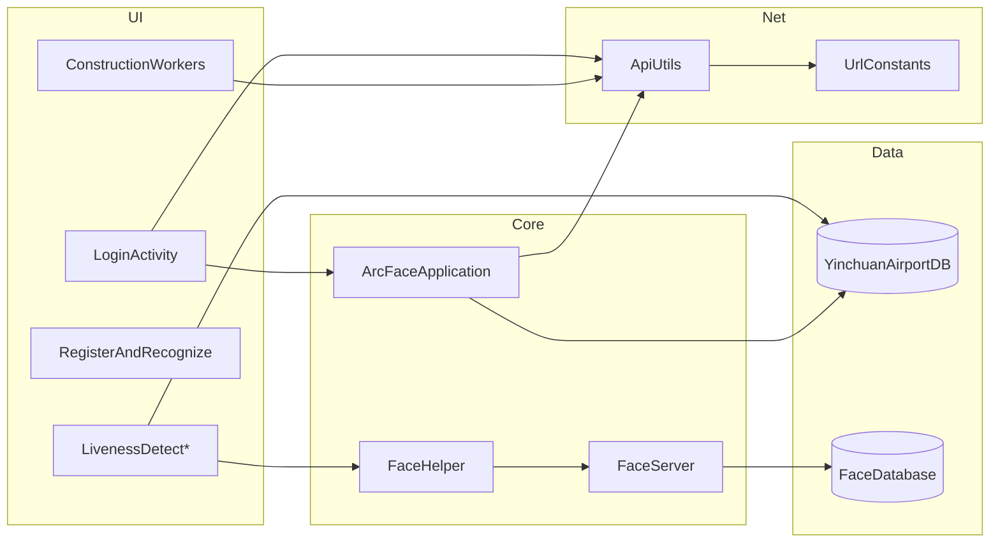

# 整体架构

## 分层结构

```
┌──────────────────────────────────────────────────────────┐
│ 表现层  Activity / Fragment / ViewModel / Adapter         │
├──────────────────────────────────────────────────────────┤
│ 业务层  LivenessDetectViewModel / FaceServer / SerialManage│
├──────────────────────────────────────────────────────────┤
│ 数据层  FaceRepository / Room DAO / CheckUnitRepository   │
├──────────────────────────────────────────────────────────┤
│ 网络层  ApiUtils / UrlConstants / OkGo Callback           │
├──────────────────────────────────────────────────────────┤
│ 基础层  ArcFace SDK / Camera / SQLCipher / Glide / XUpdate│
└──────────────────────────────────────────────────────────┘
```

## Application 启动时序

`ArcFaceApplication.onCreate()` 执行顺序：

| 步骤 | 动作 |
|------|------|
| 1 | 创建日志目录 `{externalFilesDir}/log/` |
| 2 | `XUpdate.get().init(this)` |
| 3 | `Utils.init` / Toasty / Bugly 初始化 |
| 4 | `HttpInitUtils.init`（OkGo） |
| 5 | `ALog` 配置（文件日志 2 天） |
| 6 | `InfoStorage` 初始化 |
| 7 | `ImageUploader` 实例化 |
| 8 | Room 构建 `YinchuanAirportDB` → `airportDb.db` |

登录成功后额外启动（`LoginActivity`）：

- `startUpDataToServer()` — 30s 上传
- `startPeriodicTask()` — interval 分钟周期任务

## 模块依赖图



## 双数据库

| 库 | 类 | 版本 | 路径 | 表 |
|----|-----|------|------|-----|
| 业务库 | `YinchuanAirportDB` | 19 | `db/airportDb.db` | long_term_pass, long_term_records, temporary_card_records |
| 人脸库 | `FaceDatabase` | 1 | `database/faceDB.db` | face |

- Schema 导出：`app/schemas/com.arcsoft.arcfacedemo.db.YinchuanAirportDB/`
- 迁移策略：`fallbackToDestructiveMigration()`（破坏性升级）
- 加密：SQLCipher 4.5.2

## 网络层约定

```java
request.headers("tenant-id", UrlConstants.TENANT_ID);
if (ApiUtils.accessToken != null) {
    request.headers("Authorization", "Bearer " + ApiUtils.accessToken);
}
```

封装入口：

- `ApiUtils.get(url, params, callback)`
- `ApiUtils.post(url, json, callback)`
- 部分页面 OkGo 直接调用（已统一 TENANT_ID）

## 包职责索引

| 包 | 核心类 | 文档 |
|----|--------|------|
| `ui/activity` | Login, Liveness*, Register* | 04, 06, 07, 08 |
| `ui/fragment` | Document1/2/3, *Record* | 07, 09, 11 |
| `ui/viewmodel` | *ViewModel | 各业务流程文档 |
| `network` | UrlConstants, ApiUtils | 16 |
| `db` | YinchuanAirportDB, *Dao | 17 |
| `facedb` | FaceDatabase, FaceDao | 15 |
| `faceserver` | FaceServer | 15 |
| `util/face` | FaceHelper, ConfigUtil | 14 |
| `util/glide` | AESUtils, Encrypted* | 09 |
| `Serial` | SerialManage | 12 |
| `widget/dialog` | CustomDrawerPopupView | 13 |
| `config` | ChannelConfig（flavor） | 02 |

## 线程模型

| 场景 | 调度 |
|------|------|
| 人脸检测 | 相机回调线程 → FaceHelper |
| 网络回调 | OkGo 线程 → UI runOnUiThread |
| 定时任务 | `ThreadUtils.executeByFixedAtFixRate` |
| 人脸注册批量 | RxJava `Schedulers.io()` |
| Paging | Kotlin 协程 `suspendCancellableCoroutine` |

## 相关文档

- 定时任务 → [18-background-jobs.md](./18-background-jobs.md)
- 渠道配置 → [02-product-flavors.md](./02-product-flavors.md)
