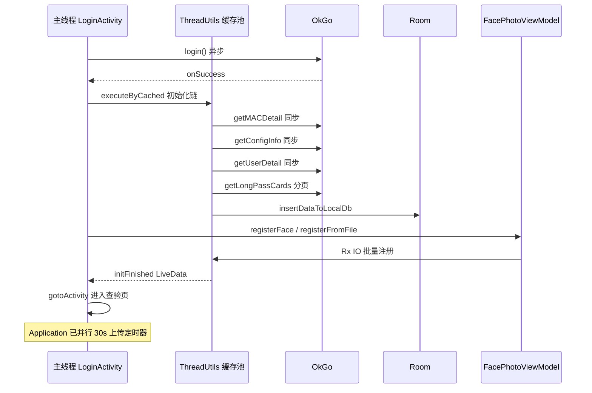

# 线程与异步模型

> 核心类：`ArcFaceApplication`、`LoginActivity`、各查验 Activity、`FacePhotoViewModel`、`RecognizeViewModel`

项目未使用统一协程/Rx 全局调度器，而是 **OkGo 异步回调 + ThreadUtils 定时任务 + RxJava 局部使用 + AsyncTask（遗留）** 混合模式。

---

## 线程池与定时常量

定义于 `ArcFaceApplication`：

| 常量 | 值 | 用途 |
|------|-----|------|
| `POOL_SIZE` | `15` | `ThreadUtils.executeByFixed*` 线程池大小 |
| `UPLOAD_LOG_TIME` | `30 * 1000` ms | 通行记录批量上传周期（注释曾写 10 分钟，现为 30 秒） |
| `PING_DELAY_TIME` | `10 * 1000` ms | 心跳 ping 周期 |
| `UPDATE_DELAY_TIME` | `5` | 增量同步间隔默认值（分钟），可被 `InfoStorage.interval` 覆盖 |

---

## ThreadUtils 任务一览

| 任务 | 启动位置 | 调度方式 | 周期/延迟 |
|------|----------|----------|-----------|
| 通行记录上传 `startUpDataToServer` | `ArcFaceApplication.onCreate` / 登录后 | `executeByFixedAtFixRate(POOL_SIZE, task, UPLOAD_LOG_TIME)` | 每 30s |
| 增量同步 + 心跳 | `startPeriodicTask()` | 首次 `executeByCachedWithDelay(30s)`，之后 `executeByFixedAtFixRate(interval分钟)` | 可配置 |
| Ping | `startPeriodicTask()` 内 `task1` | `executeByFixedAtFixRate(POOL_SIZE, task1, PING_DELAY_TIME)` | 每 10s |
| 日级任务（1点/2点/10点） | `scheduleDailyJobs` 等 | `executeByFixed` 单次或延迟 | 见 [14-background/03-daily-jobs.md](../14-background/03-daily-jobs.md) |
| 登录初始化链 | `LoginActivity.login` onSuccess | `ThreadUtils.executeByCached` | 一次性 |
| 通行证分页下载 | `getLongPassCards` | `ThreadUtils.executeByCached` + 主线程更新 UI | 分页串行 |

取消：`ThreadUtils.cancel(task)` 在 `onTerminate` 或重登时停止上传任务。

---

## 网络异步

### OkGo（主路径）

- 绝大多数 API：`OkGo.get/post(...).execute(StringCallback)` — **回调线程为 OkGo 内部线程，非主线程**
- UI 更新需 `runOnUiThread` / `ThreadUtils.runOnUiThread` / `Handler`

### ApiUtils

- 封装 OkGo `get` / `post` / `getPassCard`
- 回调 `ApiCallback.onSuccess/onFailure` 同样在 OkGo 线程

### 同步阻塞（登录链）

`LoginActivity` 初始化链中部分步骤使用：

```java
Call<String> call = OkGo.get(url)...adapt(new StringConvert());
String body = call.execute().body();  // 阻塞当前后台线程
```

在 `ThreadUtils.executeByCached` 内执行，**禁止**在主线程调用。

---

## RxJava 使用点

| 位置 | 用途 | 调度 |
|------|------|------|
| `ArcFaceApplication` 批量注册 | `Observable.create` → `flatMap` 注册 BGR24 | `subscribeOn(Schedulers.io())` + `observeOn(AndroidSchedulers.mainThread())` |
| `RecognizeViewModel.registerFace` | 单帧注册 | `Schedulers.io()` |
| `FacePhotoViewModel` | 加载/删除人脸列表 | IO + Main |

---

## Handler / WeakHandler

| 类 | Handler 用途 |
|----|--------------|
| `LoginActivity` | `WeakHandler`：进度条、登录步骤消息 `message.what` 分发 |
| 各 Liveness Activity | 刷卡超时、UI 状态机、串口回调转主线程 |
| `FaceHelper` | 预览帧处理回调（部分路径） |

---

## AsyncTask（遗留）

`LoginActivity.onClick` 零信任初始化仍使用 `AsyncTask` 包装 `SFUemSDK` 调用。Android 11+ 已废弃，但项目 minSdk 允许继续使用。

---

## 人脸引擎线程约束

| 操作 | 建议线程 |
|------|----------|
| `FaceServer.init` / `register` / `search` | 后台 IO（登录同步链、FacePhotoViewModel） |
| 相机预览 + `FaceHelper` 检测 | 相机/引擎回调线程 → 结果 post 主线程更新 UI |
| Room `FaceDao` / `LongTermPassDao` | 均在后台线程；部分 Activity 用 `AsyncTask` 或 `ThreadUtils` |

**禁止**：在主线程执行大批量 `insert` 或全量 `registerFromFile`。

---

## 并发与锁

| 机制 | 场景 |
|------|------|
| `CountDownLatch` | `LoginActivity.getLongPassCards` 多页下载等待 |
| `AtomicBoolean` | 登录/同步进行中标志，防重复点击 |
| `synchronized (FaceDatabase.class)` | Room 单例双检锁 |
| `FaceServer` 内部 | 引擎操作串行化（见 FaceServer 专篇） |

---

## 主流程时序（登录后）



---

## 排查清单

| 问题 | 方向 |
|------|------|
| 登录后 ANR | 是否在主线程调了 `call.execute()` 或大批量 DB |
| 上传不触发 | `ThreadUtils.cancel` 是否误调；`UPLOAD_LOG_TIME` |
| UI 崩溃「只能在主线程」 | OkGo 回调里直接改 View |
| 人脸注册卡住 | Rx 链 `onError` 是否吞异常；IO 线程 FaceServer 状态 |
