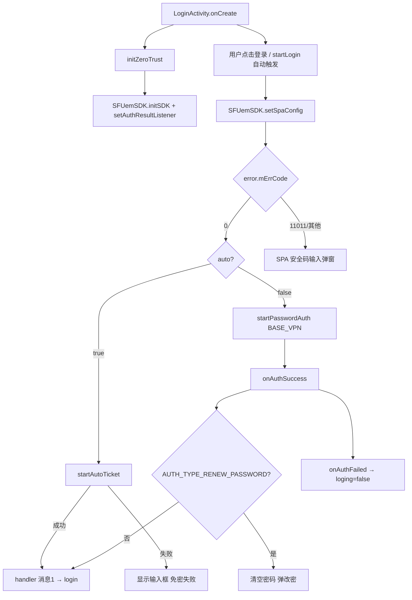

# 零信任 VPN 认证（深信服 SFUemSDK）

## 职责边界

| 范围 | 说明 |
|------|------|
| **负责** | 应用启动时初始化深信服 UEM SDK；SPA 安全码配置；免密票据 / 账密主认证；改密二次认证；认证成功后触发后台 `login()` |
| **不负责** | 业务 Token 获取（`vertical-client-login`）、通行证同步、人脸库初始化 |
| **前置条件** | 网络权限、`READ_PHONE_STATE` 等 `LoginActivity.NEEDED_PERMISSIONS` 已授权 |
| **后置动作** | `onAuthSuccess` → `login()`；免密成功 → `handler` 消息 1 → `login()` |

---

## 涉及类

| 类名 | 路径 | 职责 | 调用方 |
|------|------|------|--------|
| `LoginActivity` | `app/src/main/java/com/arcsoft/arcfacedemo/ui/activity/LoginActivity.java` | 零信任初始化、SPA 配置、认证监听、触发后台登录 | `AndroidManifest` 启动入口 |
| `SFUemSDK` | 深信服 SDK（`com.sangfor.sdk`） | SDK 初始化、SPA、免密、账密认证、二次认证 | `LoginActivity` |
| `Constants` | `app/src/main/java/com/arcsoft/arcfacedemo/common/Constants.java` | `BASE_VPN`、默认零信任账号密码 | `LoginActivity` |
| `InfoStorage` | `app/src/main/java/com/arcsoft/arcfacedemo/util/InfoStorage.java` | 持久化零信任账号密码 | `LoginActivity` |
| `DialogUtils` | `app/src/main/java/com/arcsoft/arcfacedemo/util/DialogUtils.java` | SPA 安全码输入弹窗 | `LoginActivity.onClick` |
| `SPUtils` | Blankj 工具 | 缓存 SPA 安全码 `spa` | `LoginActivity` |
| `LogingPopDialog` | `widget/dialog/LogingPopDialog.java` | 自动登录过程弹窗 | `LoginActivity.startLogin` |

---

## public / 关键方法

| 类 | 方法 | 说明 |
|----|------|------|
| `LoginActivity` | `initZeroTrust()` | `SFUemSDK.initSDK` + `setAuthResultListener` |
| `LoginActivity` | `nextZeroLogin(SFAuthType)` | 改密弹窗 → `doSecondaryAuth` |
| `LoginActivity` | `startLogin(int time)` | 延迟自动点击登录按钮 |
| `LoginActivity` | `onPause()` | `isFinishing()` 时 `setAuthResultListener(null)` |
| `SFUemSDK` | `initSDK(Context, SFSDKMode, flags, extra)` | 模式 `MODE_SUPPORT_MUTABLE`，flags 含 `FLAGS_VPN_MODE_TCP` |
| `SFUemSDK` | `setSpaConfig(json, listener)` | SPA 配置，成功后再走免密或账密 |
| `SFUemSDK` | `startAutoTicket()` | 自动登录（`auto=true` 时） |
| `SFUemSDK` | `startPasswordAuth(BASE_VPN, user, pwd)` | 账密认证 |
| `SFUemSDK` | `doSecondaryAuth(type, map)` | 改密二次认证 |
| `Constants` | `BASE_VPN` | `https://kzqtxzvpn.caacsri.com:9998` |
| `Constants` | `ZERO_USERNAME` / `ZERO_PASSWORD` | 默认 `LS001` / `6822078aA@` |

---

## 主流程



---

## 异常分支

| 场景 | 触发条件 | 用户提示 / 行为 | 代码位置 |
|------|----------|-----------------|----------|
| SPA 参数错误 | `error.mErrCode == 11011` 或 `75599999` | Toast「不支持的参数」+ 安全码输入框 | `LoginActivity.onClick` |
| SPA 安全码错误 | `11012` | Toast「请输入正确的安全码」 | 同上 |
| SPA 其他失败 | default 分支 | 安全码输入框，确认后重试登录 | 同上 |
| 免密失败 | `startAutoTicket()` 返回 false | Toast「免密登陆失败」，显示账号输入区 | `onSetSpaConfig` |
| 账密认证失败 | `onAuthFailed` | Toast 显示 `mErrStr` | `initZeroTrust` |
| 改密中断 | `AUTH_TYPE_RENEW_PASSWORD` 成功 | 清空密码字段，不调用 `login()` | `onAuthSuccess` |
| 权限未授权 | `checkPermissions` 失败 | Toast「请允许权限」 | `onClick` |
| 认证回调泄漏 | Activity 销毁 | `onPause` + `isFinishing` 清除 listener | `onPause` |

---

## SP / InfoStorage 键

| 键 | 存储 | 读写时机 | 说明 |
|----|------|----------|------|
| `zero_trust_username` | InfoStorage (`yunduanchayan`) | onCreate 读取；认证成功 / handler 消息1 写入 | 零信任用户名 |
| `zero_trust_password` | InfoStorage | 同上 | 零信任密码 |
| `spa` | SPUtils | SPA 失败弹窗确认写入；读取默认 `y121-fbcq-BPXz` | SPA 安全码（代码中 setSpaConfig 硬编码 `ZUVj-Lj9N-mWiw`） |

**SPA JSON 硬编码**（`LoginActivity.onClick`）：

```json
{"loginAddress":"https://kzqtxzvpn.caacsri.com:9998","spaSecret":"ZUVj-Lj9N-mWiw"}
```

---

## 渠道差异

零信任 VPN 地址与账号**不随渠道 flavor 变化**，全渠道共用 `Constants.BASE_VPN` 与深信服 SDK。业务 API 域名见各渠道 `ChannelConfig.BASE_URL`（与 VPN 独立）。

| 渠道 | VPN 影响 |
|------|----------|
| yinchuan / chongqing / luoyang / shihezi | 相同 VPN 网关，相同 SDK 流程 |

---

## 联调清单

- [ ] 设备可访问 `https://kzqtxzvpn.caacsri.com:9998`
- [ ] SPA 安全码 `ZUVj-Lj9N-mWiw` 有效（或与后台核对后更新硬编码）
- [ ] 免密票据：自动启动场景 `Intent extra auto=true` 时 `startAutoTicket` 行为
- [ ] 账密登录：空用户名回退 `Constants.ZERO_USERNAME`，空密码回退 `ZERO_PASSWORD`
- [ ] 首次登录改密：`onAuthProgress` → `AUTH_TYPE_RENEW_PASSWORD` → 弹窗 → `doSecondaryAuth`
- [ ] `onAuthSuccess` 后是否进入「初始化...」进度（`login()`）
- [ ] `onPause` 销毁时认证回调已清除，无重复回调
- [ ] DEBUG 包 `deviceId` 固定为 `a4835903298640a0`（`BuildConfig.DEBUG`）
