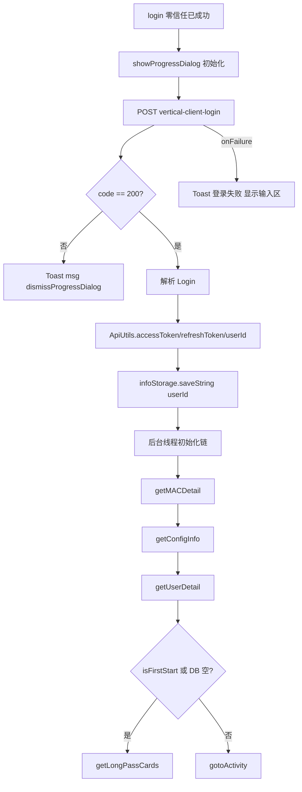

# 后台登录与 Token（vertical-client-login）

## 职责边界

| 范围 | 说明 |
|------|------|
| **负责** | 零信任成功后调用系统登录接口；解析 `accessToken` / `refreshToken` / `userId`；写入 `ApiUtils` 静态字段与 `InfoStorage`；触发登录后初始化链 |
| **不负责** | Token 定时刷新；`TokenRefreshJobService` 虽已实现，但当前未注册、未调度；VPN 认证 |
| **触发方** | `LoginActivity.login()`（零信任 `onAuthSuccess` 或免密成功后） |

---

## 涉及类

| 类名 | 路径 | 职责 | 调用方 |
|------|------|------|--------|
| `LoginActivity` | `ui/activity/LoginActivity.java` | 组装登录参数、调用 `ApiUtils.post`、解析响应、启动初始化链 | 零信任回调、`WeakHandler` |
| `ApiUtils` | `network/ApiUtils.java` | Token 静态存储；GET/POST 自动附加 `Authorization` | 全项目网络层 |
| `UrlConstants` | `network/UrlConstants.java` | `URL_LOGIN` 路径拼接 | `LoginActivity` |
| `ChannelConfig` | `src/{flavor}/.../config/ChannelConfig.java` | `BASE_URL` 决定 `SYSTEM_API` 前缀 | `UrlConstants` |
| `ApiResponse` | `entity/ApiResponse.java` | 通用响应 `code/data/msg` | Gson 反序列化 |
| `Login` | `entity/Login.java` | 登录 data 字段模型 | `LoginActivity.login` |
| `GsonUtils` | Blankj | JSON 序列化/反序列化 | `LoginActivity` |

---

## public / 关键方法

| 类 | 方法 / 字段 | 说明 |
|----|-------------|------|
| `ApiUtils` | `public static String accessToken` | 访问令牌，GET/POST 自动带 `Bearer` |
| `ApiUtils` | `public static String refreshToken` | 刷新令牌 |
| `ApiUtils` | `public static String userId` | 当前登录用户 ID |
| `ApiUtils` | `setAccessToken` / `setRefreshToken` | 登录成功后设置 |
| `ApiUtils` | `getAccessToken` / `getRefreshToken` | 读取 |
| `ApiUtils` | `post(url, json, ApiCallback)` | POST JSON，header：`tenant-id` + 可选 `Authorization` |
| `ApiUtils` | `get(url, params, ApiCallback)` | GET，自动追加 `timestamp` |
| `UrlConstants` | `URL_LOGIN` | `{BASE_URL}/app-api/system/auth/vertical-client-login` |
| `UrlConstants` | `URL_ClIENTID` | 固定 `"VERTICAL"` |
| `UrlConstants` | `TENANT_ID` | 来自 `ChannelConfig.TENANT_ID` |
| `LoginActivity` | `private void login()` | 登录主流程 |

---

## 请求与响应

### POST `vertical-client-login`

| 项目 | 值 |
|------|-----|
| URL | `UrlConstants.URL_LOGIN` |
| Method | POST JSON |
| Header | `tenant-id: ChannelConfig.TENANT_ID`（登录时无 Authorization） |

**请求体**（`LoginActivity.login` 组装）：

| 字段 | 值来源 | 说明 |
|------|--------|------|
| `username` | 输入框；空则 `"LS001"` | 注意：零信任默认 `LS001`，与 `Constants.ZERO_USERNAME` 一致 |
| `clientSecret` | 硬编码 `"admin123"` | 非输入框密码 |
| `clientId` | `UrlConstants.URL_ClIENTID` → `"VERTICAL"` | |

**响应**（`ApiResponse<Login>`）：

| 字段 | 类型 | 成功后处理 |
|------|------|------------|
| `code` | int | `200` 继续 |
| `msg` | String | 非 200 Toast 提示 |
| `data.userId` | String | → `ApiUtils.userId`、`infoStorage.userId` |
| `data.accessToken` | String | → `ApiUtils.setAccessToken` |
| `data.refreshToken` | String | → `ApiUtils.setRefreshToken` |
| `data.expiresTime` | String | 解析后**未写入本地** |

---

## 主流程

---

## 异常分支

| 场景 | 条件 | 行为 |
|------|------|------|
| JSON 解析失败 | `GsonUtils.fromJson` 异常 | Toast「接口返回异常，解析错误」；`loging=false` |
| 业务失败 | `code != 200` | Toast `resData.getMsg()`；关闭进度 |
| 网络失败 | `onFailure` | Toast「登录失败」+ 异常信息；显示 `inputLayout` |
| 初始化失败 | `getMACDetail/getConfigInfo/getUserDetail` 返回 false | Toast「初始化失败，获取xxx失败」 |
| 重复登录 | `loging` 为 true | 登录按钮直接 return |

---

## SP / InfoStorage 键

| 键 | 存储 | 写入时机 |
|----|------|----------|
| `userId` | InfoStorage | `login()` 成功解析后 |

`accessToken` / `refreshToken` **仅存内存**（`ApiUtils` 静态字段），进程重启需重新登录。

### Token 刷新现状

- `TokenRefreshJobService.java` 已实现刷新请求。
- `AndroidManifest.xml` 中 service 注册被注释。
- 三个 `LivenessDetect*Activity` 中 `scheduleTokenRefreshJob()` 调用也被注释。
- 因此当前运行版本不会自动刷新 Token；Token 过期后依赖重新登录恢复。

---

## 渠道差异

`URL_LOGIN` 使用 `SYSTEM_API = ChannelConfig.BASE_URL + "/app-api/system"`，**不带租户路径前缀**。

| 渠道 | BASE_URL | TENANT_ID |
|------|----------|-----------|
| yinchuan | `https://inckzqtxz.caacsri.com` | `1` |
| chongqing | `https://cqakzqtxz.caacsri.com` | `3` |
| luoyang | `https://txzcloudservice.caacsri.com` | `2054084946120802305` |
| shihezi | `https://txzcloudservice.caacsri.com` | `1` |

业务接口路径含 `TENANT_PREFIX`（洛阳 `fy`、石河子 `shf`），但登录接口始终在 `/app-api/system` 下。

---

## 联调清单

- [ ] POST 登录 URL 可达（需先零信任 VPN）
- [ ] `clientId=VERTICAL`、`clientSecret=admin123` 与后台一致
- [ ] 响应 `code=200` 且 `data` 含三个 Token 字段
- [ ] 登录后后续 GET 带 `Authorization: Bearer {accessToken}`
- [ ] `tenant-id` 与渠道 `TENANT_ID` 匹配
- [ ] 登录失败时 UI 回退到账号输入区
- [ ] 确认 `username` 使用输入框而非零信任密码字段
