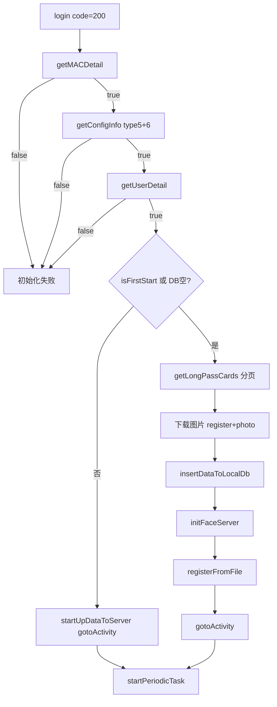

# 登录后初始化链（MAC / 配置 / 用户 / 通行证）

## 职责边界

| 范围 | 说明 |
|------|------|
| **负责** | 后台登录成功后串行拉取设备信息、查验配置、用户详情；首次或本地库空时全量同步通行证、下载图片、入库、批量注册人脸 |
| **不负责** | 零信任 VPN；查验页读卡；定时增量更新（`ArcFaceApplication.startPeriodicTask` 在 `gotoActivity` 后启动） |
| **入口** | `LoginActivity.login()` → `onSuccess` 内 `ThreadUtils.executeByCached` |

---

## 涉及类

| 类名 | 路径 | 职责 | 调用方 |
|------|------|------|--------|
| `LoginActivity` | `ui/activity/LoginActivity.java` | 四步初始化 + `getLongPassCards` + `insertDataToLocalDb` + `registerFace` | 自身 |
| `UrlConstants` | `network/UrlConstants.java` | 各 GET URL | `LoginActivity` |
| `ApiUtils` | `network/ApiUtils.java` | Token Header | 同步 OkGo 请求 |
| `InfoStorage` | `util/InfoStorage.java` | 持久化设备/配置/用户键 | `LoginActivity` |
| `DeviceUtils` | `util/DeviceUtils.java` | `deviceId`（MAC）、`getCurrentTime` | `LoginActivity` |
| `LongTermPassDao` | `db/dao/LongTermPassDao.java` | 通行证本地表 | `LoginActivity` |
| `Converters` | `util/Converters.java` | `LongPassCard` → `LongTermPass` | `insertDataToLocalDb` |
| `ImageDownloader` | `util/ImageDownloader.java` | 下载 register/photo 加密图 | `getLongPassCards` |
| `FacePhotoViewModel` | `ui/viewmodel/FacePhotoViewModel.java` | 人脸引擎初始化、批量注册 | `initFaceServer` / `registerFromFile` |
| `ArcFaceApplication` | `ArcFaceApplication.java` | `startUpDataToServer`、`startPeriodicTask` | 非首次登录分支 |

---

## 初始化步骤详解

### 1. getMACDetail()

| 项目 | 值 |
|------|-----|
| URL | `GET {businessAppApi}/check/device/detail-mac` |
| Query | `timestamp`、`mac={deviceId}` |
| Header | `tenant-id`、`Authorization: Bearer {accessToken}` |
| 执行方式 | OkGo 同步 `call.execute()`（后台线程） |

**响应 data 字段映射 → InfoStorage**：

| 响应 key | InfoStorage 键 |
|----------|----------------|
| `id` | `deviceId` |
| `name` | `deviceName` |
| `mac` | `deviceMac` |
| `areaDetail` | `deviceAreaDetail`（JSON 字符串，含区域树） |

失败：`code != 200` 或异常 → 返回 `false`，中断链。

---

### 2. getConfigInfo() — type=5 与 type=6

两次 GET 同一 URL，参数 `type` 不同。

| 项目 | 值 |
|------|-----|
| URL | `GET {businessAppApi}/check/configInfo/get` |
| Query | `timestamp`、`type`（`"5"` 然后 `"6"`） |

**type=5**（`ConfigInfo.params`）→ InfoStorage：

| 字段 | InfoStorage 键 | 说明 |
|------|----------------|------|
| `type` | `devicesType` | 配置类型 |
| `params.enter` | `devicesEnter` | 进入相关配置 |
| `params.out` | `devicesOut` | 外出相关配置 |

**type=6**：

| 字段 | InfoStorage 键 | 说明 |
|------|----------------|------|
| `params.interval` | `interval`（int） | 同步/心跳间隔等 |

type=5 失败直接 `return false`；type=6 失败返回 `false`。

---

### 3. getUserDetail(userId)

| 项目 | 值 |
|------|-----|
| URL | `GET {businessAppApi}/check/user/get` |
| Query | `timestamp`、`id={userId}` |

**成功写入**：

| 来源 | 存储 | 键 |
|------|------|-----|
| `User.nickname` | InfoStorage | `loginName` |
| `User.mobile` | SPUtils | `mobile` |

---

### 4. getLongPassCards()（条件分支）

**触发条件**：`infoStorage.getBoolean("isFirstStart", true)` **或** `longTermPassDao.getAll()` 为空。

| 项目 | 值 |
|------|-----|
| URL | `GET {businessAppApi}/check/pass/page-pass` |
| Query | `timestamp`、`pageNo`（从 1 递增）、`pageSize=20` |
| 分页逻辑 | `while(true)` 循环；有数据则 `page++`；空列表或失败则 break |

**单页处理**：

1. `status == 2` 的卡片跳过（注销）
2. 下载 `checkPhoto` → `files/register/{id}`（`ImageDownloader`，加密）
3. 下载 `photo` → `files/photo/{id}`（证件照）
4. 累积到 `longPassCardList`

**入库**（`insertDataToLocalDb`）：

- `Converters.convertToLongTermPass` → `longTermPassDao.insertAll`
- `infoStorage.saveString("startDate", DeviceUtils.getCurrentTime())`
- `infoStorage.saveBoolean("isFirstStart", false)`
- `initFaceServer()` → `registerFace()` → `registerFromFile` 完成后 `gotoActivity()`

**非首次**：`dismissProgressDialog` → `startUpDataToServer()` → `gotoActivity()`（不拉全量通行证）。

---

## public / 关键方法

| 方法 | 返回值 | 说明 |
|------|--------|------|
| `getMACDetail()` | `boolean` | 同步 GET 设备详情 |
| `getConfigInfo()` | `boolean` | 同步 GET type 5+6 |
| `getUserDetail(String userId)` | `boolean` | 同步 GET 用户 |
| `getLongPassCards()` | void | 异步分页拉取 |
| `insertDataToLocalDb(List)` | void | 入库 + 人脸注册 |
| `gotoActivity()` | void | 按 `checkType` 跳转查验 Activity |

---

## 主流程

---

## 异常分支

| 步骤 | 失败表现 | 是否阻断 |
|------|----------|----------|
| getMACDetail | Toast + 返回 false | 是 |
| getConfigInfo type5 | Toast + false | 是 |
| getConfigInfo type6 | Toast + false | 是 |
| getUserDetail | Toast + false | 是 |
| getLongPassCards 接口非200 | Toast；清空列表 break | 终止分页 |
| getLongPassCards 网络异常 | Toast「获取通信证接口数据失败」 | break |
| 人脸图片无效 | 注册阶段 `onFinish` 仍 `gotoActivity` | 不阻断进入查验 |
| register 中用户点 stop | Snackbar stop → 可能提前 `gotoActivity` | — |

---

## SP / InfoStorage 键汇总

| 键 | 类型 | 写入步骤 |
|----|------|----------|
| `deviceId` | String | getMACDetail |
| `deviceName` | String | getMACDetail |
| `deviceMac` | String | getMACDetail |
| `deviceAreaDetail` | String JSON | getMACDetail |
| `devicesType` | String | getConfigInfo type5 |
| `devicesEnter` | String | getConfigInfo type5 |
| `devicesOut` | String | getConfigInfo type5 |
| `interval` | int | getConfigInfo type6 |
| `loginName` | String | getUserDetail |
| `mobile` | String (SPUtils) | getUserDetail |
| `userId` | String | login() |
| `isFirstStart` | boolean | insertDataToLocalDb 设为 false |
| `startDate` | String | insertDataToLocalDb |
| `zero_trust_username/password` | String | 零信任阶段（非本链） |

---

## 渠道差异

| 渠道 | 业务 API 前缀 | TENANT_ID | 临时证 |
|------|---------------|-----------|--------|
| yinchuan | `{BASE}/app-api` | 1 | 支持 |
| chongqing | `{BASE}/app-api` | 3 | 支持 |
| luoyang | `{BASE}/fy/app-api` | 2054084946120802305 | 支持 |
| shihezi | `{BASE}/shf/app-api` | 1 | 支持 |

`detail-mac`、`configInfo/get`、`user/get`、`page-pass` 均走 `businessAppApiBase()`。

---

## 联调清单

- [ ] `detail-mac` 入参 `mac` 与设备 `deviceId` 一致（DEBUG 固定值）
- [ ] `areaDetail` JSON 可被查验页 `Area` 反序列化
- [ ] type=5/6 配置字段与后台定义一致
- [ ] `user/get` 返回 `nickname`、`mobile`
- [ ] 首次 `page-pass` 分页直至空列表；`status=2` 不入库
- [ ] `register`、`photo` 目录文件可解密用于人脸注册
- [ ] 二次登录跳过全量同步，本地有数据时直接进入查验页
- [ ] `gotoActivity` 的 `checkType` 与 SP 配置一致
