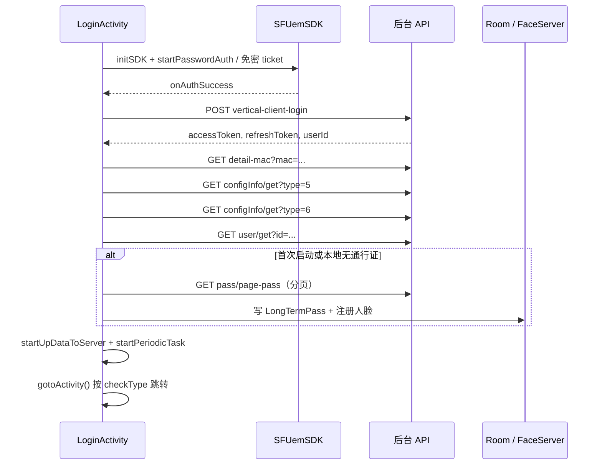

# 登录与鉴权

## 涉及类

| 类 | 路径 | 职责 |
|----|------|------|
| `LoginActivity` | `ui/activity/LoginActivity.java` | Launcher，零信任 + 后台登录 + 数据初始化 |
| `ApiUtils` | `network/ApiUtils.java` | `accessToken`/`refreshToken` 静态存储、GET/POST |
| `InfoStorage` | `util/InfoStorage.java` | 业务配置持久化（interval、devicesEnter 等） |
| `TokenRefreshJobService` | `service/TokenRefreshJobService.java` | Token 刷新（Manifest 已注释，未启用） |
| `Constants` | `common/Constants.java` | VPN 地址、默认账号、ArcFace Key |

## 完整登录时序

## 零信任 VPN

配置（`Constants.java`）：

| 常量 | 说明 |
|------|------|
| `BASE_VPN` | `https://kzqtxzvpn.caacsri.com:9998` |
| `ZERO_USERNAME` | 默认账号（空输入时使用） |
| `ZERO_PASSWORD` | 默认密码 |

初始化（`initZeroTrust()`）：

- `SFUemSDK.initSDK()`，模式 `MODE_SUPPORT_MUTABLE`，`FLAGS_VPN_MODE_TCP`
- 监听 `SFAuthResultListener`：`onAuthSuccess` → 调用 `login()`
- 支持免密 ticket 自动上线（`autoTicketSuccess`）
- 密码过期时 `AUTH_TYPE_RENEW_PASSWORD` 清空密码框

## 后台登录接口

**POST** `UrlConstants.URL_LOGIN`

请求体（JSON）：

| 字段 | 说明 | 示例 |
|------|------|------|
| `username` | 登录账号，空则用 `LS001` | `LS001` |
| `clientSecret` | 客户端密钥 | `admin123` |
| `clientId` | 客户端标识 | `VERTICAL`（`UrlConstants.URL_ClIENTID`） |

请求头：`tenant-id: UrlConstants.TENANT_ID`

成功响应（`ApiResponse` → `Login`）：

| 字段 | 存储位置 |
|------|----------|
| `accessToken` | `ApiUtils.setAccessToken()` |
| `refreshToken` | `ApiUtils.setRefreshToken()` |
| `userId` | `ApiUtils.userId` + `InfoStorage("userId")` |

## 登录后串行初始化

`LoginActivity` 在 `onSuccess` 后子线程执行：

### 1. getMACDetail()

**GET** `URL_GET_MAC_DETAIL`

| 参数 | 说明 |
|------|------|
| `timestamp` | 当前毫秒时间戳 |
| `mac` | `DeviceUtils.getDeviceId()` |

绑定设备并拉取设备级配置（区域名、默认方向等）。

### 2. getConfigInfo() × 2

**GET** `URL_GETCONFIGINFO`

| 调用 | type | 保存 |
|------|------|------|
| 第一次 | `5` | `devicesEnter`、`devicesOut` → InfoStorage |
| 第二次 | `6` | `interval`（分钟）→ InfoStorage，控制心跳/同步周期 |

### 3. getUserDetail()

**GET** `URL_GET_USER_DETAIL`

| 参数 | 说明 |
|------|------|
| `timestamp` | 毫秒时间戳 |
| `id` | `userId` |

保存用户手机号等到 SP（`mobile` 等）。

### 4. getLongPassCards()（条件触发）

触发条件：`isFirstStart || 本地 LongTermPass 列表为空`

**GET** `URL_GetLongPass`，分页参数：

| 参数 | 值 |
|------|-----|
| `pageNo` | 从 1 递增 |
| `pageSize` | `PAGE_SIZE`（20） |
| `timestamp` | 毫秒时间戳 |

每页：下载图片 → 写 `LongTermPass` → `FacePhotoViewModel` 批量注册人脸。全部完成后 `gotoActivity()`。

若本地已有数据：跳过全量同步，直接 `startUpDataToServer()` + `gotoActivity()`。

## gotoActivity() 路由

读取 `SPUtils.getInt("checkType", 0)`：

| checkType | 目标 Activity |
|-----------|---------------|
| 0 | `LivenessDetectJinActivity` |
| 1 | `LivenessDetectYuanActivity` |
| 2 | `LivenessDetectYuanAndJinActivity` |
| 3 | `RegisterAndRecognizeActivity` |

同时调用 `ArcFaceApplication.startPeriodicTask()` 并 `finish()` 自身。

## Token 生命周期

| 场景 | 处理 |
|------|------|
| 业务请求 | `Authorization: Bearer {accessToken}` |
| 401 | 跳转 `LoginActivity` 重新登录 |
| 刷新 | `URL_refresh_token`（`TokenRefreshJobService` 已实现但未在 Manifest 启用） |

## 运维入口

- 连续点击 `btnGo` **5 次** → `CustomDrawerPopupView`
- 开机参数 `auto=true`（`BootReceiver`）→ 跳过部分 UI 走自动登录

## 相关文档

- 通行证同步细节 → [05-pass-sync.md](./05-pass-sync.md)
- 查验模式 → [06-check-modes.md](./06-check-modes.md)
- 接口参数 → [16-api-reference.md](./16-api-reference.md)
