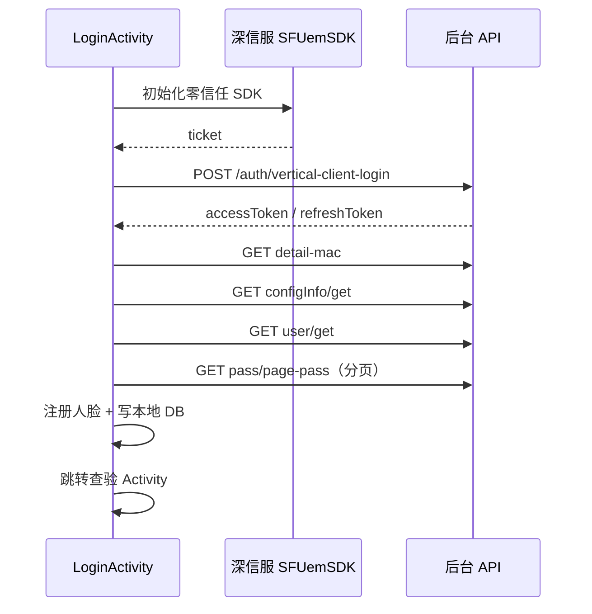

# 登录与鉴权

## 涉及类

| 类 | 路径 | 职责 |
|----|------|------|
| `LoginActivity` | `ui/activity/LoginActivity.java` | Launcher，登录主流程 |
| `ApiUtils` | `network/ApiUtils.java` | Token 存储与 HTTP 封装 |
| `TokenRefreshJobService` | `service/TokenRefreshJobService.java` | Token 刷新（Manifest 中已注释） |
| `Constants` | `common/Constants.java` | 零信任 VPN 地址与默认账号 |

## 登录流程

## 零信任 VPN

使用深信服 `SFUemSDK`，配置在 `Constants` 中：

- VPN 服务器地址
- 默认账号密码（可自动登录）

获取 ticket 成功后触发 `login()` 调用后台接口。

## 后台登录接口

| 项 | 值 |
|----|-----|
| URL | `UrlConstants.URL_LOGIN` |
| 路径 | `{BASE_URL}/app-api/system/auth/vertical-client-login` |
| 方法 | POST |
| Header | `tenant-id: UrlConstants.TENANT_ID` |

登录成功后 `ApiUtils` 保存：

- `accessToken` — 业务接口鉴权
- `refreshToken` — Token 刷新

## 登录后初始化

`LoginActivity` 串行执行：

1. `getMACDetail()` — 绑定设备 MAC，获取设备配置
2. `getConfigInfo()` — 拉取查验配置（间隔、阈值等）
3. `getUserDetail()` — 当前登录用户信息
4. `getLongPassCards()` — 分页下载全部通行证（首次或本地为空时）

完成后：

- 调用 `ArcFaceApplication.startUpDataToServer()` 启动记录上传定时器
- 按 `SPUtils.checkType` 跳转对应查验 Activity
- 启动 `startPeriodicTask()`（心跳、增量同步等）

## Token 生命周期

| 场景 | 处理 |
|------|------|
| 业务请求 | Header `Authorization: Bearer {accessToken}` |
| 401 响应 | `ArcFaceApplication` 跳转 `LoginActivity` 重新登录 |
| 刷新 | `URL_refresh_token`，`TokenRefreshJobService`（当前未启用） |

## 运维隐藏入口

`LoginActivity` 中连续点击 `btnGo` **5 次** → 弹出 `CustomDrawerPopupView` 运维侧边栏。

详见 [13-settings-and-ops-drawer.md](./13-settings-and-ops-drawer.md)。

## 路由到查验页

根据 `SPUtils.checkType` 跳转：

| checkType | Activity |
|-----------|----------|
| 0 | `LivenessDetectJinActivity` |
| 1 | `LivenessDetectYuanActivity` |
| 2 | `LivenessDetectYuanAndJinActivity` |
| 3 | `RegisterAndRecognizeActivity` |

详见 [06-check-modes.md](./06-check-modes.md)。
