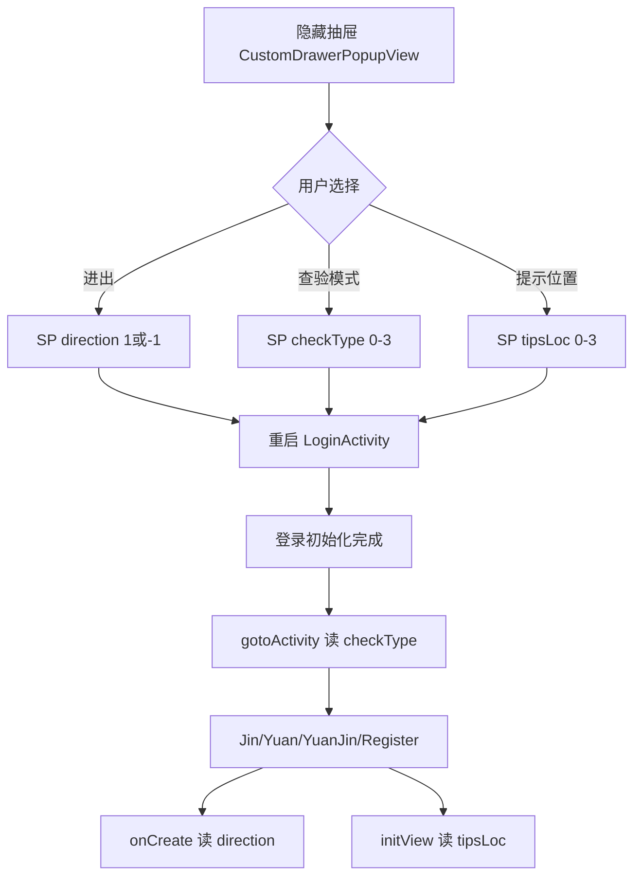

# 查验模式与进出方向（checkType / direction / tipsLoc）

## 职责边界

| 范围 | 说明 |
|------|------|
| **负责** | 本地配置「查验模式」（跳转哪个 Activity）、「进出方向」（记录字段）、「证件提示窗口位置」（UI 布局） |
| **不负责** | 服务端下发查验方式（`getCheckMethod` 在 `LoginActivity` 中**未接入主流程**，仅独立方法） |
| **存储** | 全部使用 **SPUtils**（默认 SharedPreferences），**非** InfoStorage |
| **修改入口** | 隐藏抽屉 `CustomDrawerPopupView`（登录页连点 5 次或查验页连点 `imgYuan` 5 次） |

---

## 涉及类

| 类名 | 路径 | 职责 | 调用方 |
|------|------|------|--------|
| `CustomDrawerPopupView` | `widget/dialog/CustomDrawerPopupView.java` | 读写 SP、切换配置后重启到 `LoginActivity` | 各查验 Activity |
| `LoginActivity` | `ui/activity/LoginActivity.java` | `gotoActivity()` 按 `checkType` 跳转 | 登录初始化完成 |
| `LivenessDetectJinActivity` | `ui/activity/LivenessDetectJinActivity.java` | 读取 `direction`、`tipsLoc` | 自身 |
| `LivenessDetectYuanActivity` | 同上模式 | 同上 | 自身 |
| `LivenessDetectYuanAndJinActivity` | 同上模式 | 同上 | 自身 |
| `RegisterAndRecognizeActivity` | 同上模式 | 同上 | 自身 |
| `RecordsPopDialog` | `widget/dialog/RecordsPopDialog.java` | 通行记录弹窗，参数 `direction` | 查验页 `tvMore` |
| `LongTermRecords` / `TemporaryCardRecords` | `db/entity/` | `direction` 字段写入服务器记录 | 保存记录时 |

---

## checkType（查验模式）

| position | SP 值 | 列表文案 | 目标 Activity |
|----------|-------|----------|-----------------|
| 0 | 0 | 通行证（短距）+人脸 | `LivenessDetectJinActivity` |
| 1 | 1 | 通行证（长距）+人脸 | `LivenessDetectYuanActivity` |
| 2 | 2 | 通行证（长距+短距）+人脸 | `LivenessDetectYuanAndJinActivity` |
| 3 | 3 | 人脸 | `RegisterAndRecognizeActivity` |

- **SP 键**：`checkType`
- **默认值**：`0`
- **写入**：`CustomDrawerPopupView` → `SPUtils.put("checkType", position)`
- **读取**：`LoginActivity.gotoActivity()`、`CustomDrawerPopupView` 回显

切换后若非 `LoginActivity` 为栈顶： `startActivity(LoginActivity)` + `finishOtherActivities` 各查验类。

---

## direction（进出方向）

| position | SP 值 | 列表文案 | 业务含义 |
|----------|-------|----------|----------|
| 0 | **1** | 进控制区 | 进入 |
| 1 | **-1** | 出控制区 | 离开 |

- **SP 键**：`direction`
- **默认值**：`1`（进）
- **UI 展示**：`tvTis` 文案 `"{在线/离线}模式 {区域名}{-进/-出}查验"`
- **记录字段**：`longTermRecords.direction = direction + ""`（字符串 `"1"` / `"-1"`）
- **服务端查询**：`RecordsPopDialog` 请求参数 `direction`

**注意**：代码注释中另有「2：核验」，但 SP 配置 UI **仅提供 1 / -1**。

---

## tipsLoc（证件提示窗口位置）

控制 `binding.fragmentAll`（证件卡面 Fragment 容器）在屏幕四角位置。

| position | SP 值 | 列表文案 | LayoutParams.gravity |
|----------|-------|----------|----------------------|
| 0 | 0 | 左下 | `BOTTOM \| LEFT` |
| 1 | 1 | 左上 | `TOP \| LEFT` |
| 2 | 2 | 右下 | `BOTTOM \| RIGHT` |
| 3 | 3 | 右上 | `TOP \| RIGHT` |

- **SP 键**：`tipsLoc`
- **默认值**：`0`
- **读取位置**：各查验 Activity `initView()`（变量名误写为 `checkType`，实际读 `tipsLoc`）

---

## public / 关键方法

| 类 | 方法 | 说明 |
|----|------|------|
| `LoginActivity` | `gotoActivity()` | `switch(checkType)` 跳转 |
| `CustomDrawerPopupView` | `onCreate` 内三个 `OnClickListener` | 进出 / 查验模式 / 提示位置 |
| 各查验 Activity | `initView()` | 应用 `tipsLoc` 到 `fragmentAll` |
| 各查验 Activity | `onCreate` | `direction = SPUtils.getInt("direction", 1)` |

---

## 主流程

---

## 异常分支

| 场景 | 行为 |
|------|------|
| `checkType` 无匹配 default | `intent` 为 null，`startActivity` 可能 NPE——实际 SP 仅 0-3 |
| 切换配置时已在 LoginActivity | 不重复 `startActivity`，仅 `dismiss` |
| `deviceAreaDetail` 空 | `getArea()` 返回空字符串，标题区域名为空 |

---

## SP / InfoStorage 键

| 键 | 存储 | 默认 | 用途 |
|----|------|------|------|
| `checkType` | SPUtils | 0 | 查验 Activity 路由 |
| `direction` | SPUtils | 1 | 进出方向、记录、记录弹窗 |
| `tipsLoc` | SPUtils | 0 | 证件窗口四角定位 |
| `mobile` | SPUtils | — | 抽屉显示手机号（`getUserDetail` 写入） |
| `wenan` | SPUtils | — | 自定义文案（抽屉配置） |
| `spa` | SPUtils | — | 零信任 SPA（非查验配置） |

**InfoStorage 不参与** checkType/direction/tipsLoc。

---

## 渠道差异

查验模式三档读卡能力因 Activity 不同而异（见各专篇），但 **SP 键与枚举全渠道一致**。当前四个 flavor 的 `SUPPORTS_TEMPORARY_PASS` 均为 `true`，临时证可进入对应校验流程。

---

## 联调清单

- [ ] 抽屉连点 5 次可打开（登录 `btnGo`、查验 `imgYuan`）
- [ ] 切换 `checkType` 后重新登录并进入对应 Activity
- [ ] `direction=1` 记录与弹窗查询一致；`-1` 出区记录
- [ ] 四个 `tipsLoc` 位置与卡面 Fragment 显示正确
- [ ] 标题栏「进/出」与 SP 一致
- [ ] `gotoActivity` 与当前 `checkType` 一致
