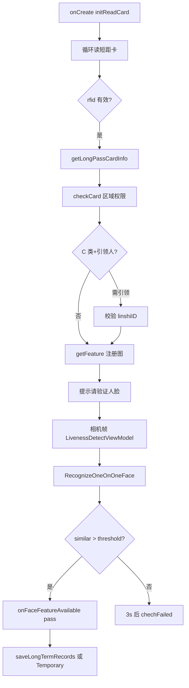

# LivenessDetectJinActivity（短距 + 人脸）

## 职责边界

| 范围 | 说明 |
|------|------|
| **负责** | **仅短距离**读卡（德卡 `BasicOper` / 华大 `AndroidSerialPort`）+ 相机活体 + **1:1** 人脸比对 + 通行记录 |
| **不负责** | 远距离 RFID（`EC_API`）；1:N 人脸搜索（那是 `RegisterAndRecognizeActivity`） |
| **对应 checkType** | `0` — 通行证（短距）+人脸 |
| **布局** | `activity_liveness_detect` + `ActivityLivenessDetectBinding` |

---

## 涉及类

| 类名 | 路径 | 职责 | 调用方 |
|------|------|------|--------|
| `LivenessDetectJinActivity` | `ui/activity/LivenessDetectJinActivity.java` | 主控制器 | `LoginActivity.gotoActivity` |
| `LivenessDetectViewModel` | `ui/viewmodel/LivenessDetectViewModel.java` | 相机帧处理、1:1 `compareFaceFeature` | Activity |
| `FaceFeatureCallback` | `util/face/FaceFeatureCallback.java` | 比对结果回调 | ViewModel → Activity |
| `BasicOper` | `com.decard.NDKMethod` | 短距 PSAM/ACPU 读卡 | `getLongPassCardID` |
| `AndroidSerialPort` | `com.hc.reader` | 小屏设备读卡 | `typeDevice==2` |
| `CardSerialConfigUtil` | `util/CardSerialConfigUtil.java` | 串口路径、波特率 | `initReadCard` |
| `SerialManage` | `Serial/SerialManage.java` | 扫码串口 | `initScanCard` |
| `Document1/2/3` | `ui/fragment/`（渠道 flavor） | 卡面展示 | `toggleFragment` |
| `LongTermPassDao` | `db/dao/` | 本地通行证查询 | 读卡后 |
| `ChannelConfig` | `config/ChannelConfig.java` | 临时证开关 | `checkCard`、`getShortPassCardID` |

---

## 与 Yuan / YuanJin 差异

| 维度 | Jin（本文） | Yuan | YuanAndJin |
|------|-------------|------|------------|
| checkType | 0 | 1 | 2 |
| 读卡循环 | **仅** `getLongPassCardID()`（短距） | 短距失败后 `readLongCard(ecApi)` 长距 | 同 Yuan（短+长） |
| `initLongReader` / `EC_API` | **无** | 有 | 有（`typeDevice==1` 时） |
| `initReadCard` | 按屏宽选 BasicOper 或 AndroidSerialPort | 仅 `initLongReader` + 短距循环 | 同 Jin 分支 + `initLongReader` |
| `onDestroy` | `stopReadLongPassCardID` + `stopReadCarIDMini` | + `unInitLongReader` | 全部 |
| 类注释 | 刷卡加人脸识别 | 刷卡加人脸识别 | 刷卡加人脸识别 |

---

## public / 关键方法

| 方法 | 说明 |
|------|------|
| `initReadCard()` | 屏宽>800：`BasicOper.dc_open` → `startReadLongPassCardID`；否则 `AndroidSerialPort` → `startReadCarIDMini` |
| `startReadLongPassCardID()` | 循环 `getLongPassCardID()`，间隔 `ArcFaceApplication.READ_TIME`（1000ms） |
| `getLongPassCardID()` | PSAM 复位 → 外部认证 → 读 RFID → `getLongPassCardInfo(rfid)` |
| `getLongPassCardInfo(String rfid)` | `dao.getByCardId` → 区域/C 类引领/人脸特征 |
| `getShortPassCardID(String carID)` | `dao.getByApplyId`，需先刷长期卡（`linshiID`） |
| `checkCard()` | 有效期、状态、黑名单、暂扣、分数、时间控制 |
| `saveRecord(LongTermPass)` | 非 C 类长期卡写入 `linshiID` |
| `onFaceFeatureAvailable(...)` | 1:1 成功/失败 → `chechSuccesse` / `chechFailed` |
| `chechSuccesse` / `chechFailed` | 写记录、UI、音效 |

---

## 主流程

---

## 异常分支（读卡 / 校验）

| 提示 | 条件 |
|------|------|
| 长期卡不存在 | `getByCardId` 空 |
| 无当前区域权限 | `isAreaPass` false |
| 请先刷引领人 | C 类 + `leadingPeopleId` 非空 + `linshiID` 空 |
| 引领人请刷卡 | `linshiID` 不在 `leadingPeopleId` 数组 |
| 请先刷长期卡 | 临时证 + `linshiID` 空 |
| 临时卡不存在 | `getByApplyId` 空 |
| 不支持临时通行证 | `type==1` 且 `!SUPPORTS_TEMPORARY_PASS` |
| 证件未生效/过期/注销等 | `checkCard()` |
| 人脸图片无效 | `getFeature(bitmap)==null` |
| 人证不匹配 | 1:1 失败 → `reason=人证不匹配` |

---

## SP / InfoStorage 键

| 键 | 存储 | 用途 |
|----|------|------|
| `direction` | SPUtils | 记录方向、UI 标题 |
| `tipsLoc` | SPUtils | `fragmentAll` 位置 |
| `linshiID` | InfoStorage | 引领人 userId；长期卡刷成功后 `saveRecord` 写入 |
| `deviceAreaDetail` | InfoStorage | 区域权限校验 |
| `deviceId/deviceName` | InfoStorage | 记录字段 |
| `loginName` | InfoStorage | 查验人姓名 |

`RegisterAndRecognizeActivity` 在 handler 消息 9 会 `remove("linshiID")`；**Jin Activity 无自动清除**（注释掉的 5 分钟 Handler）。

---

## 渠道差异

- `Document2`/`Document3` 为 flavor 源码（洛阳竖版、重庆临时证等）
- `ChannelConfig.SUPPORTS_TEMPORARY_PASS`：洛阳 `false`，其余多为 `true`

---

## 联调清单

- [ ] 短距读卡串口 `CardSerialConfigUtil` 路径/波特率正确
- [ ] 大屏 `BasicOper`、小屏 `AndroidSerialPort` 分支
- [ ] 仅短距：远距离卡**不应**被本 Activity 读取
- [ ] C 类引领流程：先刷引领人长期卡 → 再刷 C 卡
- [ ] 临时证：先长期卡设 `linshiID` → 刷临时 applyId
- [ ] 1:1 阈值 `ConfigUtil.getRecognizeThreshold()`（默认 0.80）
- [ ] 比对成功 UI 显示相似度百分比
