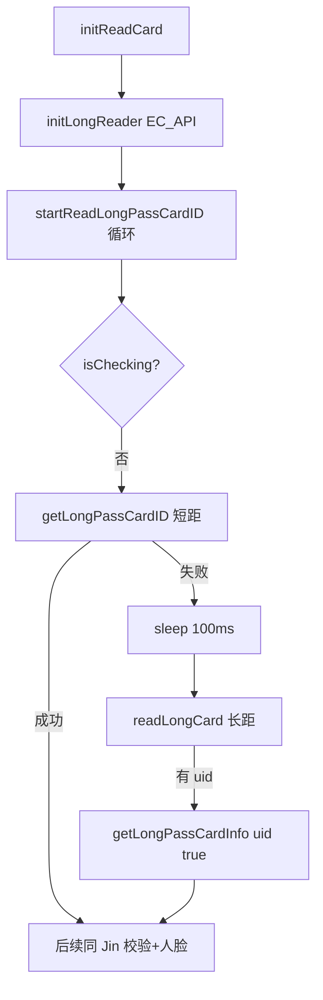

# LivenessDetectYuanActivity（长距 + 人脸）

## 职责边界

| 范围 | 说明 |
|------|------|
| **负责** | **短距 + 长距**读卡：循环内先 `getLongPassCardID()`（德卡 `BasicOper`），失败则 `readLongCard(ecApi)`（`EC_API` 远距离）；人脸 1:1 比对与记录逻辑与 Jin 同源 |
| **不负责** | 小屏 `AndroidSerialPort` 专用分支（Yuan `initReadCard` **无**屏宽分支，统一 `initLongReader` + 短距循环） |
| **对应 checkType** | `1` — 通行证（长距）+人脸 |

---

## 涉及类

| 类名 | 路径 | 职责 | 调用方 |
|------|------|------|--------|
| `LivenessDetectYuanActivity` | `ui/activity/LivenessDetectYuanActivity.java` | 主控制器 | `LoginActivity` |
| `EC_API` | `com.pc_rfid.api` | 远距离 RFID 读写器 | `readLongCard`、`initLongReader` |
| `BasicOper` | 德卡 SDK | 近距离读卡 | `getLongPassCardID` |
| `SerialManage` | 扫码串口 | QR 扫描 | `initScanCard` |
| `Tag` | `entity/Tag.java` | 远距离扫描标签 | `ScanTab` |
| 其他 | 同 Jin 篇 | ViewModel、Dao、记录上传 | — |

---

## 与 Jin / YuanJin 差异

| 维度 | Yuan（本文） | Jin | YuanAndJin |
|------|--------------|-----|------------|
| 长距读卡 | **有** `EC_API` | **无** | **有** |
| 读卡循环 | 短距失败 → `readLongCard` → `getLongPassCardInfo(uid, true)` | 仅短距 | 同 Yuan |
| `initReadCard` | `initLongReader()` 后直接 `startReadLongPassCardID` | 屏宽分支 BasicOper/AndroidSerialPort | 屏宽分支 + `initLongReader` |
| `onDestroy` | `stopReadLongPassCardID` + `unInitLongReader` | + `stopReadCarIDMini` | 全部 |
| Import | `EC_API`、`Tag`、`ConvertUtils` | `DeviceUtils`、`CardSerialConfigUtil` | 两者兼有 |

`getLongPassCardInfo` 在 Yuan 中长距分支调用 `getLongPassCardInfo(uid, true)`（第二参数区分长距卡 ID 查询路径，与 Jin 单参数版本不同）。

---

## public / 关键方法

| 方法 | 说明 |
|------|------|
| `initReadCard()` | 弹窗 Loading → `initLongReader()` → sleep 1s → `startReadLongPassCardID()` |
| `initLongReader()` | `EC_API.GetAllCOM()` 枚举串口并连接 |
| `startReadLongPassCardID()` | `!isChecking` 时：短距 `getLongPassCardID()`；失败则 `readLongCard(ecApi)` |
| `readLongCard(EC_API api)` | 远距离读 UID |
| `ScanTab(EC_API, antNum)` | 扫描天线标签列表 |
| `getLongPassCardID()` | 与 Jin 相同的 PSAM/ACPU 流程 |
| `unInitLongReader()` | 释放远距离读卡器 |
| `initScanCard()` | `SerialManage` 扫码（临时证二维码等） |

人脸、记录、`checkCard`、`linshiID` 逻辑与 Jin 基本一致（代码结构平行）。

---

## 主流程

---

## 异常分支

除 Jin 篇所列校验外：

| 场景 | 行为 |
|------|------|
| 长距读卡器初始化失败 | `initLongReader` 内连接失败，长距 UID 始终空 |
| 短距成功 | 不进入长距分支（`result=true` 时不读长距） |
| `onDestroy` 未 `unInitLongReader` | 资源泄漏风险（Yuan 已调用） |

---

## SP / InfoStorage 键

同 Jin 篇：`direction`、`tipsLoc`（SPUtils）；`linshiID`、`deviceAreaDetail` 等（InfoStorage）。

---

## 渠道差异

- 卡面 Fragment 随 flavor 变化
- 洛阳不支持临时证：`getShortPassCardID` 入口 `if (!ChannelConfig.SUPPORTS_TEMPORARY_PASS) return`

---

## 联调清单

- [ ] `EC_API` 串口枚举与天线读卡正常
- [ ] 短距失败 100ms 后长距补读
- [ ] 长距 UID 与本地 `cardId` 映射正确（`getLongPassCardInfo(uid, true)`）
- [ ] `initScanCard` 扫码与临时证 `applyId` 联动（若启用）
- [ ] 销毁时 `unInitLongReader` 无残留线程
- [ ] 与 Jin 对比：本 Activity **不应**依赖仅小屏 `AndroidSerialPort` 路径
