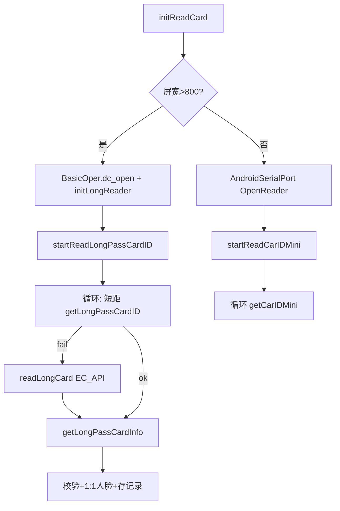

# LivenessDetectYuanAndJinActivity（长距 + 短距 + 人脸）

## 职责边界

| 范围 | 说明 |
|------|------|
| **负责** | **合并** Jin 的短距硬件分支（大屏 `BasicOper` / 小屏 `AndroidSerialPort`）与 Yuan 的长距 `EC_API`；读卡循环逻辑同 Yuan（短距优先，失败读长距） |
| **对应 checkType** | `2` — 通行证（长距+短距）+人脸 |
| **布局** | 与 Jin/Yuan 共用 `activity_liveness_detect` |

---

## 涉及类

| 类名 | 路径 | 职责 | 调用方 |
|------|------|------|--------|
| `LivenessDetectYuanAndJinActivity` | `ui/activity/LivenessDetectYuanAndJinActivity.java` | 主控制器 | `LoginActivity` |
| `BasicOper` | 德卡 | 短距读卡 | `getLongPassCardID`、`initReadCard`（大屏） |
| `AndroidSerialPort` | 华大 | 小屏短距 | `typeDevice==2` |
| `EC_API` | 远距离 RFID | `initLongReader`、`readLongCard` | 读卡循环 |
| `CardSerialConfigUtil` | 串口配置 | 路径/波特率 | `initReadCard` |
| `SerialManage` | 扫码 | `initScanCard` | onCreate |
| `TokenRefreshJobService` | `service/` | Token 刷新 Job（import 存在，与 Jin 类似） | 可选调度 |
| 其他 | 同 Jin/Yuan | ViewModel、Dao、记录 | — |

---

## 与 Jin / Yuan 差异

| 维度 | YuanAndJin（本文） | Jin | Yuan |
|------|-------------------|-----|------|
| 短距 | **有**（屏宽分支） | 有 | 有（无屏宽分支） |
| 长距 EC_API | **有** | 无 | 有 |
| `initReadCard` | `typeDevice==1`：`BasicOper`+`initLongReader`；`==2`：`AndroidSerialPort` | 同左但**无** `initLongReader` | 仅 `initLongReader` |
| 读卡循环 | 短距 → 失败 → 长距 | 仅短距 | 短距 → 长距 |
| `onDestroy` | `stopReadLongPassCardID`、`stopReadCarIDMini`、`unInitLongReader` | 前两个 | 短距 stop + `unInitLongReader` |

业务代码（`checkCard`、`getLongPassCardInfo`、`saveRecord`、`onFaceFeatureAvailable`）与 Jin/Yuan **高度重复**，差异主要在硬件初始化与读卡循环。

---

## public / 关键方法

| 方法 | 说明 |
|------|------|
| `initReadCard()` | 屏宽>800：`BasicOper.dc_open` + `initLongReader()` → `startReadLongPassCardID`；小屏：`AndroidSerialPort` → `startReadCarIDMini` |
| `startReadLongPassCardID()` | `getLongPassCardID()` 失败 → `readLongCard(ecApi)` → `getLongPassCardInfo(uid, true)` |
| `startReadCarIDMini` / `getCarIDMini` | 小屏设备循环读卡 |
| `initLongReader` / `unInitLongReader` | 长距读写器生命周期 |
| `readLongCard` / `ScanTab` | 同 Yuan |

---

## 主流程

---

## 异常分支

| 场景 | 说明 |
|------|------|
| 小屏分支 | **仅** `startReadCarIDMini`，**不**走 `startReadLongPassCardID` 长距循环 |
| 大屏分支 | 短距+长距双通道 |
| 其余 | 同 Jin 篇 `checkCard`、引领人、临时证规则 |

---

## SP / InfoStorage 键

同 Jin/Yuan：`direction`、`tipsLoc`；`linshiID`、`deviceAreaDetail`、`loginName` 等。

---

## 渠道差异

全渠道可用；临时证受 `ChannelConfig.SUPPORTS_TEMPORARY_PASS` 约束（洛阳 false）。

---

## 联调清单

- [ ] 大屏设备：短距德卡 + 长距 EC_API 均可用
- [ ] 小屏设备：仅 `AndroidSerialPort` 路径，确认是否需长距（当前代码小屏**不**调长距循环）
- [ ] `typeDevice` 由 `DeviceUtils.getScreenSize` 宽度是否 >800 决定
- [ ] 与单独 Jin/Yuan 模式行为一致性的回归
- [ ] `onDestroy` 三路读卡资源均释放
