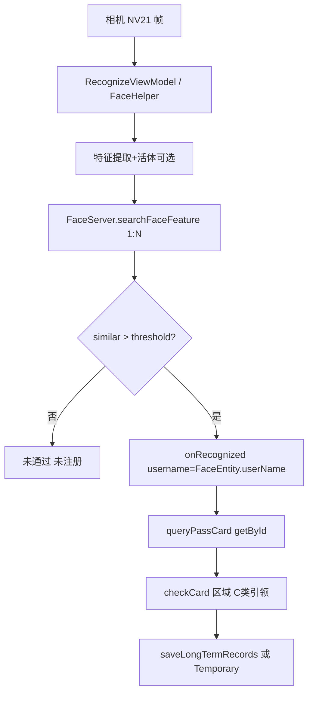

# RegisterAndRecognizeActivity（纯人脸 1:N）

## 职责边界

| 范围 | 说明 |
|------|------|
| **负责** | **无读卡**；相机预览 → `FaceHelper.searchFaceFeature`（1:N）→ 用 `FaceEntity.userName`（通行证 id）查 `LongTermPass` → 业务校验 → 存记录 |
| **不负责** | 刷卡、远距离/近距离读卡器、1:1 证件照比对 |
| **对应 checkType** | `3` — 人脸 |
| **ViewModel** | `RecognizeViewModel`（非 `LivenessDetectViewModel`） |
| **布局** | `activity_register_and_recognize` |

---

## 涉及类

| 类名 | 路径 | 职责 | 调用方 |
|------|------|------|--------|
| `RegisterAndRecognizeActivity` | `ui/activity/RegisterAndRecognizeActivity.java` | 主控制器 | `LoginActivity` |
| `RecognizeViewModel` | `ui/viewmodel/RecognizeViewModel.java` | 构建 `FaceHelper`、`RecognizeConfiguration` | Activity |
| `FaceHelper` | `util/face/FaceHelper.java` | 检测→特征→`FaceServer.searchFaceFeature` | ViewModel |
| `FaceServer` | `faceserver/FaceServer.java` | 特征库搜索 | FaceHelper |
| `FaceDao` | `facedb/dao/FaceDao.java` | 人脸库（调试查询） | Activity |
| `LongTermPassDao` | `db/dao/` | `getById(name)` 按通行证 id 查 | `queryPassCard` |
| `Document11` | `ui/fragment/` | 纯人脸模式默认 Fragment | `initFragment` |
| `RecognizeCallback` | `util/face/RecognizeCallback.java` | 识别结果接口 | Activity 实现 |

---

## 与 Liveness 系列差异

| 维度 | Register（本文） | Jin/Yuan/YuanJin |
|------|------------------|------------------|
| 读卡 | **无** | 有 |
| 人脸模式 | **1:N** 搜索库 | **1:1** 证件注册图 |
| ViewModel | `RecognizeViewModel` | `LivenessDetectViewModel` |
| 比对入口 | `FaceHelper.searchFace` → `similar > threshold` | `compareFaceFeature(mainFeature, …)` |
| 通行证定位 | `cardDao.getById(username)`，`username` 为 `FaceEntity.userName` | `getByCardId(rfid)` / `getByApplyId` |
| `linshiID` | handler 消息 **9** 定时 `remove` | 长期卡 `saveRecord` 写入 |
| 类注释 | 纯人脸识别，无刷卡 | 刷卡加人脸识别 |

---

## public / 关键方法

| 方法 | 说明 |
|------|------|
| `onRecognized(Bitmap, faceSimilar, quality, username, result)` | `result=true` → `queryPassCard(username, …)` |
| `queryPassCard(String name, …)` | `cardDao.getById(name)` → 区域/C 类引领/`checkCard` → 成功 UI |
| `checkCard()` | 同 Liveness 系列规则 |
| `saveLongTermRecords` / `saveTemporaryRecords` | 写本地记录并上传 |
| `saveRecord(LongTermPass)` | 写 `linshiID`（引领场景） |

**无** `initReadCard`、`getLongPassCardID`、`onFaceFeatureAvailable`。

---

## 主流程

---

## 异常分支

| 提示 | 条件 |
|------|------|
| 证件不存在 | `getById(name)` 空 |
| 同 Jin 系列 | `checkCard`、引领人、`linshiID`、区域权限 |
| 1500ms 内重复 | 同 `id` 过滤 |

---

## SP / InfoStorage 键

| 键 | 存储 | 说明 |
|----|------|------|
| `direction` | SPUtils | 记录方向 |
| `tipsLoc` | SPUtils | 证件窗口位置 |
| `linshiID` | InfoStorage | C 类/临时证引领；**消息 9 清除** |
| 其他 | InfoStorage | `deviceAreaDetail`、`loginName` 等同 Liveness |

---

## 渠道差异

- `Document11` + flavor `Document2`/`Document3`
- 洛阳 `SUPPORTS_TEMPORARY_PASS=false` 拒绝临时证

---

## 联调清单

- [ ] 登录后人脸库已注册（首次 `registerFromFile` 完成）
- [ ] 识别返回的 `userName` 与 `LongTermPass.id` 一致
- [ ] 1:N 阈值 `ConfigUtil.getRecognizeThreshold()`（默认 0.80）
- [ ] 无读卡器时全流程可完成查验
- [ ] `linshiID` 清除逻辑（handler case 9）与引领流程
- [ ] 与 Liveness 模式记录字段一致性
