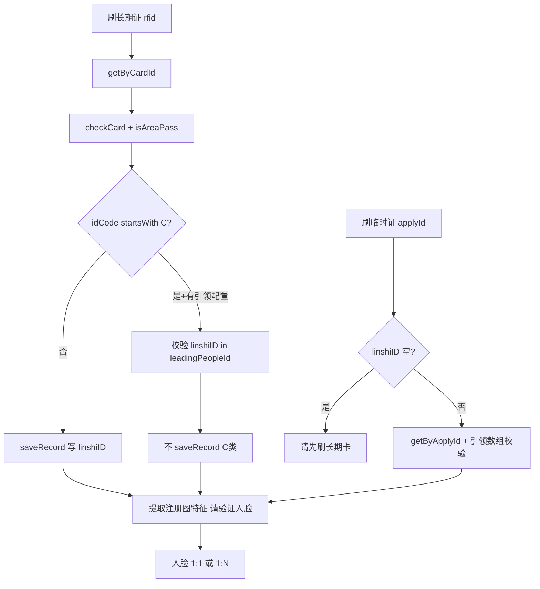

# 刷卡校验规则（长期证 / 临时证 / 引领人）

## 职责边界

| 范围 | 说明 |
|------|------|
| **负责** | 读卡后本地 `LongTermPass` 校验链：证件类型、有效期、状态、黑名单、区域、C 类引领、临时证关联 |
| **实现位置** | `LivenessDetectJinActivity`、`LivenessDetectYuanActivity`、`LivenessDetectYuanAndJinActivity`、`RegisterAndRecognizeActivity`（逻辑平行，方法名相同） |
| **数据表** | `long_term_pass`（`LongTermPass` 实体，长期与临时证共用表，`type` 区分） |

---

## 涉及类

| 类名 | 路径 | 职责 |
|------|------|------|
| `LongTermPass` | `db/entity/LongTermPass.java` | 通行证字段：`type`、`idCode`、`cardId`、`applyId`、`leadingPeopleId`、`userId` 等 |
| `LongTermPassDao` | `db/dao/LongTermPassDao.java` | `getByCardId`、`getByApplyId`、`getById` |
| `TimeControlUtil` | `util/TimeControlUtil.java` | 时间段通行控制 |
| `ChannelConfig` | `config/ChannelConfig.java` | `SUPPORTS_TEMPORARY_PASS` |
| `InfoStorage` | `util/InfoStorage.java` | `linshiID` 引领人缓存 |
| `DateUtil` | `util/DateUtil.java` | 起止日期解析 |

---

## 证件类型（type）

| type | 含义 | 读卡入口 | 人脸成功后记录 |
|------|------|----------|----------------|
| `0` | 长期证 | `getLongPassCardInfo(rfid)` → `getByCardId` | `saveLongTermRecords` |
| `1` | 临时证 | `getShortPassCardID(applyId)` → `getByApplyId` | `saveTemporaryRecords` |

---

## checkCard() 统一规则

执行顺序（`LivenessDetectJinActivity.checkCard`，其他 Activity 同构）：

| 序号 | 条件 | 提示 | 动作 |
|------|------|------|------|
| 1 | `type==1` 且 `!SUPPORTS_TEMPORARY_PASS` | 不支持临时通行证 | `setRfidNull`、`stopChecking` |
| 2 | `startDate` 未到（span>0 秒） | 证件未生效 | 同上 |
| 3 | `expiryDate` 已过（span<0 秒） | 证件过期；`status` 置 3 | 同上 |
| 4 | `status != 1` | 证件已{注销/过期/挂失/停用} | `theCardIsExpired(status)` |
| 5 | `isBlacklist` | 通行证在黑名单中 | 同上 |
| 6 | `isWithdraw` | 通行证被收回 | 同上 |
| 7 | `isWithhold` | 通行证被暂扣 | 同上 |
| 8 | `score <= 0` | 通行证分数为0 | 同上 |
| 9 | `TimeControlUtil.checkTimeControl` 不允许 | `timeControlResult.getErrorMessage()` | 同上 |

**status 文案**（`theCardIsExpired`）：1 正常、2 注销、3 过期、4 挂失、5 停用。

---

## 区域权限 isAreaPass

- 输入：`longTermPass.areaIds`、`areaRootIds`
- 对照：`infoStorage.deviceAreaDetail` 反序列化为 `Area` 树
- 逻辑：`isAreaIdsPass` **或** `isAreaRootIdsPass`；子区域 `category==2` 匹配 id

失败提示：**无当前区域权限**。

---

## linshiID（引领人缓存）

| 项目 | 说明 |
|------|------|
| **键** | InfoStorage `linshiID` |
| **写入** | `saveRecord(longTermPass)`：当 `longTermPass.userId` 非空时 `saveString("linshiID", userId)`；否则置 `""` |
| **触发时机** | 长期证（**非 C 类**）刷卡校验通过后、进入人脸前 `saveRecord` |
| **清除** | `RegisterAndRecognizeActivity` handler 消息 9：`infoStorage.remove("linshiID")`；Liveness 系列注释掉 5 分钟清除 |
| **用途** | 临时证刷卡的引领人；C 类证刷卡时校验 `leadingPeopleId` 数组是否包含 `linshiID` |

### C 类长期证（idCode 以 `C` 开头）

1. 若 `leadingPeopleId` 非空：
   - `linshiID` 为空 → **请先刷引领人**
   - `linshiID` 不在数组 → **引领人请刷卡** / **请刷引领人卡**
2. 通过后 `switchFragment3`，再次 `checkCard()`
3. C 类**不**调用 `saveRecord`（不更新 `linshiID` 为 C 卡本人）
4. 记录保存时：`longTermRecords.parentld = localLongId`，`leadingPeopleld = linshiID`

### 临时证（type=1）

1. 入口检查 `linshiID` 为空 → **请先刷长期卡**
2. `leadingPeopleId` 为 null 或 length==0 → **请关联长期卡**
3. `linshiID` 不在 `leadingPeopleId` → **引领人请刷卡**
4. 记录：`temporaryCardRecords.leadingPeopleId = linshiID`，`parentId = localLongId`

---

## 读卡去重

- 1500ms 内相同 `cardId`（长期）或 `applyId`（临时）重复读卡过滤
- `lastLongTermPass` + `lastTime` 成员变量

---

## 主流程（长期 + 临时 + 引领）

---

## SP / InfoStorage 键

| 键 | 说明 |
|----|------|
| `linshiID` | 当前会话引领人 `userId`（InfoStorage） |
| `deviceAreaDetail` | 设备区域树 JSON |
| `localLongId` | 内存：长期记录 Snowflake id，临时记录 `parentId` |

---

## 渠道差异

| 渠道 | SUPPORTS_TEMPORARY_PASS | 临时证 |
|------|-------------------------|--------|
| yinchuan | true | 支持 |
| chongqing | true | 支持 |
| shihezi | true | 支持 |
| luoyang | **false** | `checkCard` 与 `getShortPassCardID` 直接拒绝 |

---

## 联调清单

- [ ] 长期证：未生效、过期、注销(2)跳过同步、黑名单、暂扣、分数 0
- [ ] 区域：有/无 `areaIds` 与设备 `areaDetail` 匹配
- [ ] C 类：先刷引领人长期卡 → `linshiID` 有值 → 刷 C 卡
- [ ] 临时证：先长期卡 → 再临时 applyId；引领数组包含长期卡 `userId`
- [ ] 洛阳渠道刷临时证提示「不支持临时通行证」
- [ ] 记录字段 `leadingPeopleId`/`leadingPeopleld` 与 `linshiID` 一致
- [ ] 1500ms 重复刷卡过滤
