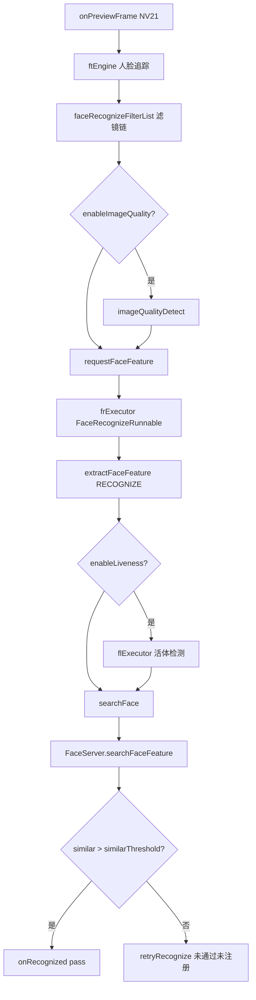

# 人脸比对管线（FaceHelper → FaceServer）

## 职责边界

| 范围 | 说明 |
|------|------|
| **1:N 识别** | `RegisterAndRecognizeActivity`：`FaceHelper` → `FaceServer.searchFaceFeature` → 阈值判断 |
| **1:1 比对** | Liveness 系列：`LivenessDetectViewModel.RecognizeOneOnOneFace` → `FaceEngine.compareFaceFeature`（**不经过** FaceServer 搜索） |
| **注册** | `FaceServer.registerNv21` / `FacePhotoViewModel.registerFromFile`（登录初始化） |
| **本文重点** | FaceHelper 帧处理管线、滤镜、FaceServer 搜索、阈值配置 |

---

## 涉及类

| 类名 | 路径 | 职责 | 调用方 |
|------|------|------|--------|
| `FaceHelper` | `util/face/FaceHelper.java` | 追踪、质量、活体、特征提取、搜索 | `RecognizeViewModel`、`LivenessDetectViewModel` |
| `FaceServer` | `faceserver/FaceServer.java` | 特征库 init、注册、searchFaceFeature | FaceHelper、ViewModel |
| `RecognizeViewModel` | `ui/viewmodel/RecognizeViewModel.java` | 1:N 配置 `RecognizeConfiguration` | RegisterAndRecognizeActivity |
| `LivenessDetectViewModel` | `ui/viewmodel/LivenessDetectViewModel.java` | 1:1 compare、getFeature | Liveness Activities |
| `RecognizeConfiguration` | `util/face/model/RecognizeConfiguration.java` | 阈值、滤镜开关、活体参数 | FaceHelper.Builder |
| `ConfigUtil` | `util/ConfigUtil.java` | SharedPreferences 读取各阈值默认值 | ViewModel、LivenessDetectViewModel |
| `FaceSizeFilter` | `util/face/facefilter/FaceSizeFilter.java` | 人脸边长限制 | FaceHelper |
| `FaceMoveFilter` | `util/face/facefilter/FaceMoveFilter.java` | 人脸移动限制 | FaceHelper |
| `FaceRecognizeAreaFilter` | `util/face/facefilter/FaceRecognizeAreaFilter.java` | 识别区域限制 | FaceHelper |
| `FaceDatabase` / `FaceDao` | `facedb/` | 人脸特征 SQLite | FaceServer |
| `CompareResult` | `ui/model/CompareResult.java` | 相似度、FaceEntity、compareCode | 回调链 |

---

## FaceHelper 帧管线（1:N）



### 滤镜（FaceRecognizeFilter）

在 `FaceHelper` 构造函数中按 `RecognizeConfiguration` 添加：

| 滤镜 | 开关 | 参数 | 作用 |
|------|------|------|------|
| `FaceSizeFilter` | `enableFaceSizeLimit` | `faceSizeLimit`（默认推荐 160） | 过滤过小人脸 |
| `FaceMoveFilter` | `enableFaceMoveLimit` | `faceMoveLimit`（默认 20 像素） | 过滤抖动过大 |
| `FaceRecognizeAreaFilter` | `enableFaceAreaLimit` | `recognizeArea` Rect | 限制识别区域 |

`RecognizeViewModel` 通过 `ConfigUtil` 设置是否启用及阈值。

---

## FaceServer.searchFaceFeature

```java
searchResult = faceEngine.searchFaceFeature(faceFeature);
// similar = searchResult.getMaxSimilar()
faceEntity = faceDao.queryByFaceId(faceFeatureInfo.getSearchId())
```

- 返回 `CompareResult(faceEntity, similar, compareCode, cost)`
- `FaceHelper.searchFace`：`pass = similar > recognizeConfiguration.getSimilarThreshold()`

---

## 1:1 管线（Liveness 查验）

| 步骤 | 说明 |
|------|------|
| 刷卡后 | `AESUtils.decryptRegisterFileToBitmap(id)` → `getFeature(bitmap)` 得 `mainFeature` |
| 预览帧 | `onPreviewFrameOnfaceFeature(nv21, faceFeature)` |
| 质量门控 | `faceScore < getImageQualityNoMaskRegisterThreshold` 则 return -1 |
| 提取 | `extractFaceFeature(..., ExtractType.RECOGNIZE, ...)` |
| 比对 | `compareFaceFeature(mainFeature, faceFeature, faceSimilar)` |
| 阈值 | `pass = faceSimilar.getScore() > ConfigUtil.getRecognizeThreshold()` |
| 回调 | `FaceFeatureCallback.onFaceFeatureAvailable(headBmp, score, faceScore, pass)` |

---

## 阈值一览（ConfigUtil 默认值）

| 配置项 | Preference key / 常量 | 默认值 | 用于 |
|--------|----------------------|--------|------|
| 识别相似度 | `preference_recognize_threshold` / `RECOMMEND_RECOGNIZE_THRESHOLD` | **0.80** | 1:N pass、1:1 pass |
| 图像质量（识别无口罩） | `IMAGE_QUALITY_NO_MASK_RECOGNIZE_THRESHOLD` | 0.49 | FaceHelper 质量 |
| 图像质量（注册无口罩） | `IMAGE_QUALITY_NO_MASK_REGISTER_THRESHOLD` | **0.63** | 1:1 质量门控、截图条件 |
| 图像质量（识别戴口罩） | `IMAGE_QUALITY_MASK_RECOGNIZE_THRESHOLD` | 0.29 | 戴口罩场景 |
| RGB 活体 | `RECOMMEND_RGB_LIVENESS_THRESHOLD` | 0.50 | 活体 |
| IR 活体 | `RECOMMEND_IR_LIVENESS_THRESHOLD` | 0.50 | 活体 |
| 活体 FQ | `RECOMMEND_LIVENESS_FQ_THRESHOLD` | 0.65 | 活体 |
| 人脸大小限制 | `RECOMMEND_FACE_SIZE_LIMIT` | 160 | FaceSizeFilter |
| 人脸移动限制 | `RECOMMEND_FACE_MOVE_LIMIT` | 20 | FaceMoveFilter |

`RecognizeConfiguration.Builder` 默认 `similarThreshold = 0.8f`；运行时 `RecognizeViewModel` 使用 `ConfigUtil.getRecognizeThreshold(context)`。

**比对公式**（FaceHelper 756-765 行）：

```text
pass = compareResult.getSimilar() > recognizeConfiguration.getSimilarThreshold()
```

---

## public / 关键方法

| 类 | 方法 | 说明 |
|----|------|------|
| `FaceHelper` | `onPreviewFrame` | 帧入口 |
| `FaceHelper` | `searchFace` | 1:N 搜索 + 回调 |
| `FaceHelper` | `requestFaceFeature` | 提交特征提取任务 |
| `FaceServer` | `init(Context, callback)` | 加载引擎 + DB 特征 |
| `FaceServer` | `searchFaceFeature(feature, engine)` | 库内搜索 |
| `FaceServer` | `registerNv21` | 预览注册单人脸 |
| `LivenessDetectViewModel` | `getFeature(Bitmap)` | 注册图特征（刷卡后） |
| `LivenessDetectViewModel` | `RecognizeOneOnOneFace` | 1:1 比对 |
| `ConfigUtil` | `getRecognizeThreshold` 等 | 读 SharedPreferences |

---

## 异常分支

| 场景 | 行为 |
|------|------|
| `searchFaceFeature` 无结果 | `retryRecognizeDelayed` |
| similar ≤ threshold | 提示「未通过：未注册」 |
| 特征提取失败 | `changeRecognizeStatus TO_RETRY` |
| 活体未通过 | `retryLivenessDetectDelayed` |
| `frThreadQueue` 满 | `ERROR_BUSY` |
| 1:1 质量不足 | `RecognizeOneOnOneFace` return -1，无回调 |
| 1:1 失败 3s | `onFaceFeatureAvailable false` → `chechFailed`（Liveness） |

---

## SP / InfoStorage 键

人脸阈值存 **默认 SharedPreferences**（`ConfigUtil` / `PreferenceManager`），键名为 `R.string.preference_*`，**非** InfoStorage。

---

## 渠道差异

ArcFace `APP_ID`/`SDK_KEY`/`ACTIVE_KEY` 在 `Constants` 全渠道相同；人脸管线无 flavor 分支。卡面 UI 不影响比对算法。

---

## 联调清单

- [ ] 首次登录 `registerFromFile` 后 `FaceServer` 人脸数 > 0
- [ ] 1:N：相似度 >0.80 识别通过；注册图 `userName` 等于 `LongTermPass.id`
- [ ] 1:1：刷卡后比对证件注册图，失败 3s 写失败记录
- [ ] `RecognizeSettingsActivity` 改阈值后生效
- [ ] 滤镜：边长/移动/区域限制开关
- [ ] 活体开启时 IR 双摄与 `LivenessType` 配置
- [ ] `searchCost` 日志与性能（FaceServer 内 `ALog.i searchCost`）
