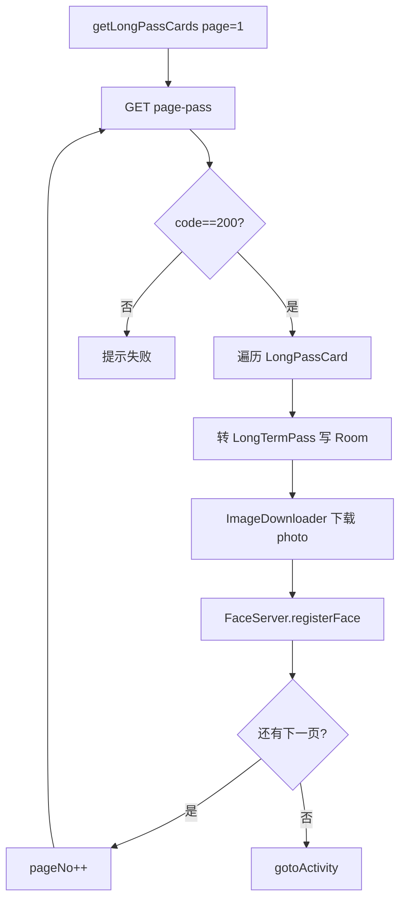

# 通行证同步与人脸注册

## 涉及类

| 类 | 职责 |
|----|------|
| `LoginActivity.getLongPassCards()` | 登录时全量分页同步 |
| `ArcFaceApplication.getLongPassCardsUpdate()` | 周期增量同步 |
| `FacePhotoViewModel` | 批量注册进度与释放引擎 |
| `FaceRepository` | 人脸分页、删除、计数 |
| `FaceServer` | ArcFace register/search |
| `ImageDownloader` | 下载证件照 + AES 落盘 |
| `LongPassCardsReInitUtils` | 凌晨 1 点完整性检查 |
| `LongPassCardsRemedialMeasuresUtils` | 运维补救批量修复 |
| `DuplicateFaceCleanupUtils` | 去重 |

## 分页参数

| 场景 | pageSize | 常量 |
|------|----------|------|
| 登录全量 | 20 | `LoginActivity.PAGE_SIZE` |
| 增量更新 | 20 | `ArcFaceApplication.UPDATE_PAGE_SIZE` |

公共 query 参数：`timestamp`（毫秒）、`pageNo`、`pageSize`。

## 全量同步流程（登录）



触发条件（`LoginActivity`）：

```java
if (isFirstStart || ObjectUtils.isEmpty(localPassList)) {
    getLongPassCards();
} else {
    startUpDataToServer();
    gotoActivity();
}
```

## 增量同步流程（周期任务）

`startPeriodicTask()` 每次执行调用 `getLongPassCardsUpdate()`：

1. GET `passCount` → 服务端 `total`
2. `localCount = db.longTermPassDao().getCount()`
3. 若 `total > localCount`：从 `updatePage=1` 分页拉取
4. 仅处理本地不存在的 `id`（按 updateTime 去重逻辑在实现中）
5. 新人脸：下载 → 注册 → 写 DB

周期：`infoStorage.getInt("interval", 5)` **分钟**。

## 单条通行证处理

| 步骤 | 说明 |
|------|------|
| 解析 | `LongPassCard` → `LongTermPass` 字段映射 |
| 复杂字段 | `leadingPeople`、`timeControl` 序列化 JSON 存 DB |
| 图片 | `photo` 字段为服务端 path → `fileStreamUrl(photo)` 下载 |
| 加密 | AES 密钥见 `ImageDownloader.KEY`（16 字节） |
| 注册 | Bitmap → `FaceServer.registerFace(context, bitmap, nickname)` |
| 失败 | POST `checkAbnormalCreate` 上报异常 |

## 人脸注册细节

`FaceServer`：

- 最大 **30000** 张（`MAX_REGISTER_FACE_COUNT`）
- 特征存 `FaceEntity.featureData`（BLOB）
- 内存 `faceRegisterInfoList` 用于快速 1:N
- 引擎双实例：`faceEngine`（检测）、`frEngine`（识别）视版本而定

## 图片加密与展示

| 环节 | 类 |
|------|-----|
| 下载加密 | `ImageDownloader` + `AESUtils` |
| Glide 加载 | `EncryptedGlideFile` → `EncryptedFileDecoder` |
| Module 注册 | `SecureGlideModule` |

卡面展示见 [09-pass-card-ui.md](./09-pass-card-ui.md)。

## 数据完整性工具

### LongPassCardsReInitUtils（凌晨 1 点）

- 对比通行证数量与人脸库数量
- 不一致时触发重新拉取/注册
- SP 标志 `reinit_check` 防重复

### LongPassCardsRemedialMeasuresUtils（运维手动）

- 批量扫描缺失 `photoBytes` 或无人脸的通行证
- 带 `RemedialProgressCallback` 进度
- RxJava 链式处理，失败数统计

### DuplicateFaceCleanupUtils

- 按 nickname 或特征查重
- 保留最新一条，删除重复 `FaceEntity`

## 本地表 long_term_pass

主键：`id`（通行证 ID）  
`updateTime` 用于增量判断  
完整字段见 [17-entity-models.md](./17-entity-models.md)。

## 相关文档

- 登录触发 → [04-login-and-auth.md](./04-login-and-auth.md)
- 人脸库 API → [15-face-database.md](./15-face-database.md)
- 定时任务 → [18-background-jobs.md](./18-background-jobs.md)
