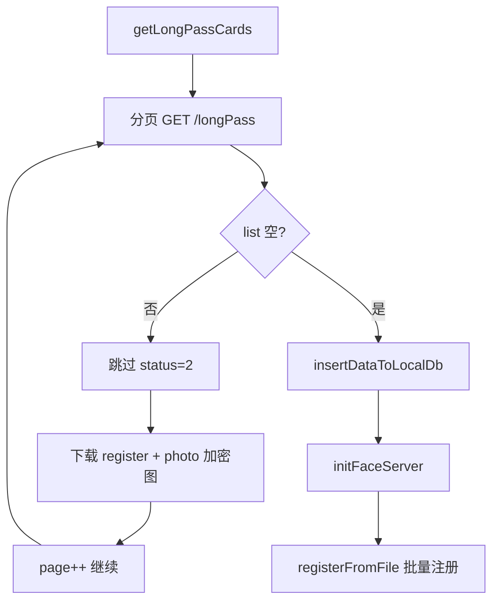

# 全量通行证同步：LoginActivity.getLongPassCards

源码：`app/src/main/java/com/arcsoft/arcfacedemo/ui/activity/LoginActivity.java`

首次登录或需要拉取全量长期通行证时调用，分页下载图片、写入本地 DB、批量注册人脸。

---

## 触发时机

登录流程中，当需要初始化本地通行证数据时调用 `getLongPassCards()`（例如首次启动 `isFirstStart` 分支）。

---

## 成员变量

| 变量 | 值/说明 |
|------|---------|
| `page` | 当前页码，从 1 开始 |
| `PAGE_SIZE` | `20`，每页条数 |
| `longTermPassDao` | Room DAO |
| `latch` | `CountDownLatch(1)`（当前循环内使用，实际单页请求后即 break） |

---

## 逐步流程

### 步骤 1：初始化

```text
longPassCardList = new ArrayList<>()
longTermPassDao = ArcFaceApplication.getApplication().getDb().longTermPassDao()
params = { timestamp, pageNo=page, pageSize=20 }
latch = CountDownLatch(1)
显示 Snackbar「注册中请稍候」，停止按钮 → finish()
```

### 步骤 2：AsyncTask 后台循环

`AsyncTask.execute(() -> { while (true) { ... } })`

#### 2.1 构造请求

- `GET UrlConstants.URL_GetLongPass`
- 每次刷新 `timestamp = System.currentTimeMillis()`
- Header：`tenant-id`；若有 `ApiUtils.accessToken` 则 `Authorization: Bearer ...`
- **同步** `call.execute()`（必须在子线程）

#### 2.2 HTTP 200 且业务 code 200

- 解析 `ApiResponse<LongPassCards>`
- 若 `data.list` 非空：

**对每条 `LongPassCard`：**

1. UI 更新 Snackbar：`正在下载：{nickname}，第{page}页`
2. **`status == 2`（注销）**：`continue`，跳过下载
3. **register 目录**：`getExternalFilesDir(null)/register`
   - `ImageDownloader.downloadImage(dir, checkPhoto, id, nickname, zip=false)`
4. **photo 目录**：`getExternalFilesDir(null)/photo`
   - `ImageDownloader.downloadImage(dir, photo, id, nickname, zip=true)`

5. `longPassCardList.addAll(list)`
6. `page++`，更新 `params.pageNo`
7. `latch.countDown()` → **`continue`** 请求下一页

- 若 `list` 为空：**`break`** 结束分页

#### 2.3 业务 code 非 200

- `showWarningToast(msg)`
- `page = 1`，`longPassCardList.clear()`，**`break`**

#### 2.4 异常

- Toast「获取通信证接口数据失败」
- `page = 1`，清空列表，`latch.countDown()`，**`break`**

#### 2.5 非 200 HTTP

- 循环末尾 **`break`**（只请求一页失败后退出）

### 步骤 3：收尾 UI

```text
runOnUiThread → snackbar.dismiss()
若 longPassCardList.size() > 0:
    page = 1
    insertDataToLocalDb(longPassCardList)
```

---

## insertDataToLocalDb

| 步骤 | 说明 |
|------|------|
| 1 | `ThreadUtils.executeByCached` 后台 |
| 2 | `Converters.convertToLongTermPass` 逐条转换 |
| 3 | `longTermPassDao.insertAll(longTermPassList)` **全量插入** |
| 4 | `infoStorage.saveString("startDate", DeviceUtils.getCurrentTime())` |
| 5 | 主线程：`dismissProgressDialog`、`isFirstStart=false`、Toast 成功 |
| 6 | `initFaceServer()` |
| 7 | `registerFace()` → `registerFromFile(register目录)` |

---

## 与增量的差异

| 维度 | 全量 getLongPassCards | 增量 getLongPassCardsUpdate |
|------|----------------------|----------------------------|
| 时间范围 | 无 startDate/endDate | `startDate` ~ `now` |
| 分页大小 | 20 | `UPDATE_PAGE_SIZE`（Application 内 10） |
| DB 写入 | `insertAll` | `insertOrUpdateUsers` |
| 注销 status=2 | 跳过不下载 | 删除本地图片 |
| 人脸更新 | 批量 `registerFromFile` | `updateFace` 逐条注册 |

---

## 数据流图



---

## 相关类

- `ImageDownloader`：Glide 下载 + AES 落盘
- `Converters`：API 模型 → `LongTermPass`
- `FacePhotoViewModel.registerFromDecryptFile`：批量解密注册
