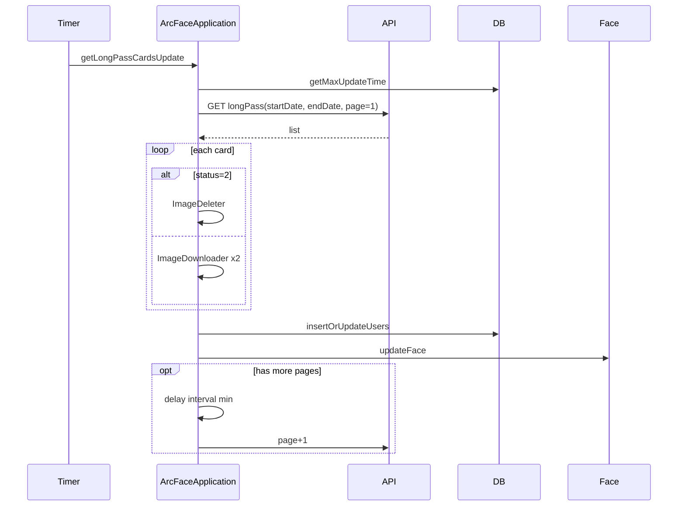

# 增量通行证同步：ArcFaceApplication

源码：`app/src/main/java/com/arcsoft/arcfacedemo/ArcFaceApplication.java`

后台定时任务中周期性拉取**变更区间**内的通行证，更新本地 DB 与人脸库。

---

## 调度入口

`startUpDataToServer()` 内固定速率任务（生产：`interval * 60 * 1000` ms，默认 interval 来自 `infoStorage`）每次执行：

1. 心跳 `UrlConstants.heartbeat`
2. **`getLongPassCardsUpdate()`**
3. 内存/CPU 监控等

另有凌晨 1 点 `LongPassCardsReInitUtils` 完整性检查（独立文档）。

---

## 并发控制：updateNext

| 状态 | 行为 |
|------|------|
| `updateNext == false` | `getLongPassCardsUpdate` 直接 return（上一批分页链未结束） |
| 进入同步 | `updateNext = false` |
| 本页无下一页 / 完成 | `updateNext = true` |
| 下载失败提前 return | `updateNext = true`（允许下次重试） |

---

## getLongPassCardsUpdate 流程

### 1. 计算 startDate

```text
startDate = db.longTermPassDao().getMaxUpdateTime()
若为空 → "2025-06-11 10:56:00"
TEST 模式 → 强制 "2025-06-11 10:56:00"
endDate = DeviceUtils.getCurrentTime()
```

### 2. 请求参数

| 参数 | 值 |
|------|-----|
| pageNo | `updatePage`（每轮任务重置为 1） |
| pageSize | `UPDATE_PAGE_SIZE`（10） |
| startDate | 上一步 |
| endDate | 当前时间 |
| timestamp | 每次请求刷新 |

### 3. fetchNextPage(params)

同步 `GET URL_GetLongPass`，Header 同全量同步。

---

## fetchNextPage 单页逻辑

### 成功且 list 非空

对每条 `LongPassCard`（**非 TEST 模式**）：

#### status == 2（注销）

1. 删除 `register/{checkPhoto}.jpg` → `ImageDeleter.deleteImage`
2. 删除 `photo/{photo}.jpg`

#### status != 2（有效/变更）

1. 下载 `checkPhoto` → register（`zip=false`）
2. 下载 `photo` → photo（`zip=true`）
3. **任一下载失败**：`updateNext=true`，**return**（不翻页）

然后：

- `needFetchNext = true`
- `longPassCardList.addAll(list)`

### list 为空

- 日志「更新通行证数据为空」
- 不设置 `needFetchNext`

### 业务 401

- 跳转 `LoginActivity`（`auto=true`）
- `updateNext = true`，return

### 业务其他非 200

- 打日志，不翻页

### 收尾

```text
若非 TEST: handleUpdateComplete(longPassCardList)

若 needFetchNext:
    延迟 interval 分钟（infoStorage "interval", 默认 UPDATE_DELAY_TIME）
    pageNo + 1 → fetchNextPage(params)
否则:
    updateNext = true
```

---

## handleUpdateComplete

```text
if longPassCardList.size() > 0:
    updateLocalDatabase(list)
updatePage = 1
```

---

## updateLocalDatabase

| 步骤 | 说明 |
|------|------|
| 转换 | `Converters.convertToLongTermPass` |
| 写入 | `longTermPassDao().insertOrUpdateUsers`（**增量 upsert**） |
| 人脸 | `updateFace(longPassCardList)` |

> 全量同步用 `insertAll`；增量用 `insertOrUpdateUsers`，按主键/业务键更新。

---

## updateFace

对列表中每条：

```text
DuplicateFaceCleanupUtils.prepareRegisterFace(id)  // 清同 user 旧证 + 当前 id 旧特征
bitmap = AESUtils.decryptRegisterFileToBitmap(id)
registerFaceByBitmap(bitmap, id)
```

`registerFaceByBitmap` 内部走 `FaceServer.registerJpeg` 等注册链路。

---

## 增量 vs 全量对照

| 项目 | 增量 | 全量（LoginActivity） |
|------|------|----------------------|
| 接口 | 同 `URL_GetLongPass` | 同 |
| 时间过滤 | startDate ~ endDate | 无 |
| pageSize | 10 | 20 |
| 注销处理 | 删本地图 | 跳过不下载 |
| DB | insertOrUpdateUsers | insertAll |
| 人脸 | updateFace 逐条 | registerFromFile 批量 |
| 翻页间隔 | 可配置分钟延迟 | 连续 while |
| 失败重入 | updateNext 门闩 | 清空重试 |

---

## 时序图


