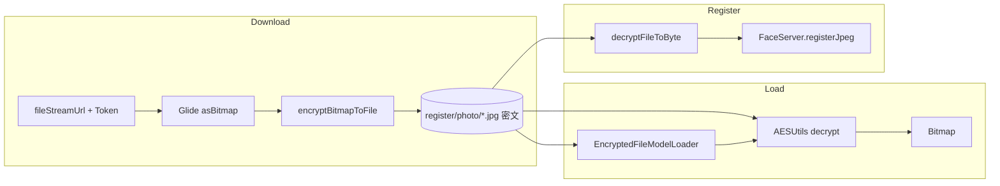

# 加密图片管线：ImageDownloader / AESUtils / Glide

涉及文件：

- `util/ImageDownloader.java` — 远程下载 + 加密落盘
- `util/glide/AESUtils.java` — AES 加解密
- `util/glide/SecureGlideModule.java` — Glide 模块注册
- `util/glide/EncryptedFileModelLoader.java` — 加密文件 → InputStream
- `util/glide/EncryptedFileDecoder.java` — 加密 File → Bitmap
- `util/glide/EncryptedGlideFile.java`（Model 包装类，由 Module 引用）

---

## 密钥与算法

| 项 | 值 |
|----|-----|
| 算法 | `AES`（`Cipher.getInstance("AES")`） |
| 密钥字符串 | `1Hbfh667adfDEJ78`（16 字节） |
| IV | 与密钥相同字符串的 UTF-8 字节（`FIXED_IV`） |
| 生成 | `AESUtils.generateKey()` → `SecretKeySpec` |

> 注释标明演示用途；生产应使用 Keystore。

---

## 下载加密落盘：ImageDownloader

### `downloadImage(File directory, String imageUrl, String imageName, String nickname, boolean zip)`

#### 链路

```text
1. 目标文件: {directory}/{imageName}.jpg
2. baseUrl = UrlConstants.fileStreamUrl(imageUrl)
3. GlideUrl + Authorization Bearer (ApiUtils.getAccessToken())
4. Glide.with(app).asBitmap().load(glideUrl)
     .encodeFormat(JPEG)
     .diskCacheStrategy(NONE)
     .submit() → FutureTarget.get()
5. 可选 zip=true → compressBitmap (max边 400px 缩放)
6. AESUtils.encryptBitmapToFile(bitmap, file, generateKey())
```

#### 返回值

- `true`：下载并加密成功
- `false`：bitmap 空/回收、压缩失败、加密异常

#### compressBitmap

- 最长边 > 400 时等比缩小
- 不回收原始 bitmap（避免误用）

#### 其他

- `encrypt(InputStream, OutputStream, key)`：流式 AES（CipherOutputStream）
- `unsafeOkHttpClient()`：信任所有证书（SSL）

---

## AESUtils 加解密

### 加密：`encryptBitmapToFile(bitmap, outputFile, key)`

```text
bitmap → PNG 100% → byte[]
Cipher ENCRYPT_MODE + IvParameterSpec(FIXED_IV)
doFinal → 写入文件（密文，非标准图片格式）
```

### 解密读取

| 方法 | 路径规则 |
|------|----------|
| `decryptRegisterFileToBitmap(fileName)` | `externalFilesDir/register/{fileName}.jpg` |
| `decryptPhotoFileToBitmap(fileName)` | `externalFilesDir/photo/{fileName}.jpg` |
| `decryptFileToBitmap(dir, fileName)` | `externalFilesDir/{dir}/{fileName}.jpg` |
| `decryptFileToBitmap(filePath)` | 绝对路径 |
| `decryptFileToBitmap(File, SecretKey)` | 指定文件+密钥 |
| `decryptFileToByte(...)` | 同上，返回 byte[] |

流程：读密文 → DECRYPT_MODE → `BitmapFactory.decodeByteArray`

### 路径工具

- `getRegisterPath(name)` / `getPhotoPath(name)`

---

## Glide 集成

### SecureGlideModule（@GlideModule）

`registerComponents`：

1. **网络**：`OkHttpUrlLoader` + `OkHttpUtils.getUnsafeOkHttpClient()`  
   - 解决自签名 HTTPS `SSLHandshakeException`
2. **本地加密文件**：  
   `registry.append(EncryptedGlideFile.class, InputStream.class, EncryptedFileModelLoader.Factory(secretKey))`

### EncryptedFileModelLoader

- `handles`：文件存在
- `buildLoadData`：`EncryptedStreamFetcher`
- **Fetcher**：`AESUtils.decryptFileToByte(file, key)` → `ByteArrayInputStream`
- `DataSource.LOCAL`

### EncryptedFileDecoder

- `ResourceDecoder<File, Bitmap>`
- `decode` → `AESUtils.decryptFileToBitmap(source, secretKey)` → `BitmapResource`

### 下载场景 vs 展示场景

| 场景 | 使用组件 |
|------|----------|
| 通行证同步下载 | `ImageDownloader`：Glide 拉 **网络 Bitmap** → AES 写盘 |
| UI 加载本地密文 | `EncryptedGlideFile` + ModelLoader，或业务直接 `AESUtils.decrypt*` |
| 人脸注册 | `AESUtils.decryptRegisterFileToBitmap` / `decryptFileToByte` |

---

## 目录约定

| 目录 | 内容 | zip |
|------|------|-----|
| `register/` | 查验照 `checkPhoto`，`{passId}.jpg` 密文 | false |
| `photo/` | 证件照 `photo`，`{passId}.jpg` 密文 | true（压缩后加密） |

`imageName` / `fileName` 均为通行证 **`id`**（非 nickname）。

---

## 端到端数据流



---

## 调用方摘要

| 调用方 | 方法 |
|--------|------|
| LoginActivity 全量同步 | `ImageDownloader.downloadImage` ×2 |
| ArcFaceApplication 增量 | 同上；注销用 `ImageDeleter` |
| LongPassCardsRemedialMeasuresUtils | 补救下载同上 |
| ArcFaceApplication.updateFace | `AESUtils.decryptRegisterFileToBitmap` |
| Remedial registerFromFile | `AESUtils.decryptFileToByte(file)` |
