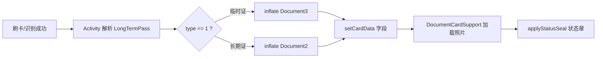

# 证卡 UI 框架（Document1/2/3）

> 源码：`ui/fragment/Document*.java`、`DocumentCardSupport`、`DocumentCardUiHelper`

查验页刷卡/识别人脸通过后，在界面右侧（或指定 `tipsLoc`）展示 **长期证 Document2** 或 **临时证 Document3** 卡面。

---

## 类层次结构

```text
Fragment
├── Document1          main/          旧版/简化卡面
├── Document11         main/          变体
├── AbstractDocument2  main/          长期证抽象基类
│   ├── Document2      yinchuan/
│   ├── Document2      chongqing/
│   ├── Document2      shihezi/
│   └── Document2      luoyang/       区域徽章网格
└── AbstractDocument3  main/          临时证抽象基类
    ├── Document3      各 flavor/     渠道覆盖 layout 绑定
```

**编译规则**：运行时只存在当前 flavor 的 `Document2`/`Document3` 具体类，与 `main` 中抽象类链接。

---

## 数据绑定流程



Activity 侧典型步骤：

1. `FragmentTransaction.replace(R.id.document_container, documentFragment)`
2. 设置 `nickname`、`idCode`、`companyName`、`expiryDate`、`areaDisplayCode`、`templateType`、`status` 等
3. 调用 `DocumentCardSupport.loadLongTermCardPhoto` 或 `loadTemporaryCardPhoto`

---

## AbstractDocument2 契约

| 方法 | 职责 |
|------|------|
| `getLayoutResId()` | 返回 `R.layout.document2`（各渠道可共用 layout 或 flavor 覆盖 layout） |
| `bindViews(View)` | findViewById 绑定控件 |
| `bindCardContent()` | 把成员字段刷到 TextView/ImageView |

**公共字段**（基类 protected）：`nickname`、`idCode`、`companyName`、`expiryDate`、`startDate`、`areaDisplayCode`、`templateType`、`status`、`photo`、`passid` 等。

---

## 渠道 UI 差异详表

### Document2（长期证）

| 渠道 | layout | 独有控件/逻辑 |
|------|--------|---------------|
| 银川 | `document2` | `access_area` 单行；`img_color` 黄条（templateType=2 或证号 C/B 开头）；`faceSimilar` |
| 重庆 | `document2` | 渠道 `bindViews` 字段与银川类似，资源可能不同 |
| 石河子 | `document2` | 接近默认抽象实现 |
| 洛阳 | `document2` | `access_area_badges` **4 列徽章**；`DocumentCardUiHelper.formatValidityPeriod`；`luoyang_area_badge_outline` |

洛阳 `bindCardContent` 片段逻辑：

```java
DocumentCardUiHelper.bindAreaBadgeGrid(accessAreaBadges, areaDisplayCode,
    R.drawable.luoyang_area_badge_outline, AREA_BADGE_TEXT_COLOR, 4);
```

### Document3（临时证）

各 flavor 继承 `AbstractDocument3`，差异主要在：

- layout 中单位、引领人、有效次数等字段是否显示
- 洛阳 `SUPPORTS_TEMPORARY_PASS=false`，**实际不会进入 Document3**

---

## DocumentCardSupport

| 方法 | 说明 |
|------|------|
| `applyStatusSeal(overlay, text, status)` | `status` 2/3/4/5 → 显示「已过期」「已停用」等（部分状态注释未启用） |
| `loadLongTermCardPhoto(img, passid, photo, activity)` | 优先本地 `AESUtils.getPhotoPath(passid)` → `EncryptedGlideFile`；否则远程 URL + Bearer |
| `loadTemporaryCardPhoto(...)` | 同长期证路径逻辑 |
| `loadRemotePhoto(...)` | OkGo Header：`tenant-id`、`Authorization` |

---

## DocumentCardUiHelper

| 方法 | 说明 |
|------|------|
| `formatValidityPeriod(start, end)` | 洛阳有效期展示格式 |
| `bindAreaBadgeGrid(container, areaCode, drawable, textColor, columns)` | 将区域码拆成多枚徽章 |

---

## 与查验模式关系

| checkType | 常用 Document |
|-----------|---------------|
| 刷卡+人脸 | Document2 或 3 |
| 纯人脸出区 | 可能 Document1/11 或简化信息条 |

具体 inflate 分支见各 Activity 专篇 [05-check/](../05-check/)。

---

## 照片加载失败排查

| 现象 | 检查 |
|------|------|
| 空白证件照 | `register/` 或 `photo/` 下 passid 文件；网络 URL |
| 解密失败 | AES 密钥是否与下载一致 |
| 远程 401 | `ApiUtils.accessToken` 是否有效 |
| 洛阳无临时证 UI | `SUPPORTS_TEMPORARY_PASS` |

---

## 扩展新渠道卡面

1. 在 `app/src/newflavor/` 添加 `Document2.java` / `Document3.java`
2. 可选覆盖 `res/layout/document2.xml`
3. 在 `ChannelConfig` 配置 `TENANT_*`
4. 复用 `DocumentCardSupport`，勿重复写 Glide/AES 逻辑
