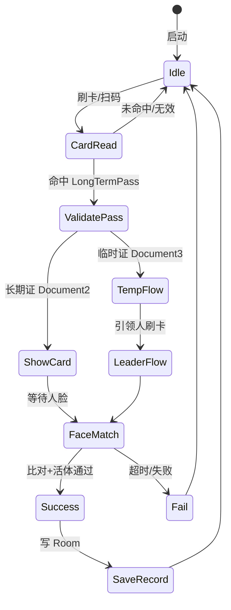

# 刷卡+人脸查验流程

适用于 `LivenessDetectJinActivity`、`LivenessDetectYuanActivity`、`LivenessDetectYuanAndJinActivity`。

## 核心类

| 类 | 职责 |
|----|------|
| `LivenessDetectViewModel` | 识别状态、Fragment 切换、比对结果处理 |
| `FaceHelper` | 检测、特征、活体、滤镜链 |
| `FaceServer` | 1:N `searchFace()` |
| `DualCameraHelper` | RGB/IR 双摄预览 |
| `SerialManage` | 二维码串口 |
| `CardSerialConfigUtil` | RFID 串口参数 |
| `AbstractDocument2` / `Document2` | 长期证卡面 |
| `AbstractDocument3` / `Document3` | 临时证卡面 |
| `DocumentCardSupport` | 状态章、加密图 |
| `SoundManager` | 成功/失败提示音 |
| `VerifyFeatureSettings` | 控制 `needVerify` 标记 |

## Activity 启动初始化

1. 读取 `direction`、`tipsLoc`、离线标志
2. 初始化 `LivenessDetectViewModel`、绑定 `activity_liveness_detect.xml`
3. 打开 RGB/IR 相机（`DualCameraHelper`）
4. 注册 `FaceHelper` 回调，开始预览帧处理
5. 打开 RFID 串口（按 Activity 类型近/远/双路）
6. `SerialManage.open()` 打开二维码串口
7. 显示 idle Fragment（`Document1` 或渠道默认）
8. 顶部显示：`在线/离线模式 + areaName + 进/出查验`

## 状态机（简化）

## 长期证校验项

刷卡命中 `LongTermPass` 后依次检查：

| 检查项 | 字段/逻辑 |
|--------|-----------|
| 证件状态 | `status == 2` 已注销 → 拒绝 |
| 有效期 | `expiryDate` 与当前日期 |
| 暂扣 | `isWithhold` + 暂扣日期区间 |
| 黑名单 | `isBlacklist` |
| 撤回 | `isWithdraw` |
| 通行区域 | `areaIds` 与设备绑定区域 |
| 时段限制 | `timeControl` JSON 解析 |

通过后展示 `Document2`，启动人脸比对（与卡主特征 1:1 或 1:N 匹配）。

## 临时证流程（非洛阳）

> `ChannelConfig.SUPPORTS_TEMPORARY_PASS == false` 时整个分支跳过

1. 刷临时证 → `type==1` → `Document3`
2. **引领人绑定**：需刷关联长期证（`leadingPeople` / `leadingPeopleId`）
3. 支持**多引领人**：按 `LeadingPeople` 列表逐个校验
4. 人脸比对通过 → `TemporaryCardRecords`

## 人脸比对链路

| 步骤 | 实现 |
|------|------|
| 检测 | `FaceEngine.detectFaces`（RGB 帧） |
| 跟踪 | `FaceHelper` 维护 trackId |
| 滤镜 | `FaceSizeFilter`、`FaceMoveFilter`、`FaceRecognizeAreaFilter` |
| 活体 | IR 帧 `processLiveness` |
| 特征 | `extractFeature` |
| 搜索 | `FaceServer.searchFace` → `CompareResult` |
| 阈值 | `ConfigUtil.getRecognizeThreshold()` 默认 **0.80** |

## 通行记录写入

### 长期证 LongTermRecords

关键字段赋值：

| 字段 | 来源 |
|------|------|
| `id` | `SnowFlake` 或业务 ID 生成 |
| `passid` / `cardId` / `idCode` | 通行证 |
| `direction` | `SPUtils.direction` 转字符串 |
| `sitePhoto` | 现场 AES 加密图本地路径 |
| `faceSimilar` / `faceQuality` | 比对结果 |
| `checkTime` | 当前时间 |
| `needVerify` | `VerifyFeatureSettings.needVerifyForNewRecord()` |
| `area` / `areaName` | 设备绑定区域 |

### 临时证 TemporaryCardRecords

额外包含 `leadingPeopleld`、`parentld` 等引领人关联字段。

上传：见 [10-offline-records-upload.md](./10-offline-records-upload.md)（30 秒周期）。

## UI 辅助

| 功能 | 实现 |
|------|------|
| 底部查验日志 | `CheckLogListAdapter` + `Records` |
| 在线记录弹窗 | `RecordsPopDialog(direction)` |
| 施工人员 | `ConstructionWorkersEntrance` → `ConstructionWorkersActivity` |
| 版本更新 | 启动时 `UpdateUtils` / `UpdatePopDialog` |

## 相关文档

- 查验模式 → [06-check-modes.md](./06-check-modes.md)
- 卡面 UI → [09-pass-card-ui.md](./09-pass-card-ui.md)
- 识别参数 → [14-recognize-settings.md](./14-recognize-settings.md)
