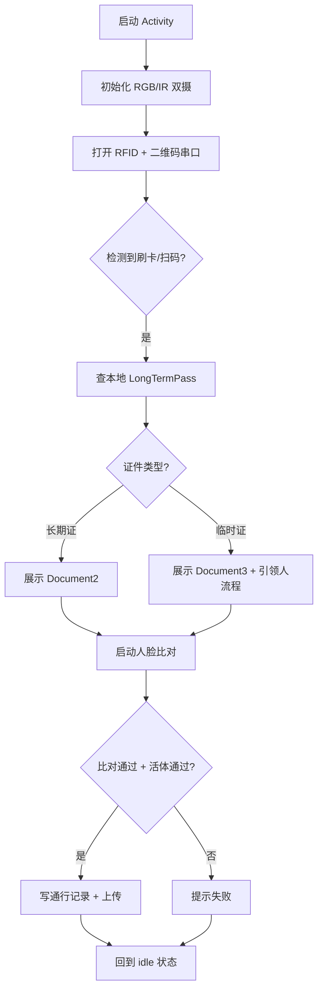

# 刷卡+人脸查验流程

适用于 `LivenessDetectJinActivity`、`LivenessDetectYuanActivity`、`LivenessDetectYuanAndJinActivity`。

## 涉及类

| 类 | 职责 |
|----|------|
| `LivenessDetectViewModel` | 识别状态机、比对逻辑 |
| `FaceHelper` | 相机帧处理、人脸检测与特征提取 |
| `FaceServer` | 1:N 搜索 |
| `SerialManage` | 二维码串口 |
| `CardSerialConfigUtil` | RFID 读卡器串口配置 |
| `AbstractDocument2` / `Document2` | 长期证卡面 |
| `AbstractDocument3` / `Document3` | 临时证卡面 |
| `DocumentCardSupport` | 卡面状态 overlay、加密图加载 |
| `SoundManager` | 提示音 |
| `ConstructionWorkersEntrance` | 施工人员入口图标 |

## 主流程

## 读卡逻辑

### RFID 读卡器

- 串口参数由 `CardSerialConfigUtil` 配置（波特率、端口路径）
- 读到卡号后查 `LongTermPassDao` 匹配 `cardId` 或 `idCode`

### 二维码串口

- `SerialManage` 单例管理二维码扫描枪串口
- 参数由 `QrSerialConfigUtil` 配置

## 长期证流程

1. 刷卡 → 匹配 `LongTermPass`
2. 校验有效期、状态、通行区域
3. 展示渠道定制 `Document2` 卡面
4. 人脸 1:N 比对（与卡主特征比对）
5. 比对通过 → 创建 `LongTermRecords` → 异步上传

## 临时证流程

> 洛阳渠道跳过此流程（`SUPPORTS_TEMPORARY_PASS = false`）

1. 刷临时证 → 展示 `Document3`
2. 需先刷**长期证**（引领人绑定）
3. 再刷**引领人**长期证确认
4. 人脸比对通过后创建 `TemporaryCardRecords`

## 人脸比对

| 步骤 | 类/方法 |
|------|---------|
| 相机帧采集 | `DualCameraHelper` + `FaceHelper` |
| 活体检测 | ArcFace IR 活体 |
| 特征提取 | `FaceHelper.extractFeature()` |
| 1:N 搜索 | `FaceServer.searchFace()` |
| 阈值判断 | `ConfigUtil` 中配置的识别阈值 |

## 通行记录

比对成功后写入本地 Room，由 `ArcFaceApplication.startUpDataToServer()` 定时上传：

| 证件类型 | 实体 | 上传接口 |
|----------|------|----------|
| 长期证 | `LongTermRecords` | `URL_CREATE_LONG_RECORD` |
| 临时证 | `TemporaryCardRecords` | `URL_CREATE_TEMP_RECORD` |

详见 [10-offline-records-upload.md](./10-offline-records-upload.md)。

## Idle 页面

未刷卡时显示 `Document1`（提示页）或渠道默认背景。

## 施工人员入口

布局中嵌入 `ConstructionWorkersEntrance`，点击跳转 `ConstructionWorkersActivity`。详见 [11-construction-workers.md](./11-construction-workers.md)。
