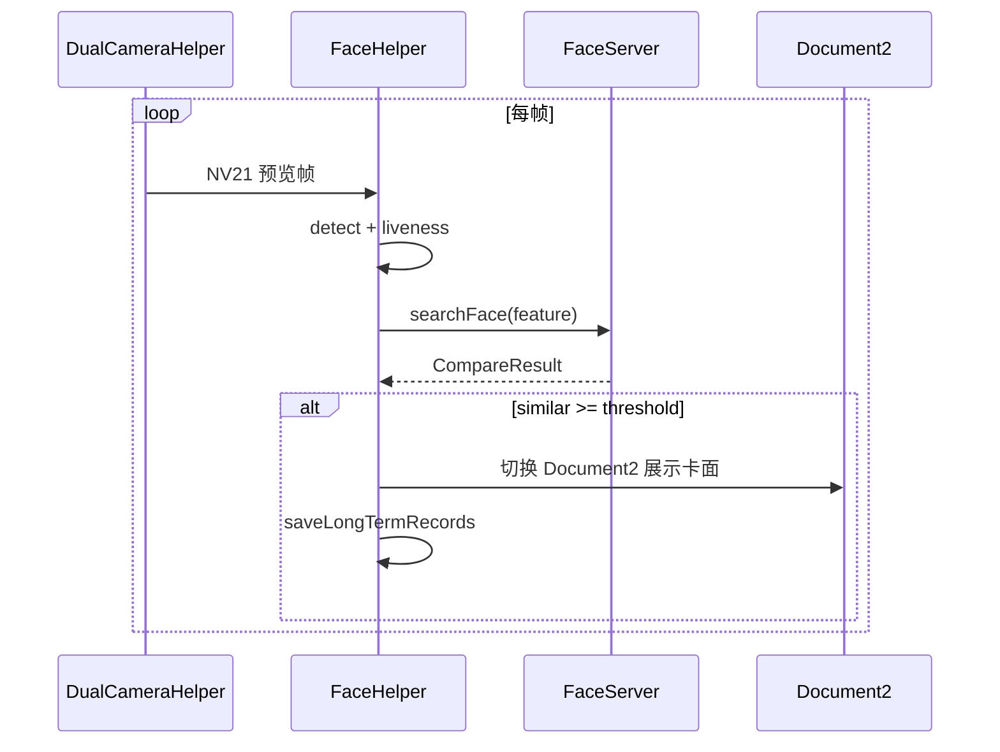

# 纯人脸出区查验

**Activity**：`RegisterAndRecognizeActivity`  
**ViewModel**：`RecognizeViewModel`  
**checkType**：`3`  
**布局**：`activity_register_and_recognize.xml`

## 与刷卡模式对比

| 项目 | 刷卡+人脸 | 纯人脸出区 |
|------|-----------|------------|
| Activity | `LivenessDetect*` | `RegisterAndRecognizeActivity` |
| 读卡/串口 | RFID + 二维码 | 无 |
| Idle UI | `Document1` | `Document11` |
| 比对触发 | 刷卡后等待人脸 | 持续 1:N |
| 典型场景 | 进控制区 | 出控制区 |
| 记录类型 | 长期 + 临时 | 仅长期 |

## 启动流程

1. `RecognizeViewModel` 初始化，`FaceServer.init`
2. `DualCameraHelper` 打开 RGB/IR
3. `FaceHelper` 注册回调 `RecognizeCallback`
4. 默认 Fragment：`Document11`（等待识别提示）
5. 读取 `direction`、`isOffLine` 显示顶部状态

## 识别循环

## RecognizeViewModel 职责

| 方法/逻辑 | 说明 |
|-----------|------|
| 预览配置 | `PreviewConfig` 分辨率、旋转 |
| 人脸框 | `FaceRectView` 坐标变换 |
| 搜索 | 调用 `FaceServer.searchFace` |
| 阈值 | `ConfigUtil.getRecognizeThreshold()` |
| 去重触发 | 短时间同一人不重复写记录 |

## 比对成功后

1. 根据 `CompareResult` 的 `faceId` 查 `LongTermPass`
2. `replace` 为渠道 `Document2` Fragment
3. `DocumentCardSupport` 加载加密头像、状态章
4. 组装 `LongTermRecords`（`direction` 通常为 **-1** 出区）
5. `needVerify` 受 `VerifyFeatureSettings` 控制
6. 播放成功音 `SoundManager`
7. 延时后回到 `Document11`

## 不支持的能力

- 无临时证流程（出区仅长期证人证）
- 无引领人刷卡环节
- 洛阳渠道与刷卡模式相同，仅长期证

## 运维能力

与刷卡页相同：

- 隐藏入口打开 `CustomDrawerPopupView`
- 可切换 direction / checkType（切换后需经 Login 重新路由）
- `RecordsPopDialog` 查在线记录

## 相关文档

- 查验模式 → [06-check-modes.md](./06-check-modes.md)
- 识别参数 → [14-recognize-settings.md](./14-recognize-settings.md)
- 记录上传 → [10-offline-records-upload.md](./10-offline-records-upload.md)
