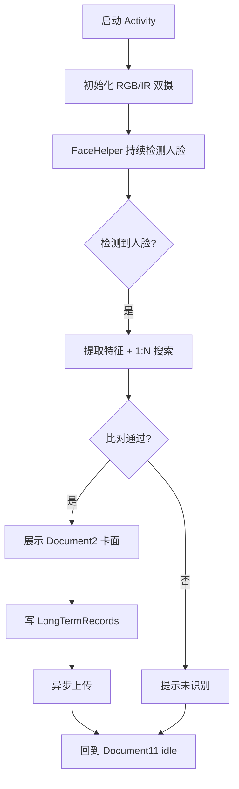

# 纯人脸出区查验

适用于 `RegisterAndRecognizeActivity`（checkType = 3）。

## 涉及类

| 类 | 职责 |
|----|------|
| `RegisterAndRecognizeActivity` | 出区查验主界面 |
| `RecognizeViewModel` | 识别状态与搜索逻辑 |
| `FaceHelper` | 相机帧处理 |
| `FaceServer` | 1:N 搜索 |
| `Document11` | Idle 提示页 Fragment |
| `AbstractDocument2` / `Document2` | 识别成功后展示长期证卡面 |

## 与刷卡模式的差异

| 对比项 | 刷卡+人脸 | 纯人脸出区 |
|--------|-----------|------------|
| Activity | `LivenessDetect*Activity` | `RegisterAndRecognizeActivity` |
| ViewModel | `LivenessDetectViewModel` | `RecognizeViewModel` |
| 读卡器 | RFID + 二维码串口 | 无 |
| 触发方式 | 先刷卡再人脸 | 直接人脸 1:N |
| Idle 页 | `Document1` | `Document11` |
| 用途 | 进控制区 | 出控制区 |

## 主流程

## 识别逻辑

`RecognizeViewModel` 核心步骤：

1. `FaceHelper` 从 RGB 相机帧检测人脸
2. IR 相机帧做活体检测
3. 提取 `FaceFeature` 调用 `FaceServer.searchFace()`
4. 返回 `CompareResult`（含相似度、匹配的 `FaceEntity`）
5. 相似度 ≥ 阈值 → 查 `LongTermPass` 展示卡面

## 卡面展示

识别成功后：

1. 根据 `FaceEntity.faceId` 关联 `LongTermPass`
2. 加载渠道定制 `Document2` Fragment
3. `DocumentCardSupport` 处理状态章、AES 解密照片

## 通行记录

与刷卡模式相同，写入 `LongTermRecords` 并定时上传，详见 [10-offline-records-upload.md](./10-offline-records-upload.md)。

## 运维功能

同样支持 `CustomDrawerPopupView` 侧边栏（连续点击隐藏区域触发），可切换进出方向、查验模式等。
