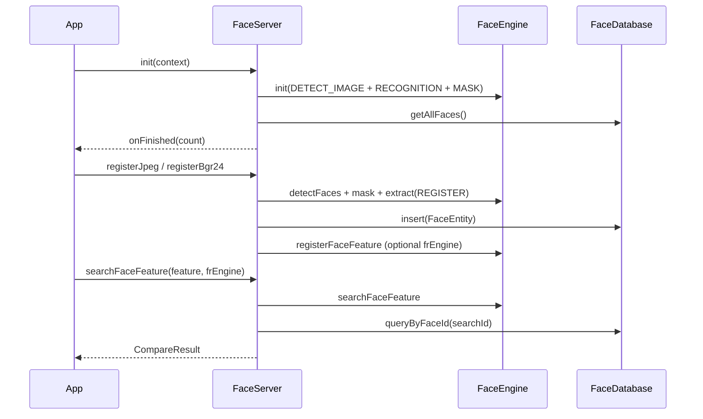

# FaceServer 人脸库操作类

源码：`app/src/main/java/com/arcsoft/arcfacedemo/faceserver/FaceServer.java`

单例类，负责人脸注册、特征入库、特征搜索，以及注册照本地文件管理。

---

## 常量

| 名称 | 值 | 可见性 | 说明 |
|------|-----|--------|------|
| `MAX_REGISTER_FACE_COUNT` | `30000` | `private static final` | 最大注册人脸数。`registerJpeg` 时若 `faceRegisterInfoList.size() >= 30000` 抛出 `RegisterFailedException("registered face count limited")`。超过上限会影响识别率。 |

---

## 单例与引擎访问

### `getInstance()`

- 双重检查锁单例。
- 返回全局 `FaceServer` 实例。

### `getFaceEngine()`

- 返回静态 `faceEngine`（注册/检测用引擎）。
- `init` 成功后非 null；`release` 后置 null。

### `getFrEngine()`

- 返回静态 `frEngine`（识别流程专用引擎）。
- 在 `initFaceList(..., recognize=true)` 时由外部传入并赋值。

---

## 初始化

### `init(Context context)`

- 委托 `init(context, null)`。

### `init(Context context, OnInitFinishedCallback onInitFinishedCallback)`

- **同步方法**。
- 若 `faceEngine == null` 且 `context != null`：
  1. `new FaceEngine()`
  2. `faceEngine.init(context, ASF_DETECT_MODE_IMAGE, ASF_OP_ALL_OUT, 1, ASF_FACE_RECOGNITION | ASF_FACE_DETECT | ASF_MASK_DETECT)`
  3. 成功则 `initFaceList(context, null, callback, false)`
  4. 失败则 `faceEngine = null` 并打日志
- 若 `faceRegisterInfoList != null` 且回调非 null：直接 `onFinished(faceRegisterInfoList.size())`（引擎已存在时）。

### `initFaceList(Context, FaceEngine engine, OnInitFinishedCallback, boolean recognize)`

- IO 线程（RxJava）执行：
  - **`recognize=true`**：设置 `frEngine = engine`，从 Room 取全部 `FaceEntity`，调用 `registerFaceFeatureInfoListFromDb` 灌入引擎，回调 `faceEntityList.size()`。
  - **`recognize=false`**：仅加载 `faceRegisterInfoList = faceDao().getAllFaces()`，回调列表大小。
- 主线程回调 `onInitFinishedCallback.onFinished(size)`。

### `OnInitFinishedCallback`

```java
void onFinished(int faceCount);
```

---

## 销毁

### `release()`

- 清空 `faceRegisterInfoList` 并置 null。
- `faceEngine.unInit()` 后置 null。
- `faceServer = null`（单例可被重建）。

---

## 注册

### `registerNv21(Context, byte[], width, height, FacePreviewInfo, name, frEngine, registerFaceEngine)`

- **用途**：预览帧实时注册。
- **参数校验**：`registerFaceEngine`、`context`、`nv21` 非空；`width % 4 == 0`；`nv21.length == width * height * 3 / 2`。
- **流程**：
  1. `extractFaceFeature(nv21, ..., ExtractType.REGISTER, MaskInfo.NOT_WORN)`
  2. `getBestRect` 扩边裁剪 → `getHeadImage` → JPEG 存盘
  3. `FaceEntity` 插入 Room
  4. `registerFaceFeatureInfoFromDb(faceEntity, frEngine)` 写入识别引擎
- **返回**：`boolean` 是否成功。

### `registerJpeg(Context, byte[] jpeg, String name, boolean recognize)`

- **用途**：JPEG 字节批量/文件注册入口。
- **上限检查**：`faceRegisterInfoList.size() >= MAX_REGISTER_FACE_COUNT` → 抛 `RegisterFailedException`。
- **流程**：`ImageUtil.jpegToScaledBitmap` → 对齐 BGR24 → `registerBgr24`。
- **返回**：`FaceEntity` 或抛异常。

### `registerBgr24(Context, byte[] bgr24, width, height, name, boolean recognize)`

- **用途**：BGR24 注册主逻辑。
- **参数校验**：`faceEngine`、context、bgr24 非空；`width % 4 == 0`；`bgr24.length == width * height * 3`。
- **流程**：
  1. `detectFaces` → `process(ASF_MASK_DETECT)` → `getMask`
  2. 口罩 `WORN` / `UNKNOWN` → 返回 null（注册照要求不戴口罩）
  3. `extractFaceFeature(..., ExtractType.REGISTER, MaskInfo.NOT_WORN)`
  4. 裁剪头像 JPEG 存盘 → Room insert → 加入 `faceRegisterInfoList`
  5. `recognize=true` 时同步 `registerFaceFeatureInfoFromDb` 到 `frEngine`
- **返回**：`FaceEntity` 或 null。

### `registerFaceFeatureInfoListFromDb(FaceEngine faceEngine, List<FaceEntity> faceEntityList)`

- **public**，批量将 DB 特征注册到指定引擎。
- 先 `removeFaceFeature(-1)` 清空引擎，再 `registerFaceFeature(faceFeatureInfoList)`。
- `FaceFeatureInfo` 的 searchId = `(int) faceEntity.getFaceId()`。

### `registerFaceFeatureInfoFromDb`（private）

- 单条 `registerFaceFeature`。

---

## 搜索

### `searchFaceFeature(FaceFeature faceFeature, FaceEngine faceEngine)`

- **入参**：特征向量 + 指定引擎（通常为 `frEngine`）。
- **流程**：
  1. `faceEngine.searchFaceFeature(faceFeature)` → `SearchResult`
  2. 用 `searchId` 查 Room：`faceDao().queryByFaceId(searchId)`
  3. 命中则构造 `CompareResult(faceEntity, maxSimilar, MOK, costMs)`
- **返回**：`CompareResult` 或 null（引擎/特征为空、未命中、异常）。

---

## 删除与列表维护

### `removeOneFace(FaceEntity faceEntity)`

- 从内存 `faceRegisterInfoList` 移除一条。
- **返回**：是否移除成功。

### `clearAllFaces()`

- 清空 `faceRegisterInfoList`。
- `faceEngine.removeFaceFeature(-1)`。
- Room `faceDao().deleteAll()`。
- 删除 `getImageDir()` 下全部注册照文件。
- **返回**：DB 删除条数。

---

## 内部路径与图像

| 方法 | 说明 |
|------|------|
| `getImageDir()` | `{externalFilesDir/Pictures}/faceDB/registerFaces` |
| `getImagePath(name)` | `{imageRootPath}/{name}_{timestamp}.jpg` |
| `getHeadImage(...)` | 裁剪、按人脸角度旋转、转 Bitmap |
| `getBestRect(width, height, srcRect)` | 人脸框外扩约一半高度作头像裁剪区，边界溢出时收缩 |

---

## init / register / search 关系图



---

## 关键依赖

- `FaceDatabase` / `FaceEntity`：Room 持久化
- `CompareResult`：搜索结果封装
- `RegisterFailedException`：注册上限异常
- `ImageUtil` / `ArcSoftImageUtil`：图像格式转换
