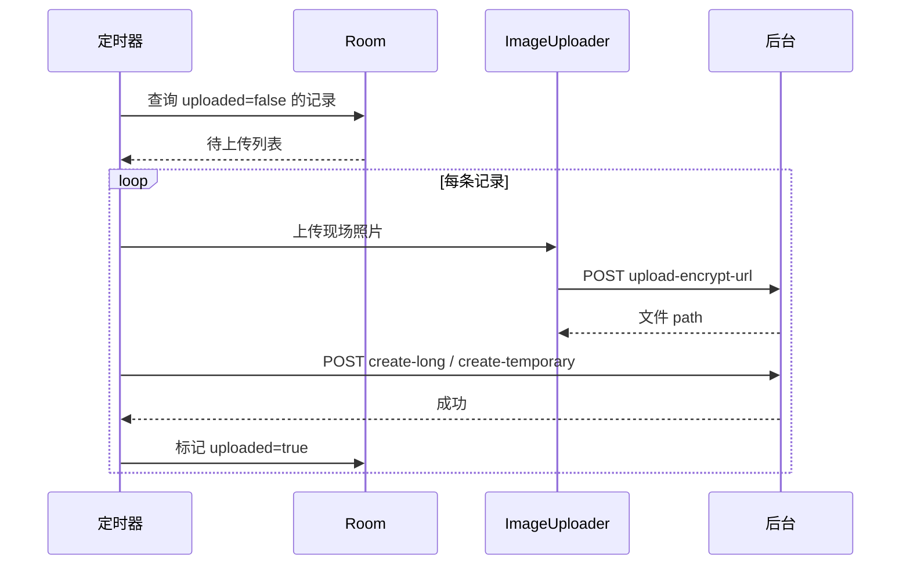

# 离线记录与上传

## 涉及类

| 类 | 职责 |
|----|------|
| `ArcFaceApplication` | `startUpDataToServer()` 定时上传 |
| `ImageUploader` | 上传现场抓拍加密图 |
| `LongTermRecords` | 长期证通行记录实体 |
| `TemporaryCardRecords` | 临时证通行记录实体 |
| `LongTermRecordsDao` | 长期记录 DAO |
| `TemporaryCardRecordsDao` | 临时记录 DAO |
| `RecordsPopDialog` | 在线通行记录查询弹窗 |
| `CheckLogListAdapter` | 查验页底部日志列表 |

## 本地记录表

### LongTermRecords（长期证）

| 字段 | 说明 |
|------|------|
| `id` | 本地自增主键 |
| `passId` | 通行证 ID |
| `direction` | 进出方向（1 进 / -1 出） |
| `checkTime` | 查验时间 |
| `photoPath` | 现场抓拍图本地路径（AES 加密） |
| `uploaded` | 是否已上传 |
| `mac` | 设备 MAC |

### TemporaryCardRecords（临时证）

结构类似，额外包含引领人 ID、临时证 ID 等字段。

## 写入时机

查验 Activity 在人脸比对通过后：

1. 现场抓拍 → AES 加密存本地
2. 组装记录实体写入 Room
3. `uploaded = false`

## 上传流程

`ArcFaceApplication.startUpDataToServer()` 默认 **30 秒**周期：

## 上传接口

| 证件类型 | 接口 |
|----------|------|
| 长期证 | `URL_CREATE_LONG_RECORD` |
| 临时证 | `URL_CREATE_TEMP_RECORD` |
| 现场照片 | `URL_UPLOAD_FILE` |

## 离线模式

`ArcFaceApplication.isOffLine` 由网络 Ping 检测设置：

- 离线时记录仍写本地 Room
- 恢复网络后定时器自动上传积压记录

## 在线记录查询

`RecordsPopDialog` 弹窗：

- 调用 `URL_GET_RESORD_PAGE` 分页查询服务端记录
- 按 `direction` 筛选进/出记录
- 在运维侧边栏或查验页触发

## 查验页日志

`CheckLogListAdapter` 在查验 Activity 底部展示最近通行记录摘要（本地 `Records` 实体）。
