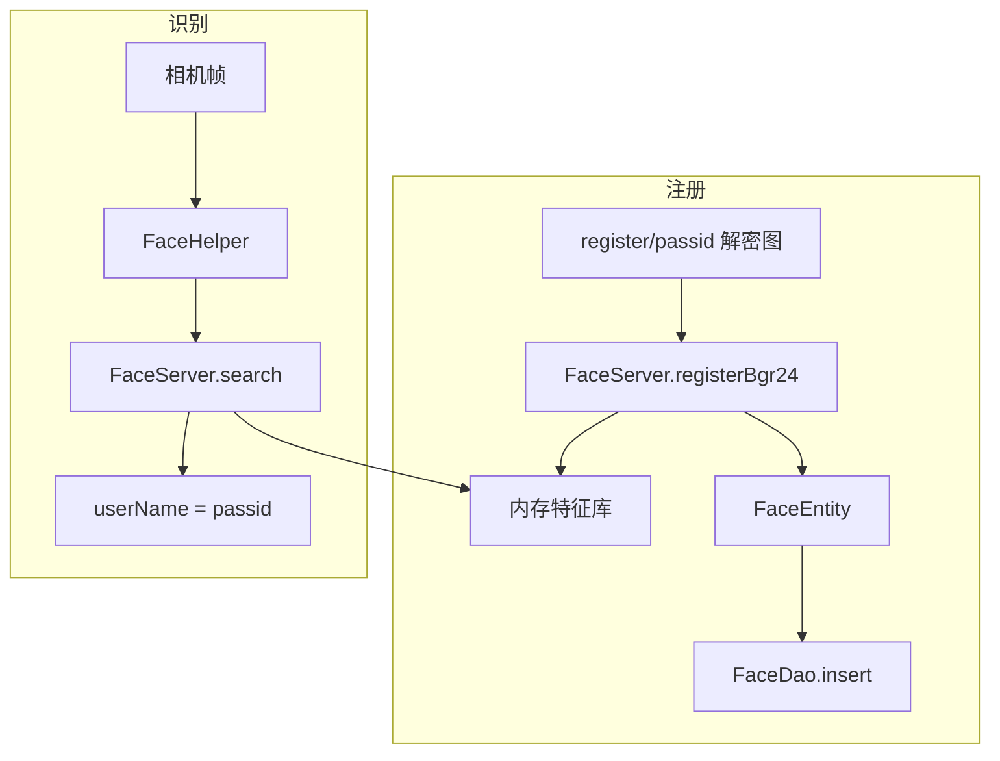

# FaceDatabase 人脸特征库（facedb）

> 源码：`facedb/FaceDatabase.java`、`facedb/dao/FaceDao.java`、`facedb/entity/FaceEntity.java`  
> 与业务库 `db/YinchuanAirportDB`（通行证表）**分离**

ArcSoft 识别比对使用的 **本地人脸特征向量** 存储；登录后从 `register/` 图片批量注册写入此库。

---

## 数据库文件

| 项目 | 值 |
|------|-----|
| 路径 | `{externalFilesDir}/database/faceDB.db` |
| 版本 | `1` |
| 实体 | `FaceEntity` 单表 `face` |
| 迁移 | 无 Migration；升级需手动处理或清数据 |
| 单例 | 双检锁 `FaceDatabase.getInstance(context)` |

---

## FaceEntity 字段

| 列名 | Java 字段 | 类型 | 说明 |
|------|-----------|------|------|
| `faceId` | `faceId` | `long` PK 自增 | 库内主键 |
| `user_name` | `userName` | `String` | **通行证 passid**，与 `LongTermPass.passid` 对应 |
| `image_path` | `imagePath` | `String` | 注册源图路径（常在 `register/` 或引擎目录） |
| `feature_data` | `featureData` | `byte[]` | ArcSoft 提取的人脸特征 |
| `register_time` | `registerTime` | `long` | 注册时间戳 ms |

`equals` 仅比较 `faceId`；日志用 `toString2()` 省略特征字节。

---

## FaceDao 方法表

| 方法 | SQL/注解 | 返回值 | 调用场景 |
|------|----------|--------|----------|
| `getAllFaces()` | `SELECT * FROM face` | `List<FaceEntity>` | 人脸管理页 |
| `getFaces(start, size)` | `ORDER BY faceId DESC LIMIT` | 分页列表 | 大量人脸分页 |
| `getFaceCount()` | `COUNT(1)` | `int` | 统计 |
| `insert(faceEntity)` | `@Insert` | `long` rowId | 注册成功 |
| `updateFaceEntity` | `@Update` | `int` | 更新 |
| `updateOrInsertFaceEntity` | `@Update` | `int` | 注：应用层应优先 insert |
| `deleteFace` | `@Delete` | `int` | 单条删除 |
| `deleteAll()` | `DELETE FROM face` | `int` | 重初始化 |
| `queryByFaceId(faceId)` | `WHERE faceId = ?` | 单条 | 按 ID |
| `queryByUserName(user_name)` | `WHERE user_name = ? LIMIT 1` | 单条 | **比对命中后查详情** |
| `queryByName(user_name)` | 同名多条 | `List` | 去重补救 |

**线程**：所有 DAO 调用须在后台线程执行。

---

## 与 FaceServer 关系

- `FacePhotoViewModel` / `LoginActivity.registerFromFile` 驱动注册
- `RecognizeViewModel` / 查验 Activity 驱动搜索
- 引擎内存索引与 Room **应同步**；仅删 Room 不删引擎会导致不一致

---

## 写入时机

| 时机 | 入口 |
|------|------|
| 登录全量同步后 | `LoginActivity.registerFace` → `registerFromFile(register/)` |
| 增量同步新证 | `ArcFaceApplication` 周期任务内注册 |
| 运维重新初始化 | `LongPassCardsRemedialMeasuresUtils` |
| 手动人脸管理 | `FaceManageActivity` |

---

## 读取时机

| 时机 | 入口 |
|------|------|
| 人脸管理列表 | `FacePhotoViewModel.loadData` |
| 识别结果展示 | `FaceServer` 返回 `userName` 映射通行证 |

---

## 清理与重建

| 操作 | 影响 |
|------|------|
| `faceDao.deleteAll()` | 仅清表 |
| `FaceServer.unInit` + 删 `registerFaces/` | 引擎侧 |
| 运维抽屉「重新初始化」 | 全链路重建 |
| 卸载应用 | 删除整个 `database/faceDB.db` |

---

## 联调检查清单

- [ ] `SELECT COUNT` 与界面「已注册人脸数」一致
- [ ] `user_name` 与通行证 `passid` 一一对应（去重工具可查重复）
- [ ] 注册失败时查 `register/` 图片是否存在、是否损坏
- [ ] 识别相似度低：先查引擎阈值 `ConfigUtil`，再查特征是否过期未更新
