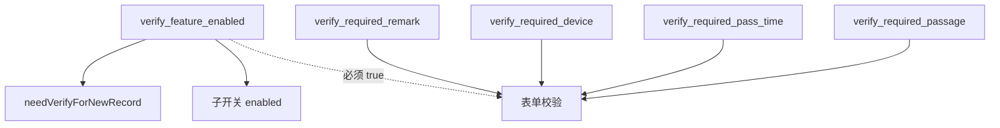

# VerifyFeatureSettings 核销功能配置

源码：

- `app/src/main/java/com/arcsoft/arcfacedemo/util/VerifyFeatureSettings.kt`
- `app/src/main/java/com/arcsoft/arcfacedemo/widget/dialog/VerifyFeatureSettingsDialog.kt`

存储：`SPUtils`（与 `SharedPreferences` 等价封装）。

---

## 设计原则

- **总开关** `verify_feature_enabled` 为 `true` 时，新存通行记录 `needVerify` 应为 `true`。
- 子开关（通道/时间/设备/备注是否必填）**仅在总开关开启时**在 UI 上可编辑；业务校验应同样以总开关为前提。

---

## 键（Key）一览

| 常量 | SP 键字符串 | 类型 | 默认 | 说明 |
|------|-------------|------|------|------|
| `KEY_VERIFY_FEATURE_ENABLED` | `verify_feature_enabled` | Boolean | **false** | 核销功能总开关 |
| `KEY_REQUIRE_PASSAGE` | `verify_required_passage` | Boolean | false | 核销表单：通道是否必填 |
| `KEY_REQUIRE_PASS_TIME` | `verify_required_pass_time` | Boolean | false | 核销表单：通行时间是否必填 |
| `KEY_REQUIRE_DEVICE` | `verify_required_device` | Boolean | false | 核销表单：设备是否必填 |
| `KEY_REQUIRE_REMARK` | `verify_required_remark` | Boolean | false | 核销表单：备注是否必填 |

---

## API 方法

### 总开关

| 方法 | 行为 |
|------|------|
| `isVerifyFeatureEnabled()` | 读 `verify_feature_enabled`，默认 false |
| `setVerifyFeatureEnabled(enabled)` | 写入；若值变化则 `notifyNeedVerifyChanged(enabled)` |

### 子字段必填（只读 getter）

| 方法 | 对应键 |
|------|--------|
| `isRequirePassage()` | `verify_required_passage` |
| `isRequirePassTime()` | `verify_required_pass_time` |
| `isRequireDevice()` | `verify_required_device` |
| `isRequireRemark()` | `verify_required_remark` |

> 子字段无独立 setter；由 `VerifyFeatureSettingsDialog` 内直接 `sp.put(KEY, v)`。

### 业务语义

| 方法 | 返回值 |
|------|--------|
| `needVerifyForNewRecord()` | 与 `isVerifyFeatureEnabled()` 相同 |

新写入通行记录时，据此设置 `needVerify` 字段。

---

## 监听器

```kotlin
fun interface NeedVerifyChangeListener {
    fun onNeedVerifyChanged(needVerify: Boolean)
}
```

| 方法 | 说明 |
|------|------|
| `addNeedVerifyChangeListener` | 注册（`CopyOnWriteArraySet`） |
| `removeNeedVerifyChangeListener` | 移除 |
| `notifyNeedVerifyChanged` | 仅总开关变化时触发 |

---

## VerifyFeatureSettingsDialog 行为

入口：`CustomDrawerPopupView` → `VerifyFeatureSettingsDialog.show(context)`

| UI 控件 | 绑定 |
|---------|------|
| `switch_verify_master` | `setVerifyFeatureEnabled`；关闭时子开关 `isEnabled=false`，组 alpha=0.45 |
| `switch_require_passage` | `KEY_REQUIRE_PASSAGE` |
| `switch_require_time` | `KEY_REQUIRE_PASS_TIME` |
| `switch_require_device` | `KEY_REQUIRE_DEVICE` |
| `switch_require_remark` | `KEY_REQUIRE_REMARK` |
| `btn_close` | `dismiss()` |

`load()` 打开时从 SP 恢复全部开关状态。

---

## 与通行记录的关系

```text
保存记录时:
  needVerify = VerifyFeatureSettings.needVerifyForNewRecord()

核销弹窗校验时（业务层）:
  if (!isVerifyFeatureEnabled()) → 不要求核销
  else 按 isRequirePassage / Time / Device / Remark 校验表单
```

具体 UI：`VerifyAndConfirmDialog.kt` 等（本配置仅提供开关语义）。

---

## 键依赖图


