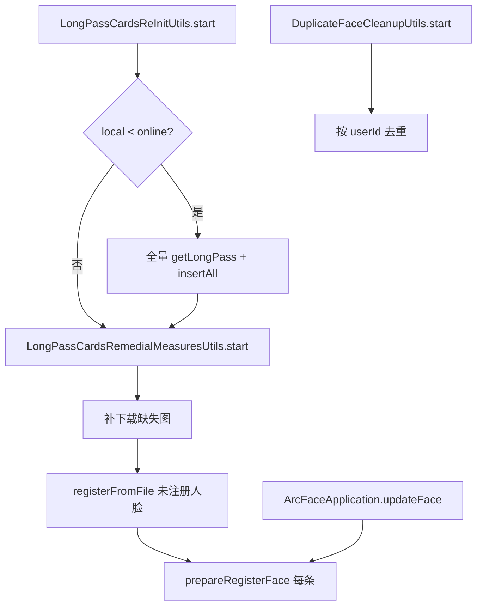

# 补救与运维工具类

涉及：

- `LongPassCardsReInitUtils` — 在线数量对比 + 全量拉取
- `LongPassCardsRemedialMeasuresUtils` — 本地图片补救 + 未注册人脸批量注册
- `DuplicateFaceCleanupUtils` — 重复人脸清理

入口：`CustomDrawerPopupView` 侧边栏；`ArcFaceApplication` 凌晨 1 点自动 `ReInit`；增量/注册流程内调用 `DuplicateFaceCleanupUtils`。

---

## 互斥与 doing 标志

| 工具 | 进行中提示 | 与其它工具 |
|------|------------|------------|
| `LongPassCardsReInitUtils` | `isDoing()` | 阻塞 Remedial、Duplicate 启动 |
| `LongPassCardsRemedialMeasuresUtils` | `doing` 字段 | 阻塞 ReInit、Duplicate |
| `DuplicateFaceCleanupUtils` | `doing` 字段 | 阻塞 ReInit、Remedial |

---

## LongPassCardsReInitUtils

**职责**：对比本地与线上通行证**数量**；本地少则全量分页拉取写入 DB；然后链式启动本地补救。

### 单例

`getInstance()` 双重检查锁。

### `start()`

1. 若 `doing` / Remedial.doing / Duplicate.doing → Toast「正在处理中...」
2. 线程池执行：
   - `onlineCount = getOnlineCount()` → `GET UrlConstants.passCount`
   - `localCount = longTermPassDao().getAll().size()`
   - **`localCount < onlineCount`** → `update()`
   - **`LongPassCardsRemedialMeasuresUtils.getInstance().start()`**（无论是否 update 都会执行）

### `getOnlineCount()`

- Header：`tenant-id`、`Authorization`
- 解析 `ApiResponse<Integer>`，code 200 返回 `data`，否则 0

### `update()`

1. `getLongPassCards()` 全量分页（pageSize=100，无 startDate）
2. 失败 → Toast「请求失败，稍后重试」
3. 成功 → `Converters.convertToLongTermPass` → **`insertAll`**（注意：非 upsert）

### `getLongPassCards()`（private）

- `doing=true` 直至结束
- `while` 分页 `URL_GetLongPass`，累积 list
- 异常清空 list 并 break

### 自动触发

`ArcFaceApplication` 每天 **1 点**，`SPUtils "reinit_check"` 为 true 时执行一次，随后置 false。

---

## LongPassCardsRemedialMeasuresUtils

**职责**：对本地**未注销**通行证检查图片是否缺失并补下载；再对**未注册人脸**批量解密注册。

### `start()`

需当前 `Activity` 为 `BaseActivity`：

1. 显示无限 Snackbar「开始执行数据完整性检查功能...」
2. `update(callback)` 补下载
3. `callback.end()` → Snackbar「查询未注册人脸中」
4. `registerFromFile(activity, register目录, BatchRegisterCallback1)`

### `update(RemedialProgressCallback)`（private）

数据源：`longTermPassDao().getByStatusNotCancelled()`

对每条 `LongTermPass`：

| 文件 | 目录 | zip | 逻辑 |
|------|------|-----|------|
| checkPhoto | register | false | `downloadImageIfNotExists` |
| photo | photo | true | 同上 |

- 文件已存在 → 跳过（返回 null）
- 失败记入 `failFileNames`，进度回调 `onProgress(current, failed, total)`
- 结束：`tellServer(failFileNames)` 上报异常

### `registerFromFile(context, dir, callback)`

1. 列出 register 下 jpg/jpeg/png
2. 查 `getByStatusNotCancelled()`，收集 **`faceDao.queryByUserName(pass.id)==null`** 的 id → `validIds`
3. 过滤文件：文件名（去扩展名）∈ `validIds`
4. RxJava `Observable.fromArray(files)`：
   - `AESUtils.decryptFileToByte(file)`
   - `DuplicateFaceCleanupUtils.prepareRegisterFace(name)`
   - `faceRepository.registerJpeg(context, bytes, name)`
5. 失败列表 `tellServer`

### 其它 public 方法

| 方法 | 说明 |
|------|------|
| `parseRegisterImages(context, fileIds, outputDir)` | 批量解密到 `decrypted_register` |
| `parseRegisterImage(context, fileId, outputDir)` | 单张解密 |

### `tellServer`

`POST UrlConstants.checkAbnormalCreate`，body 含 deviceId、account、detail（id 列表）、detailContent（id+reason）。

---

## DuplicateFaceCleanupUtils

**职责**：

1. **侧边栏** `start()`：全盘扫描，同 `userId` 多条人脸时删重复
2. **注册前** `prepareRegisterFace(passId)`：删同 user 其它证 + 当前证旧特征
3. **增量 updateFace** / Remedial 注册前均调用

### `start()`（侧边栏）

1. 互斥检查 doing / Remedial / ReInit
2. Snackbar 进度：「共 N 条，检查第 M 个，已移除 K 个」
3. `clearDuplicateFacesSync` → Toast 结果

### `prepareRegisterFace(passId)`

```text
removeOtherFacesForPassId(passId)  // 同 userId 其它 pass 的人脸
removeFaceByPassId(passId)         // 当前 pass 旧人脸
```

### `removeFaceByPassId(passId)`

- `userName == passId` 的 `FaceEntity`
- 从 frEngine + faceEngine `removeFaceFeature`
- `FaceServer.removeOneFace`、删注册照文件、Room `deleteFace`

### `removeOtherFacesForPassId(keepPassId)`

- 查 `keepPass.userId` 下所有 `LongTermPass`
- 对 `id != keepPassId` 调用 `removeFaceByPassId`

### `clearDuplicateFacesSync`（private）

1. `groupFacePassIdsByUserId`：userId → 关联的 passId 列表（来自人脸 userName）
2. `collectDuplicatePassIdsToRemove`：同一 user 多 pass 时，保留一条，其余加入删除列表
3. 遍历人脸快照，passId 在删除列表 → `removeFaceByPassId`

### 保留策略 `resolveKeepPassId`

1. 优先 `dao.getActiveByUserId` 中且在人脸列表里的 **status=1 有效证**
2. 否则在人脸关联 pass 中选最优：`isPreferredPass`
   - status=1 优先于非 1
   - 非注销(2) 优先于注销
   - `type` 大者优先
   - `updateTime` 字符串比较新者优先
3. 兜底 `facePassIds.get(0)`

---

## 三者协作关系



---

## 与同步链路衔接

| 场景 | 工具 |
|------|------|
| 增量注册前 | `prepareRegisterFace` |
| 本地图丢失 | Remedial `update` |
| 线上条数多于本地 | ReInit `update` + Remedial |
| 一人多证多人脸 | Duplicate `start` 或注册时 `removeOtherFacesForPassId` |
