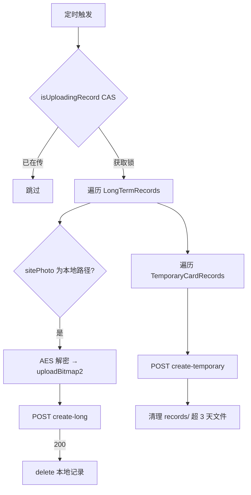

# 后台定时任务

调度中心：`ArcFaceApplication.java`

## 时间常量（源码）

| 常量 | 值 | 说明 |
|------|-----|------|
| `UPLOAD_LOG_TIME` | `30 * 1000`（30 秒） | 通行记录上传周期 |
| `PING_DELAY_TIME` | `10 * 1000`（10 秒） | 网络 Ping 周期 |
| `UPDATE_DELAY_TIME` | `5`（分钟） | 默认心跳/同步间隔（可被后台覆盖） |
| `POOL_SIZE` | `15` | 线程池大小 |
| `PAGE_SIZE` | `20` | 增量同步分页大小 |

后台下发的 `interval` 通过 `InfoStorage.getInt("interval", UPDATE_DELAY_TIME)` 读取，单位 **分钟**。

## 任务一：通行记录上传 startUpDataToServer()

**周期**：每 30 秒  
**触发**：`LoginActivity` 登录成功后

要点：

- 使用 `AtomicBoolean isUploadingRecord` 防并发重复上传
- 现场照先 `ImageUploader.uploadBitmap2()` 得服务端 path，再 POST 整条记录 JSON
- 上传成功 **删除** 本地 Room 记录（非标记 uploaded）
- `{externalFilesDir}/records/` 下超过 **3 天**的文件自动删除

重启：`reset()` 取消旧任务后重新 `startUpDataToServer()`。

## 任务二：周期任务 startPeriodicTask()

**周期**：`interval` 分钟（默认 5 分钟，TEST 模式 30 秒单次）  
**触发**：`LoginActivity.gotoActivity()`

每次执行内容：

| 序号 | 动作 | 说明 |
|------|------|------|
| 1 | 凌晨 2 点重启 | `reboot` SP 标志防重复；屏宽 >800 用 `ZysjSystemManager`，否则 `MyManager` |
| 2 | 上午 10 点日志上传 | `upload_log` 标志；`LogUploadUtils.upload()` |
| 3 | 凌晨 1 点数据检查 | `reinit_check` 标志；`LongPassCardsReInitUtils.start()` |
| 4 | 心跳 | GET `heartbeat`，参数 `mac`、`interval` |
| 5 | 增量同步 | `getLongPassCardsUpdate()` 分页拉新通行证 |
| 6 | 资源监控 | Java 堆、内存、CPU 使用率日志 |

### 心跳请求

**GET** `UrlConstants.heartbeat`

| 参数 | 来源 |
|------|------|
| `mac` | `DeviceUtils.getDeviceId()` |
| `interval` | `infoStorage.getInt("interval", 5)` |

### 增量同步 getLongPassCardsUpdate()

1. GET `passCount` 得服务端总数
2. 与本地 `longTermPassDao().getCount()` 对比
3. 若有新增，分页 GET `URL_GetLongPass`（`updatePage`，`UPDATE_PAGE_SIZE=20`）
4. 新通行证：下载图 → 写 DB → 注册人脸

## 任务三：网络 Ping

**周期**：每 10 秒（独立 `SmallTask task1`）

- `NetworkUtils.isAvailableByPing()` 检测连通性
- 设置 `ArcFaceApplication.isOffLine` 标志
- 查验页顶部显示「离线模式」/「在线模式」

## 日级任务标志位机制

每个日级任务用 SP boolean 防止同一小时内重复执行：

| 小时 | SP 键 | 任务 |
|------|-------|------|
| 1 | `reinit_check` | 数据完整性检查 |
| 2 | `reboot` | 设备重启 |
| 10 | `upload_log` | 日志上传 |

该小时过后将标志重置为 `true`，次日可再次触发。

## 401 处理

周期任务或上传中若接口返回 401，跳转 `LoginActivity` 要求重新登录（具体实现在各回调中）。

## 相关文档

- 记录上传字段 → [10-offline-records-upload.md](./10-offline-records-upload.md)
- 通行证同步 → [05-pass-sync.md](./05-pass-sync.md)
- 登录后启动 → [04-login-and-auth.md](./04-login-and-auth.md)
