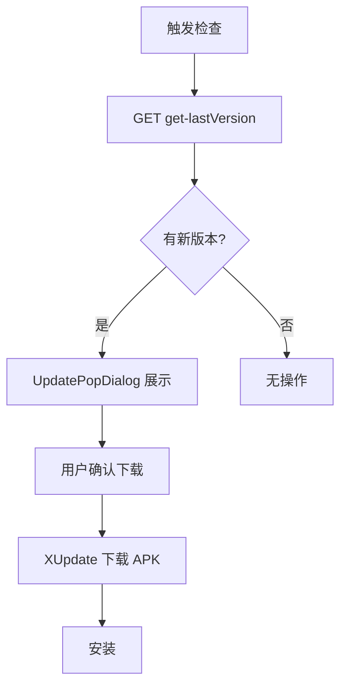

# 版本更新

## 涉及类

| 类 | 路径 | 职责 |
|----|------|------|
| `UpdateUtils` | `util/UpdateUtils.java` | XUpdate 封装 |
| `UpdatePopDialog` | `widget/dialog/UpdatePopDialog.java` | 更新弹窗 |
| `ArcFaceApplication` | `ArcFaceApplication.java` | XUpdate 初始化 |
| `Version` | `entity/Version.java` | 版本信息实体 |

## 依赖模块

`:xupdate-lib`（`com.xuexiang.xupdate`）

初始化（`ArcFaceApplication.onCreate`）：

```java
XUpdate.get()
    .debug(true)
    .isWifiOnly(false)
    .init(this);
```

## 检查更新 API

| 项 | 值 |
|----|-----|
| URL | `UrlConstants.URL_GET_APP_LAST_VERSION` |
| 路径 | `{BASE_URL}/app-api/system/appVersion/get-lastVersion` |
| 参数 | `type=3`（竖屏客户端） |

## 更新流程



## 触发入口

| 入口 | 说明 |
|------|------|
| `CustomDrawerPopupView` | 运维侧边栏「检查更新」 |
| 查验 Activity | 启动时自动检测（部分渠道） |
| `UpdateUtils.update(context)` | 代码直接调用 |

## UpdateUtils

封装 XUpdate 配置：

| 配置 | 值 | 说明 |
|------|-----|------|
| `debug` | true | 调试日志 |
| `isWifiOnly` | false | 允许移动网络下载 |
| `isGet` | true | GET 请求检查 |
| `supportSilentInstall` | false | 非静默安装 |

HTTP 服务使用 `OKHttpUpdateHttpService`（内部 OkGo），请求头携带 `tenant-id` 和 `Authorization`。

## UpdatePopDialog

自定义更新弹窗：

- 显示版本号、更新说明
- 下载进度条（`NumberProgressBar`）
- 下载完成后触发安装

## FileProvider

APK 安装通过 `FileProvider` 共享，`AndroidManifest.xml` 中配置 `update_file_paths.xml`。

## 独立 update 模块

`update/` 模块（`com.sz.zysx.autoupdate`）为独立测试包，**app 未依赖**，不在此更新流程中使用。
