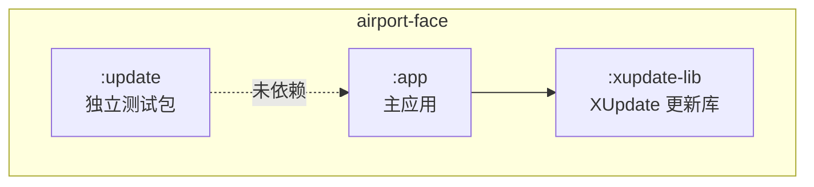
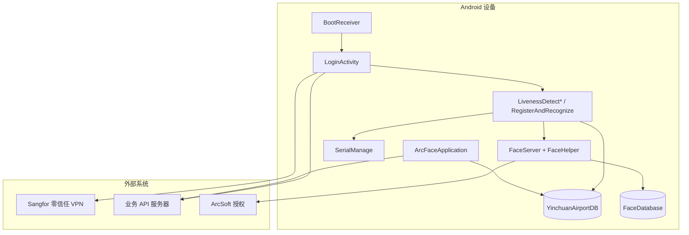

# 01 · 系统架构总览

## 1. 系统定位

| 维度 | 描述 |
|------|------|
| **产品** | 机场控制区通行证竖屏查验终端（Kiosk） |
| **部署** | 闸机/立式 Android 设备，竖屏，arm64-v8a |
| **核心能力** | 读卡（RFID/PSAM）+ 人脸活体 + 1:1/1:N 比对 + 电子卡面 + 通行记录 |
| **接入** | 深信服零信任 VPN + Bearer Token + 多租户（tenant-id） |
| **渠道** | 四 flavor：银川、重庆、石河子、洛阳 |

---

## 2. Gradle 模块结构



| 模块 | 类型 | 职责 | 重构相关 |
|------|------|------|----------|
| `:app` | Application | 全部业务逻辑 | 重构主战场 |
| `:xupdate-lib` | Library | APK 下载/安装 UI | 可保持独立 |
| `:update` | Application | autoupdate 测试 | 可忽略或删除 |

---

## 3. 架构风格：混合式分层

项目**名义上**采用四层架构，**实际上**是「部分 MVVM + 巨型 Activity + 全局 Application 调度」的混合模式。

```
┌─────────────────────────────────────────────────────────────┐
│ L1 表现层                                                    │
│ Activity / Fragment / ViewModel / Adapter / Dialog           │
├─────────────────────────────────────────────────────────────┤
│ L2 业务层                                                    │
│ FaceServer / FaceHelper / SerialManage / 各类 Utils          │
├─────────────────────────────────────────────────────────────┤
│ L3 数据层                                                    │
│ Room(DAO) / FaceRepository / CheckUnitRepository             │
├─────────────────────────────────────────────────────────────┤
│ L4 基础设施                                                  │
│ OkGo / ArcFace SDK / Camera / Glide / XUpdate / Bugly        │
└─────────────────────────────────────────────────────────────┘
```

### 已采用的模式

| 模式 | 应用范围 | 成熟度 |
|------|----------|--------|
| MVVM（ViewModel + LiveData） | 识别引擎、施工人员模块 | 部分 |
| Repository | FaceRepository、CheckUnitRepository | 少量 |
| Paging3 | 施工人员列表 | 较新（Kotlin） |
| DataBinding / ViewBinding | 全局开启 | 广泛使用 |
| Product Flavors | 四渠道 ChannelConfig | 成熟 |
| RxJava2 | FaceServer 异步、Application 定时 | 遗留 |
| 单例 + 静态工具 | ApiUtils、ArcFaceApplication、SerialManage | 大量 |

### 未严格遵循的分层

- 查验 Activity 直接调用 OkGo、Room DAO、SerialManage、InfoStorage
- `ArcFaceApplication` 承担上传调度、通行证同步、心跳等「服务层」职责
- 网络请求存在 **ApiUtils** 与 **直接 OkGo** 双通道

---

## 4. 技术栈

| 层 | 技术 | 版本/说明 |
|----|------|-----------|
| 语言 | Java 为主 + Kotlin（施工模块） | JVM 1.8 |
| UI | DataBinding、ViewBinding、XPopup、Material | — |
| 架构组件 | Lifecycle、ViewModel、LiveData、Paging3 | Room 2.4.3 |
| 人脸 | ArcSoft ArcFace（arcsoft_face.jar） | RGB+IR、1:N ≤30000 |
| 网络 | OkGo 3.0.4 + OkHttp 4.9.1 + Gson | — |
| 本地存储 | Room + SharedPreferences（SPUtils/InfoStorage） | SQLCipher 依赖已加但未接入 |
| 图片 | Glide 4.16 + 自定义 AES 解密 Loader | — |
| 串口/读卡 | Android-SerialPort、EC_RFID、ZY-Interface 等 | libs/ 本地 AAR/JAR |
| 安全 | SangforSDK（零信任 VPN） | — |
| 监控 | Bugly、ALog 文件日志 | — |
| 更新 | XUpdate（:xupdate-lib） | — |
| 构建 | AGP 8.9.1、Kotlin 2.2.10、compileSdk 36 | ABI arm64-v8a |

---

## 5. 渠道架构（Product Flavors）

```
flavorDimensions "channel"
├── yinchuan   TENANT_ID="1"      临时证=是
├── chongqing  TENANT_ID="3"      临时证=是
├── shihezi    TENANT_ID="1"      TENANT_PREFIX="shf"  临时证=是
└── luoyang    TENANT_ID="2054…"  TENANT_PREFIX="fy"   临时证=否
```

**编译期注入链**：

```
ChannelConfig (flavor 源码)
  → UrlConstants（BASE_URL、TENANT_ID、API 路径）
  → SUPPORTS_TEMPORARY_PASS（业务规则）
  → Document2/3 + layout（卡面 UI 差异）
```

重构时需保持 flavor 覆盖机制，或改为运行时配置 + 远程配置（需评估离线场景）。

---

## 6. 运行时组件拓扑



---

## 7. Activity 分类

### 生产路径（8 个）

| Activity | 行数（约） | 职责 |
|----------|------------|------|
| `LoginActivity` | 1,320 | Launcher、零信任、登录、全量同步、人脸注册 |
| `LivenessDetectJinActivity` | 3,116 | 短距 RFID + 人脸查验 |
| `LivenessDetectYuanActivity` | 3,364 | 长距 EC_API + 人脸查验 |
| `LivenessDetectYuanAndJinActivity` | 3,633 | 双读卡器 + 人脸查验 |
| `RegisterAndRecognizeActivity` | 2,459 | 纯人脸 1:N 出区 |
| `ConstructionWorkersActivity` | 77 | 施工人员入口（Kotlin） |
| `PermissionDegreeDialog` | 75 | 权限/角度提示 DialogFragment |
| — | — | 各查验页内嵌 Fragment（Document1/2/3） |

### 调试/运维路径（6 个）

| Activity | 职责 |
|----------|------|
| `HomeActivity` | ArcFace Demo 首页（非生产） |
| `ActivationActivity` | SDK 在线/离线激活 |
| `CameraConfigureActivity` | 双相机预览与校准 |
| `RecognizeSettingsActivity` | 识别阈值 Preference |
| `FaceManageActivity` | 人脸库管理 |
| `FaceCompareActivity` | 人脸比对调试 |
| `RecognizeDebugActivity` | 双路预览调试 |

---

## 8. 全局入口：ArcFaceApplication

**职责过重**（约 980 行），集中了：

| 职责域 | 关键方法 |
|--------|----------|
| 初始化 | onCreate：XUpdate、Bugly、OkGo、Room、InfoStorage、ImageUploader |
| 记录上传 | `startUpDataToServer()` — 30s 定周期，CAS 防并发 |
| 通行证同步 | `startPeriodicTask()` — 增量分页同步 |
| 心跳 | 周期 Ping |
| 日任务 | 1点/2点/10点维护（日志、清理等） |
| 人脸分页 | 与 FaceRepository 协作加载 |

> 登录成功后由 `LoginActivity` 触发 `startUpDataToServer()` 和 `startPeriodicTask()`，不在 Application.onCreate 中启动。

---

## 9. 双库数据架构

| 数据库 | 路径 | 版本 | 实体 | 职责 |
|--------|------|------|------|------|
| `YinchuanAirportDB` | `externalFilesDir/db/airportDb.db` | v19 | LongTermPass、LongTermRecords、TemporaryCardRecords | 通行证档案、待上传记录 |
| `FaceDatabase` | `externalFilesDir/database/faceDB.db` | v1 | FaceEntity | 人脸特征向量、注册图路径 |

**关联键**：`FaceEntity.userName` ≈ `LongTermPass.nickname`

**迁移策略**：`fallbackToDestructiveMigration()` — 破坏性迁移，重构时需评估数据安全。

---

## 10. 配置存储三件套

| 存储 | 实现 | 典型键 | 用途 |
|------|------|--------|------|
| SPUtils | Blankj UtilCodeX | checkType、direction、tipsLoc、串口配置 | 查验模式、UI 布局 |
| InfoStorage | SharedPreferences `yunduanchayan` | 设备信息、用户、interval、linshiID | 登录态、设备绑定 |
| DefaultSharedPreferences | ConfigUtil + Preference | 识别阈值、活体方式 | ArcFace 引擎参数 |

全局键索引见 [doc/00-glossary.md](../doc/00-glossary.md)。

---

## 11. 源码体量热点（重构优先关注）

| 文件 | 行数 | 问题 |
|------|------|------|
| `LivenessDetectYuanAndJinActivity` | ~3,633 | 业务/UI/硬件/网络高度耦合 |
| `LivenessDetectYuanActivity` | ~3,364 | 同上，与 Jin 大量重复 |
| `LivenessDetectJinActivity` | ~3,116 | 同上 |
| `RegisterAndRecognizeActivity` | ~2,459 | 纯人脸模式，仍有大量重复 |
| `util/log/ALog.java` | ~1,355 | 日志框架 |
| `util/face/FaceHelper.java` | ~1,291 | 核心管线，相对内聚 |
| `LoginActivity` | ~1,320 | 登录链 + 初始化链 |
| `ArcFaceApplication` | ~980 | God Object 倾向 |
| `RecognizeViewModel` | ~713 | 识别状态，相对合理 |

四个 Liveness Activity 合计 **~12,600 行**，存在显著 **复制-粘贴式重复**，是重构最高优先级区域。

---

## 12. 与现有 doc/ 的映射

| 架构主题 | refactor 文档 | doc/ 详细实现 |
|----------|---------------|---------------|
| 分层 | 03-layer-and-dependencies | 03-architecture/ |
| 登录 | 04-data-flow §1 | 04-auth/ |
| 查验 | 02-functional-modules §5 | 05-check/ |
| 通行证 | 02 §6 | 06-pass-card/ |
| 记录 | 02 §7 | 07-records/ |
| 网络 | 05-technical-debt §2 | 11-network/ |
| 人脸引擎 | 02 §4 | 10-face-engine/ |
