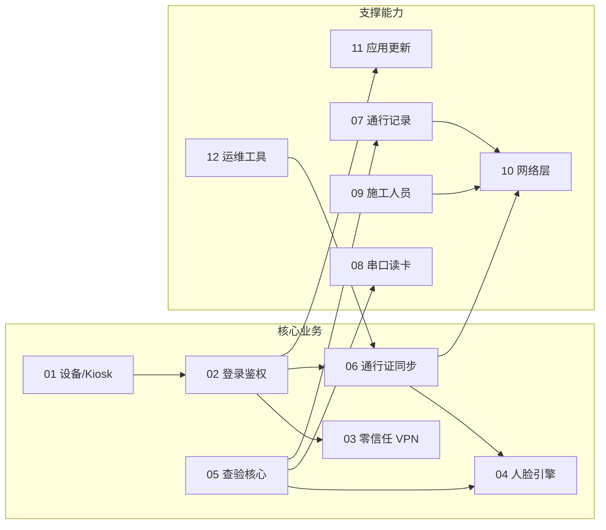

# 02 · 功能模块详解

按业务域划分 12 个功能模块，每个模块包含：职责边界、入口类、核心类、对外依赖、重构关注点。

---

## 模块总览



---

## M01 · 设备与 Kiosk

| 项 | 内容 |
|----|------|
| **职责** | 开机自启、Home/Launcher 注册、设备重启、屏幕管理 |
| **入口** | `BootReceiver` |
| **核心类** | `BootReceiver`、`DeviceUtils`、`com.ys.rkapi.MyManager`、`ZysjSystemManager` |
| **依赖** | Android 系统广播、厂商 SDK |
| **边界** | 不负责业务逻辑，仅拉起 LoginActivity |
| **doc/** | [16-device/01-boot-kiosk.md](../doc/16-device/01-boot-kiosk.md) |

**重构关注**：Kiosk 逻辑分散在 LoginActivity（HOME category）与 BootReceiver，可抽取 `KioskManager`。

---

## M02 · 登录与鉴权

| 项 | 内容 |
|----|------|
| **职责** | 零信任连接、账号登录、Token 管理、设备绑定、初始化链、跳转查验页 |
| **入口** | `LoginActivity`（MAIN/LAUNCHER/HOME） |
| **核心类** | `LoginActivity`、`ApiUtils`（Token 静态存储）、`InfoStorage`、`FacePhotoViewModel` |
| **初始化链** | MAC → Config → User → Pass 全量同步 → 人脸注册 → 启动后台任务 |
| **依赖** | M03 VPN、M06 通行证、M04 人脸、M10 网络 |
| **doc/** | [04-auth/](../doc/04-auth/) |

**关键方法索引**（LoginActivity，约 1,320 行）：

| 方法域 | 示例 |
|--------|------|
| 零信任 | `initZeroTrust()` |
| 登录 | `login()`、`getUserDetail()` |
| 同步 | `getLongPassCards()`、`registerFaceFromServer()` |
| 路由 | `gotoActivity()` — 按 checkType 跳转 |
| 后台任务 | 触发 `ArcFaceApplication.startUpDataToServer()` |

**重构关注**：LoginActivity 承担过多初始化编排，应抽取 `LoginCoordinator` / `InitPipeline`。

---

## M03 · 零信任 VPN

| 项 | 内容 |
|----|------|
| **职责** | 深信服 SFUemSDK 初始化、SPA 认证、隧道建立 |
| **核心类** | `LoginActivity.initZeroTrust()`、SangforSDK（libs/） |
| **配置** | SPUtils `spa` 等 |
| **依赖** | 厂商 AAR，与业务 API 串行 |
| **doc/** | [04-auth/01-zero-trust-vpn.md](../doc/04-auth/01-zero-trust-vpn.md) |

**重构关注**：VPN 与登录强耦合，失败分支复杂；可抽象 `VpnConnector` 接口便于 mock 测试。

---

## M04 · 人脸引擎

| 项 | 内容 |
|----|------|
| **职责** | SDK 激活、人脸检测/活体/特征提取/1:1/1:N 搜索、注册 |
| **入口** | 各查验 Activity、`LoginActivity`（批量注册） |
| **核心类** | `FaceServer`（589行）、`FaceHelper`（1291行）、`RecognizeViewModel`（713行）、`ConfigUtil` |
| **数据** | `FaceDatabase`、`FaceEntity`、`FaceRepository` |
| **本地 SDK** | `arcsoft_face.jar`、`arcsoft_image_util.jar` |
| **doc/** | [10-face-engine/](../doc/10-face-engine/) |

**调用链**：

```
DualCameraHelper（预览帧）
  → FaceHelper.onPreviewFrame（检测/活体/质量/口罩/区域过滤）
  → FaceServer.searchFace / compareFace（1:1 或 1:N）
  → RecognizeViewModel.onRecognized（LiveData 输出）
  → Activity UI 更新
```

**子模块**：

| 子模块 | 类 | 说明 |
|--------|-----|------|
| 引擎封装 | FaceServer | 单例，引擎生命周期 |
| 预览管线 | FaceHelper | 帧处理、过滤器链 |
| 相机 | DualCameraHelper、CameraGLSurfaceView | RGB + IR 双路 |
| 配置 | ConfigUtil、preference/* | 阈值、活体类型 SP |
| 调试 | DebugFaceHelper、RecognizeDebugViewModel | 调试页专用 |

**重构关注**：FaceServer/FaceHelper 相对内聚，**不建议大动**；重点是把 Activity 中的引擎调用下沉到 UseCase。

---

## M05 · 查验核心 ★

| 项 | 内容 |
|----|------|
| **职责** | 读卡 → 查库 → 展示卡面 → 人脸比对 → 写记录 → 反馈 UI |
| **入口** | 4 个 Activity（见下表） |
| **ViewModel** | `RecognizeViewModel`、`LivenessDetectViewModel` |
| **UI** | Document1/2/3 Fragment、FaceRectView、RecognizeAreaView |
| **依赖** | M04 人脸、M08 串口、M06 通行证数据、M07 记录 |
| **doc/** | [05-check/](../doc/05-check/) |

### 查验模式（checkType）

| SP 值 | Activity | 读卡方式 | 行数 |
|-------|----------|----------|------|
| 0 | LivenessDetectJinActivity | 短距 RFID（SerialManage） | ~3,116 |
| 1 | LivenessDetectYuanActivity | 长距 EC_API + PSAM | ~3,364 |
| 2 | LivenessDetectYuanAndJinActivity | 双读卡器 | ~3,633 |
| 3 | RegisterAndRecognizeActivity | 无读卡，1:N | ~2,459 |

### 共同流程

```
1. onCreate：读 direction/tipsLoc/checkType 配置
2. 初始化相机 + FaceHelper + RecognizeViewModel
3. 初始化串口/读卡器（模式 0/1/2）
4. 刷卡回调 onCardRead
5. LongTermPassDao 查询 → checkCard() 校验
6. Document2/3 展示卡面（Glide 加密图）
7. 人脸比对 pipeline
8. 成功 → saveLongTermRecords / saveTemporaryCardRecords
9. UI 反馈（音效 SoundManager、Toast、动画）
```

### 重复代码分析（重构关键）

四个 Activity 共享大量逻辑，差异主要在：

| 维度 | Jin | Yuan | YuanAndJin | Register |
|------|-----|------|------------|----------|
| 读卡器 | 短距串口 | 长距 EC_API | 两者 | 无 |
| 比对模式 | 1:1 | 1:1 | 1:1 | 1:N |
| PSAM | 无/少 | 有 | 有 | 无 |
| 引领人/临时证 | 有 | 有 | 有 | 部分 |

**建议抽取**：

- `CheckFlowCoordinator` — 通用查验状态机
- `CardReaderStrategy` — 读卡策略（短距/长距/双/无）
- `BaseLivenessActivity` — 共有 UI/相机/人脸/记录逻辑
- `CheckResultHandler` — 比对结果 → 记录写入

---

## M06 · 通行证与卡面

| 项 | 内容 |
|----|------|
| **职责** | 全量/增量同步通行证、加密照片下载、卡面 UI 展示 |
| **核心类** | `ArcFaceApplication`（同步调度）、`ImageDownloader`、`ImageUploader`、Document1/2/3 |
| **数据** | `LongTermPass`、`LongTermPassDao` |
| **图片** | Glide + `EncryptedFileModelLoader` + `AESUtils` |
| **渠道** | flavor 覆盖 Document2/3、layout |
| **doc/** | [06-pass-card/](../doc/06-pass-card/) |

**同步策略**：

| 类型 | 触发 | 方法 |
|------|------|------|
| 全量 | 登录后 | LoginActivity.getLongPassCards() |
| 增量 | 周期（interval 分钟） | ArcFaceApplication.startPeriodicTask() |
| 分页 | PAGE_SIZE=20 | 逐页拉取直到无数据 |

**重构关注**：同步逻辑在 Application 与 LoginActivity 两处；ImageDownloader/Uploader 可合并为 `PassMediaRepository`。

---

## M07 · 通行记录

| 项 | 内容 |
|----|------|
| **职责** | 本地写入、30s 定周期上传、上传成功后删除 |
| **核心类** | `ArcFaceApplication.startUpDataToServer()`、`ImageUploader` |
| **数据** | `LongTermRecords`、`TemporaryCardRecords` + 对应 DAO |
| **并发** | AtomicBoolean CAS 防重入 |
| **API** | POST create-long / create-temporary |
| **doc/** | [07-records/](../doc/07-records/) |

**写入时机**：查验成功后在 Activity 内直接 insert Room。

**重构关注**：写入分散在 4 个 Activity；应统一到 `RecordRepository.saveCheckResult()`。

---

## M08 · 串口与读卡

| 项 | 内容 |
|----|------|
| **职责** | 串口通信、RFID 读卡、QR 扫码串口、读卡器配置 |
| **核心类** | `SerialManage`（单例）、`SerialHandle`、`QrSerialConfigUtil`、`CardSerialConfigUtil` |
| **本地库** | Android-SerialPort-API、EC_RFID.jar、ZY-Interface、hcreader、dc_reader |
| **配置** | SPUtils 串口路径/波特率；运维抽屉配置入口 |
| **doc/** | [09-serial/](../doc/09-serial/) |

**读卡器类型**：

| 类型 | 用于 | 接口 |
|------|------|------|
| 短距 RFID | Jin | SerialManage 串口 |
| 长距 RFID | Yuan | EC_API + BasicOper PSAM |
| QR 扫码 | 辅助 | 独立串口配置 |

**重构关注**：硬件回调与 Activity 生命周期绑定，需 `CardReaderManager` 统一生命周期管理。

---

## M09 · 施工人员

| 项 | 内容 |
|----|------|
| **职责** | 核销验证、通行记录查询、进出统计 |
| **入口** | `ConstructionWorkersActivity`（Kotlin） |
| **架构** | ViewPager2 + Fragment + ViewModel + Paging3（**较新范式**） |
| **核心类** | `AccessRecordViewModel`、`WriteOffRecordViewModel`、`InOutStatisticsViewModel`、各 PagingSource |
| **UI** | `VerifyAndConfirmDialog`、`ConstructionWorkers*` 自定义控件 |
| **doc/** | [08-construction/](../doc/08-construction/) |

**特点**：本模块是项目中 **架构最规范** 的部分，可作为重构参考样板。

| Fragment | ViewModel | PagingSource |
|----------|-----------|--------------|
| WriteOffRecordFragment | WriteOffRecordViewModel | WriteOffRecordPagingSource |
| AccessRecordFragment | AccessRecordViewModel | AccessRecordPagingSource |
| InOutStatisticsFragment | InOutStatisticsViewModel | — |

---

## M10 · 网络层

| 项 | 内容 |
|----|------|
| **职责** | HTTP 请求、Token/Header 管理、URL 常量、回调封装 |
| **核心类** | `ApiUtils`、`UrlConstants`、`HttpInitUtils`、`JsonCallback` 等 |
| **双通道** | ApiUtils 封装 vs 直接 OkGo（Activity/Application/PagingSource） |
| **Header** | tenant-id、Authorization Bearer、timestamp |
| **doc/** | [11-network/](../doc/11-network/) |

**主要 API 域**：

| 域 | 路径前缀 | 示例 |
|----|----------|------|
| 认证 | /app-api/system/auth/ | vertical-client-login |
| 通行证 | /check/pass/ | page-pass |
| 记录 | /check/record/ | create-long, create-temporary |
| 施工 | /check/construction/ | 核销、统计 |
| 系统 | /app-api/system/ | 心跳、版本 |

**重构关注**：统一网络入口为单一 `ApiClient` / Retrofit 接口，消除双通道。

---

## M11 · 应用更新

| 项 | 内容 |
|----|------|
| **职责** | 版本检查、APK 下载安装 |
| **模块** | `:xupdate-lib` |
| **集成** | `ArcFaceApplication.onCreate()` → `XUpdate.get().init(this)` |
| **UI** | `UpdatePopDialog` |
| **API** | URL_GET_APP_LAST_VERSION |
| **doc/** | [15-update/01-xupdate-integration.md](../doc/15-update/01-xupdate-integration.md) |

**重构关注**：模块已独立，低优先级；`:update` 测试包可考虑移除。

---

## M12 · 运维与调试

| 项 | 内容 |
|----|------|
| **职责** | 隐藏抽屉菜单、查验模式切换、串口配置、补救工具、日志上传 |
| **入口** | `CustomDrawerPopupView`（连点 5 次触发） |
| **核心类** | `CustomDrawerPopupView`、`LongPassCardsReInitUtils`、`LongPassCardsRemedialMeasuresUtils`、`DuplicateFaceCleanupUtils`、`LogUploadUtils` |
| **调试页** | ActivationActivity、CameraConfigureActivity、RecognizeSettingsActivity、FaceManageActivity 等 |
| **doc/** | [13-ops/](../doc/13-ops/)、[17-troubleshooting/](../doc/17-troubleshooting/) |

**补救工具**：

| 工具 | 用途 |
|------|------|
| ReInitUtils | 重新初始化通行证 |
| RemedialMeasuresUtils | 补救措施（709行） |
| DuplicateFaceCleanupUtils | 人脸去重 |

---

## 模块间依赖矩阵

| 模块 | 依赖 | 被依赖 |
|------|------|--------|
| M01 Kiosk | — | M02 |
| M02 登录 | M03,M06,M04,M10 | M05,M07 |
| M03 VPN | 厂商 SDK | M02 |
| M04 人脸 | ArcSoft SDK,M10 | M02,M05 |
| M05 查验 | M04,M06,M07,M08 | — |
| M06 通行证 | M10 | M02,M05 |
| M07 记录 | M10 | M05 |
| M08 串口 | 硬件 SDK | M05 |
| M09 施工 | M10 | — |
| M10 网络 | OkGo | 全局 |
| M11 更新 | M10 | M02 |
| M12 运维 | M06,M04,M08 | — |
