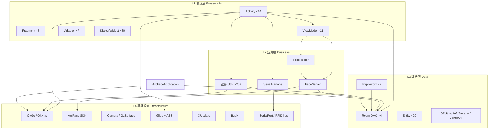
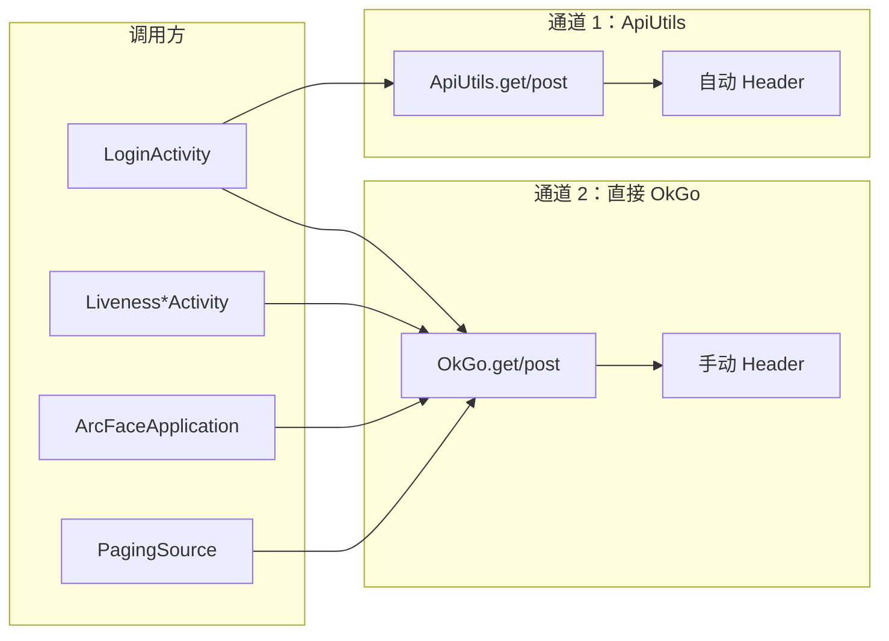

# 03 · 分层架构与依赖关系

## 1. 四层架构详图



---

## 2. 包结构与职责

根包：`com.arcsoft.arcfacedemo`

```
com.arcsoft.arcfacedemo/
├── ArcFaceApplication.java          # 全局 Application（L2+L3 混合）
│
├── ui/                              # L1 表现层
│   ├── activity/        (14)        # 页面入口
│   ├── fragment/        (8)         # 卡面 + 施工子页
│   ├── viewmodel/       (11)        # MVVM 状态
│   ├── adapter/         (7)         # 列表适配
│   ├── pagingsource/    (2)         # Paging3 数据源
│   ├── callback/        (2)         # 注册回调接口
│   └── model/           (3)         # UI 模型
│
├── widget/                          # L1 UI 组件
│   ├── dialog/          (15+)       # XPopup 弹窗
│   └── *.java/kt        (15+)       # 自定义 View
│
├── faceserver/                      # L2 人脸引擎封装
│   ├── FaceServer.java
│   └── RegisterFailedException.java
│
├── util/                            # L2 工具（部分 L4）
│   ├── face/            (15+)       # FaceHelper、过滤器、配置模型
│   ├── camera/          (5+)        # 双相机、GL 预览
│   ├── glide/           (5)         # 加密图片加载
│   ├── debug/           (8+)        # 调试信息导出
│   └── log/             (1)         # ALog 日志框架
│
├── Serial/                          # L2 串口管理
│   ├── SerialManage.java
│   └── SerialHandle.java
│
├── network/                         # L2/L4 网络
│   ├── ApiUtils.java
│   ├── UrlConstants.java
│   ├── OkHttpUtils.java
│   └── CheckUnitRepository.kt
│
├── data/                            # L3/L4 数据
│   ├── FaceRepository.java
│   └── http/            (7)         # OkGo 回调封装
│
├── db/                              # L3 业务数据库
│   ├── YinchuanAirportDB.java
│   ├── dao/             (3)
│   └── entity/          (3)
│
├── facedb/                          # L3 人脸数据库
│   ├── FaceDatabase.java
│   ├── dao/FaceDao.java
│   └── entity/FaceEntity.java
│
├── entity/                          # L3 API 模型
│   └── (17 Java + 3 Kotlin)
│
├── preference/                      # L1/L3 识别参数 UI
│   └── (8)
│
├── manager/                         # L2
│   ├── SoundManager.java
│   └── ToastDialogManager.java
│
├── service/                         # L2 后台
│   └── TokenRefreshJobService.java  # 已注释未启用
│
├── receiver/                        # L1 系统事件
│   └── BootReceiver.java
│
├── common/                          # 全局常量
│   └── Constants.java
│
└── config/                          # 仅 flavor 源码
    └── ChannelConfig.java
```

---

## 3. 跨层依赖矩阵

### 3.1 Activity → 下游依赖

| Activity | ViewModel | L2 业务 | L3 数据 | L4 基础设施 | 直接 OkGo |
|----------|-----------|---------|---------|-------------|-----------|
| LoginActivity | FacePhotoViewModel | FaceServer, ImageDownloader | Room, InfoStorage | OkGo, SangforSDK | ✓ |
| LivenessDetectJin | Recognize, Liveness | FaceHelper, SerialManage | Room DAO | Camera, ArcFace | ✓ |
| LivenessDetectYuan | 同上 | 同上 + EC_API | 同上 | 同上 + PSAM | ✓ |
| LivenessDetectYuanAndJin | 同上 | 同上（双读卡） | 同上 | 同上 | ✓ |
| RegisterAndRecognize | Recognize | FaceHelper | Room DAO | Camera, ArcFace | ✓ |
| ConstructionWorkers | 3× Kotlin VM | — | — | OkGo (via Paging) | ✓ |
| FaceManageActivity | FacePhotoViewModel | FaceServer | FaceRepository | — | — |

### 3.2 Application → 下游依赖

| 方法 | Room | OkGo | Utils |
|------|------|------|-------|
| onCreate | YinchuanAirportDB | HttpInitUtils | InfoStorage, ImageUploader |
| startUpDataToServer | Records DAO | create-long/temporary | ImageUploader |
| startPeriodicTask | Pass DAO | page-pass | — |
| 日任务 | Pass/Face DAO | 多种 | LogUploadUtils |

### 3.3 耦合度评级

| 关系 | 耦合度 | 说明 |
|------|--------|------|
| Activity → Room DAO | 🔴 高 | 绕过 Repository，4 个查验 Activity 直接操作 DAO |
| Activity → OkGo | 🔴 高 | 与 ApiUtils 双通道并存 |
| FaceHelper → FaceServer | 🟢 低 | 清晰单向 |
| RecognizeViewModel → FaceHelper | 🟢 低 | 回调驱动 |
| LoginActivity → 全部 | 🔴 高 | 初始化链串联 6+ 模块 |
| ArcFaceApplication → 全部 | 🔴 高 | God Object |
| ConstructionWorkers → OkGo | 🟡 中 | 通过 PagingSource，结构清晰 |
| Document → Glide | 🟢 低 | 加密图片加载独立 |

---

## 4. ViewModel 分布

| ViewModel | 语言 | 层级定位 | 业务内聚度 |
|-----------|------|----------|------------|
| RecognizeViewModel | Java | L1→L2 桥接 | ★★★★ 高 |
| LivenessDetectViewModel | Java | L1 状态 | ★★★ 中 |
| FacePhotoViewModel | Java | L1→L2→L3 | ★★★★ 高 |
| ActiveViewModel | Java | L1→L4 | ★★★ 中 |
| AccessRecordViewModel | Kotlin | L1→L3 | ★★★★★ 高 |
| WriteOffRecordViewModel | Kotlin | L1→L3 | ★★★★★ 高 |
| InOutStatisticsViewModel | Kotlin | L1→L3 | ★★★★ 高 |

**问题**：Liveness 系列 Activity 中大量业务逻辑未下沉到 ViewModel，ViewModel 仅覆盖识别引擎状态。

---

## 5. Repository 现状

| Repository | 覆盖域 | 调用方 | 完整度 |
|------------|--------|--------|--------|
| FaceRepository | 人脸库 CRUD | FacePhotoViewModel, LoginActivity | 部分 |
| CheckUnitRepository | 申办单位列表 | 施工模块 | 完整 |

**缺失 Repository**（重构应新建）：

| 建议 Repository | 覆盖 |
|-----------------|------|
| PassRepository | LongTermPass 同步、查询 |
| RecordRepository | 记录写入、待上传队列 |
| AuthRepository | 登录、Token、用户信息 |
| CheckRepository | 查验流程编排 |

---

## 6. 网络层双通道



**问题**：

- Token 存储在 `ApiUtils` 静态字段，OkGo 直接调用需手动拼接
- Header 字段（tenant-id、Authorization）可能不一致
- 无统一错误处理、重试、Token 刷新（TokenRefreshJobService 未启用）

---

## 7. 线程模型

| 场景 | 线程 | 类 |
|------|------|-----|
| 相机预览回调 | Camera 线程 | DualCameraHelper |
| 人脸检测/识别 | 预览线程 / Handler | FaceHelper |
| OkGo 网络回调 | OkGo 线程池 → UI | JsonCallback |
| 记录上传 | ThreadUtils 固定速率池（15） | ArcFaceApplication |
| 通行证同步 | 同上 + interval | ArcFaceApplication |
| Room 读写 | 调用方线程 | 各 Activity（⚠️ 主线程风险） |
| Paging 加载 | IO Dispatcher | PagingSource |
| RxJava | IO / Computation | FaceServer |

**重构关注**：Room 操作应统一移到 IO 线程（Coroutine/RxJava）。

---

## 8. 渠道编译期依赖

```
app/src/main/          ← 公共代码（所有 flavor 共享）
app/src/yinchuan/      ← 覆盖 ChannelConfig + Document2/3 + layout
app/src/chongqing/     ← 同上
app/src/shihezi/       ← 同上
app/src/luoyang/       ← 同上（SUPPORTS_TEMPORARY_PASS=false）
```

**覆盖规则**：同包名 + 同类名 → flavor 源码优先。

**重构影响**：抽取公共基类时，Document2/3 的 flavor 覆盖机制需保留或改为资源/配置驱动。

---

## 9. 外部依赖（libs/）

| 库 | 层级 | 替换难度 |
|----|------|----------|
| arcsoft_face.jar | L4 | 🔴 不可替换（核心） |
| SangforSDK.aar | L4 | 🔴 厂商绑定 |
| Android-SerialPort-API | L4 | 🟡 可封装 |
| EC_RFID.jar | L4 | 🔴 硬件绑定 |
| ZY-Interface / hcreader / dc_reader | L4 | 🔴 硬件绑定 |
| yface_api.jar | L4 | 🟡 设备 API |

---

## 10. 理想目标分层（重构方向）

```
┌─────────────────────────────────────────┐
│ UI Layer                                │
│ Activity/Fragment（薄） + ViewModel      │
├─────────────────────────────────────────┤
│ Domain Layer                            │
│ UseCase / Coordinator / Strategy        │
│ CheckFlowCoordinator, CardReaderStrategy│
├─────────────────────────────────────────┤
│ Data Layer                              │
│ Repository（统一数据入口）               │
│ PassRepo / RecordRepo / FaceRepo / Auth │
├─────────────────────────────────────────┤
│ Infrastructure                          │
│ ApiClient, FaceEngine, SerialPort, DB   │
└─────────────────────────────────────────┘
```

详见 [06-refactor-priority-matrix.md](./06-refactor-priority-matrix.md)。
