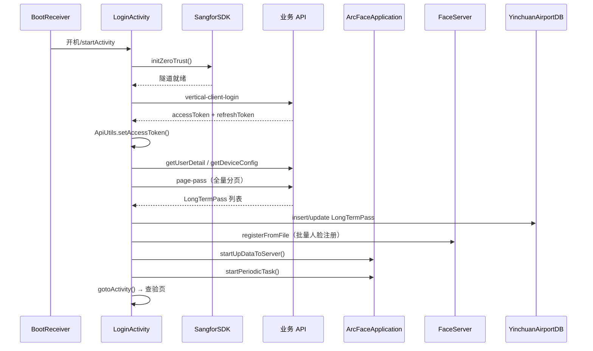
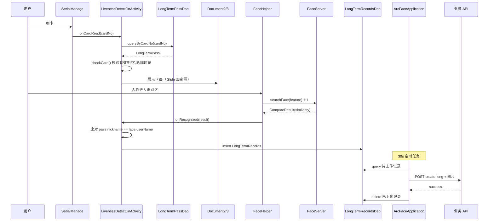
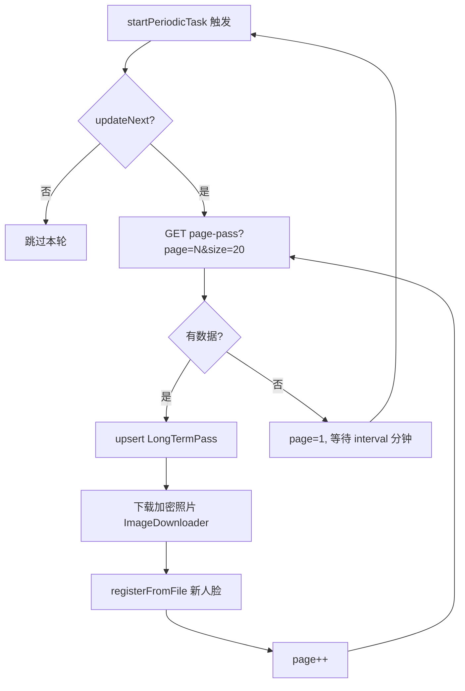
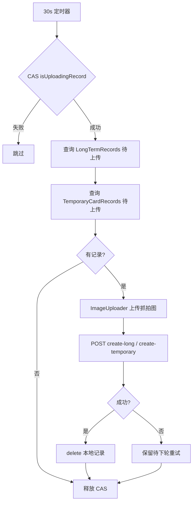
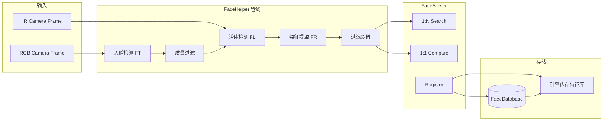
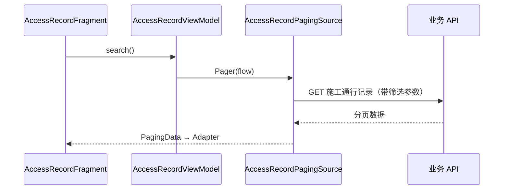
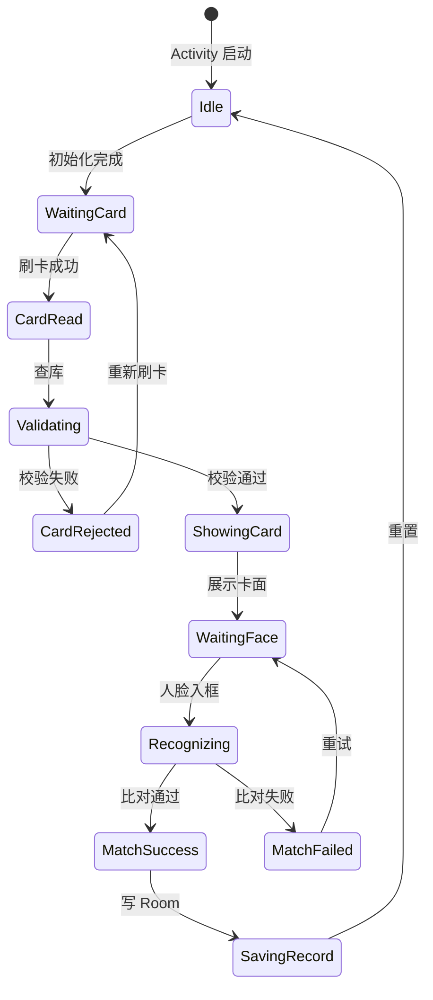

# 04 · 核心数据流与交互

## 1. 应用启动与登录流



**关键数据**：

| 步骤 | 输入 | 输出 | 存储 |
|------|------|------|------|
| 登录 | 账号密码 | Token | ApiUtils 静态 + InfoStorage |
| 设备配置 | deviceId | areaName, interval | InfoStorage |
| 全量同步 | page=1..N | LongTermPass[] | Room |
| 人脸注册 | Pass.photoPath | FaceEntity | FaceDatabase + FaceServer 引擎 |

---

## 2. 查验成功流（刷卡+人脸）

以 LivenessDetectJinActivity（短距）为例，Yuan/YuanAndJin 读卡步骤不同但后续一致。



**临时证分支**：走 TemporaryCardRecords + create-temporary API。

**纯人脸模式**（RegisterAndRecognizeActivity）：跳过刷卡，直接 1:N searchFace → 反查 LongTermPass。

---

## 3. 通行证增量同步流



**并发控制**：`updateNext` 标志位防止重叠同步。

**关联键**：Pass.nickname → FaceEntity.userName → 引擎 faceId。

---

## 4. 通行记录上传流



**CAS 机制**：

```java
if (!isUploadingRecord.compareAndSet(false, true)) return;
try { /* 上传 */ } finally { isUploadingRecord.set(false); }
```

---

## 5. 人脸引擎数据流



---

## 6. 加密图片加载流


**涉及类**：`util/glide/*`、`ImageDownloader`（下载时加密存储）。

---

## 7. 施工人员查询流



**特点**：Kotlin + Coroutine + Paging3，网络调用在 PagingSource 内。

---

## 8. 配置数据流

### 查验模式切换

```
CustomDrawerPopupView
  → SPUtils.put("checkType", 0-3)
  → SPUtils.put("direction", 1/-1)
  → SPUtils.put("tipsLoc", 0-3)
  → restart LoginActivity
  → gotoActivity() 读 checkType 跳转
  → 各 Activity 读 direction/tipsLoc
```

### 识别参数

```
RecognizeSettingsActivity
  → PreferenceFragment
  → DefaultSharedPreferences
  → ConfigUtil.getRecognizeConfiguration()
  → RecognizeViewModel.init()
  → FaceHelper 应用阈值
```

---

## 9. 渠道差异数据流

| 差异点 | 影响流 |
|--------|--------|
| TENANT_PREFIX | URL 路径拼接 |
| TENANT_ID | HTTP Header |
| SUPPORTS_TEMPORARY_PASS=false | checkCard() 拒绝临时证；Document3 占位 UI |
| Document2/3 layout | 卡面展示字段/样式 |

---

## 10. 异常与离线分支

| 场景 | 行为 | 涉及模块 |
|------|------|----------|
| VPN 连接失败 | 阻塞登录，UI 提示 | M03 |
| Token 过期 | 当前无自动刷新（JobService 未启用） | M02,M10 |
| 网络不可用 | 记录本地保存，待上传队列累积 | M07 |
| 人脸引擎 init 失败 | 提示重新激活 | M04 |
| 读卡超时 | UI 提示重新刷卡 | M08 |
| 比对失败 | 音效 + 提示，不写记录 | M05 |
| 临时证渠道不支持 | checkCard() 直接拒绝 | M06,渠道 |

---

## 11. 状态机：查验页简化



**重构价值**：此状态机当前隐含在 Activity 的 if-else/flag 中，抽取后可测试、可复用。
