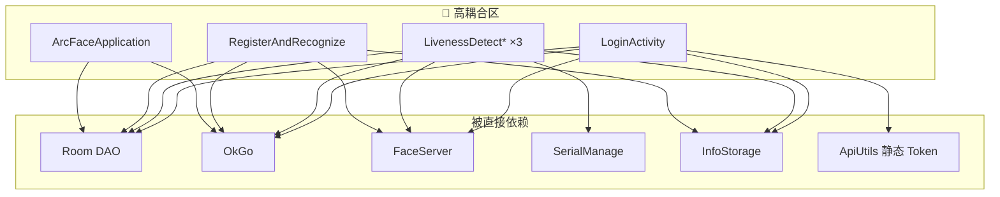

# 05 · 技术债评估

> 基于 `doc/`（60 篇）与源码扫描整理，为重构优先级提供量化依据。
> 最近复核：2026-07-17 · 版本基准：`1.0.75`

---

## 1. 评估维度

| 维度 | 说明 | 权重 |
|------|------|------|
| **影响面** | 改动波及模块数、生产路径是否必经 | 高 |
| **重复度** | 复制粘贴代码量、维护成本 | 高 |
| **耦合度** | 跨层直接依赖、God Object | 高 |
| **可测性** | 能否单元测试、mock 难度 | 中 |
| **风险** | 硬件/SDK/离线场景回归成本 | 高 |
| **收益** | 新需求接入效率、缺陷修复速度 | 中 |

风险等级：🔴 高 · 🟡 中 · 🟢 低

---

## 2. 技术债清单

### TD-01 · 巨型查验 Activity（🔴 核心重构对象）

| 项 | 内容 |
|----|------|
| **现状** | 4 个 Activity 合计 12,332 行，业务/UI/硬件/网络/DB 混写 |
| **文件** | `LivenessDetectJinActivity`（3,056）、`LivenessDetectYuanActivity`（3,305）、`LivenessDetectYuanAndJinActivity`（3,572）、`RegisterAndRecognizeActivity`（2,399） |
| **重复块** | `checkCard()`、`saveLongTermRecords`、`saveTemporaryRecords`、上传、Fragment 切换、Handler 定时、相机初始化、人脸回调 |
| **doc/** | [05-check/](../doc/05-check/)、[06-card-read-validate.md](../doc/05-check/06-card-read-validate.md) |
| **后果** | 修一处 bug 需改 4 份；新渠道/新读卡器接入成本极高 |
| **重构方向** | 先抽纯 `CardValidator` / UseCase 与硬件接口，再通过组合式 Coordinator 瘦身 Activity；谨慎引入巨型 `BaseCheckActivity`，避免把复制代码变成继承耦合 |

---

### TD-02 · ArcFaceApplication God Object（🔴）

| 项 | 内容 |
|----|------|
| **现状** | 1,003 行，承担初始化、记录上传、通行证增量同步、心跳、日任务、人脸分页 |
| **耦合** | 直接 OkGo、Room DAO、ImageUploader、FaceRepository |
| **doc/** | [02-arcface-application.md](../doc/03-architecture/02-arcface-application.md)、[14-background/](../doc/14-background/) |
| **后果** | 后台逻辑与 UI 生命周期无关却挤在 Application；难以单测与替换调度策略 |
| **重构方向** | 拆为 `RecordUploadScheduler`、`PassSyncScheduler`、`HeartbeatService`、`DailyMaintenanceJob` |

---

### TD-03 · LoginActivity 初始化链过重（🔴）

| 项 | 内容 |
|----|------|
| **现状** | 1,413 行：零信任 VPN + 登录 + 设备配置 + 全量通行证同步 + 人脸批量注册 + 路由 |
| **doc/** | [04-auth/](../doc/04-auth/)、[03-login-init-chain.md](../doc/04-auth/03-login-init-chain.md) |
| **后果** | 登录页成为「第二 Application」；失败分支复杂、难以分步重试 |
| **重构方向** | `LoginCoordinator` / `InitPipeline`（步骤：VPN → Auth → Device → PassFullSync → FaceRegister → StartJobs） |

---

### TD-04 · 网络双通道（🔴）

| 项 | 内容 |
|----|------|
| **现状** | `ApiUtils`、直接 `OkGo`、`ImageUploader`/Token Job 裸 OkHttp 多入口并存 |
| **问题** | Token 在 `ApiUtils` 静态字段；调用方手动拼 Header；无统一 401 刷新；现有 Token Job 未启用且刷新后未写回 accessToken；全局客户端使用不安全证书信任 |
| **doc/** | [11-network/](../doc/11-network/)、[01-api-utils.md](../doc/11-network/01-api-utils.md) |
| **后果** | Header 不一致风险；Token 刷新 `TokenRefreshJobService` 已注释未启用 |
| **重构方向** | 统一 `ApiClient`（OkGo 拦截器注入 tenant-id + Bearer + timestamp） |

---

### TD-05 · Repository 层缺失（🟡）

| 项 | 内容 |
|----|------|
| **现状** | 仅 `FaceRepository`、`CheckUnitRepository`；查验 Activity 直接操作 DAO |
| **缺失** | `PassRepository`、`RecordRepository`、`AuthRepository`、`CheckRepository` |
| **doc/** | [01-layered-architecture.md](../doc/03-architecture/01-layered-architecture.md) |
| **后果** | 数据访问散落；调用方各自决定线程，缺少可验证的统一 IO 调度边界（[03-thread-and-async.md](../doc/03-architecture/03-thread-and-async.md)） |
| **重构方向** | Repository 统一 IO 调度（Kotlin Coroutine / RxJava） |

---

### TD-06 · 查验状态机隐含在 flag 中（🟡）

| 项 | 内容 |
|----|------|
| **现状** | `checking`、`reading`、`checkFailed`、`rfid` 等静态/实例 flag 控制流程 |
| **doc/** | [04-data-flow §11](./04-data-flow-and-interactions.md) |
| **后果** | 状态转换不清晰；并发读卡与人脸比对易出现竞态 |
| **重构方向** | 显式 `CheckState` 枚举 + `CheckFlowCoordinator` |

---

### TD-07 · 串口/读卡与 Activity 生命周期绑定（🔴）

| 项 | 内容 |
|----|------|
| **现状** | 读卡线程在 Activity 内轮询；Yuan 调用 `BasicOper` 但未在本页面 `dc_open`，三个查验页均未 `dc_exit` |
| **doc/** | [09-serial/](../doc/09-serial/)、[17-troubleshooting/03-card-serial.md](../doc/17-troubleshooting/03-card-serial.md) |
| **SDK 边界** | App 仍使用 20230516 AAR；20231121 新版仅归档于 `doc/sdk/`，尚未替换和真机回归 |
| **后果** | 冷启动直接进 Yuan 时短距能力不确定；Activity 重建/模式切换时串口、线程和 native 资源泄漏风险 |
| **重构方向** | 先修复打开/关闭对称性并加真机回归，再引入生命周期感知的 `CardReaderManager` + 策略（Jin/Yuan/Dual/None） |

---

### TD-08 · 配置存储三件套分散（🟢）

| 项 | 内容 |
|----|------|
| **现状** | SPUtils、InfoStorage、DefaultSharedPreferences 三套，键分散 |
| **doc/** | [00-glossary.md](../doc/00-glossary.md) |
| **后果** | 配置读写无类型安全；运维改模式需 restart |
| **重构方向** | 短期保持；长期可 `AppConfig` 门面类聚合只读访问 |

---

### TD-09 · Room 破坏性迁移（🟡）

| 项 | 内容 |
|----|------|
| **现状** | 已声明 10→19 AutoMigration，同时仍调用 `fallbackToDestructiveMigration()` |
| **后果** | 未覆盖的升级路径仍可能清空通行证和待上传记录；重构 Schema 时需格外谨慎 |
| **重构方向** | 新模块引入前补齐 Migration；或导出/导入补救工具（已有 RemedialMeasures） |

---

### TD-10 · util 包膨胀（🟢）

| 项 | 内容 |
|----|------|
| **现状** | `util/` 70 个文件，职责边界模糊 |
| **后果** | 新人难以定位；部分 Utils 实为业务逻辑 |
| **重构方向** | 按域迁入 `domain/`、`data/`、`infra/` 包，util 仅留纯工具 |

---

### TD-11 · 施工人员模块与查验模块架构割裂（🟢 正面参考）

| 项 | 内容 |
|----|------|
| **现状** | Kotlin + ViewModel + Paging3，结构清晰 |
| **doc/** | [08-construction/](../doc/08-construction/) |
| **价值** | **作为查验/登录重构的样板**，新代码优先 Kotlin + Coroutine |

---

### TD-12 · 遗留与死代码（🟢）

| 项 | 内容 |
|----|------|
| **示例** | `ApiUtils.upload()` 空实现；`TokenRefreshJobService` 未启用；`:update` 模块未依赖；`HomeActivity` 非生产 |
| **重构方向** | 阶段 0 只做调用图和弃用标记；建立测试护栏后再删除，避免误删反射/Manifest/厂商入口 |

---

### TD-13 · 自动化测试与行为基线缺失（🔴 前置阻塞）

| 项 | 内容 |
|----|------|
| **现状** | `src/test` / `src/androidTest` 仅模板示例；核心校验、渠道、同步与记录上传无自动化测试 |
| **后果** | 无法证明“纯重构无行为变化”，12k 行复制逻辑抽取风险不可控 |
| **重构方向** | 先建立 [07-refactor-safety-baseline.md](./07-refactor-safety-baseline.md)，为 `CardValidator`、区域权限、状态机和 Repository 增加特征测试 |

---

### TD-14 · 网络、签名与权限安全债（🔴）

| 项 | 内容 |
|----|------|
| **现状** | OkGo 全局客户端信任不安全证书；Manifest 允许明文流量；签名口令硬编码；申请 `MANAGE_EXTERNAL_STORAGE` |
| **后果** | 中间人攻击、凭据泄露、发布链不可审计及权限合规风险 |
| **重构方向** | 分开治理：证书信任/域名白名单、签名 Secret 外置、权限最小化；每项独立 PR 并保留可回滚配置 |

---

### TD-15 · Activity 即时上传分支为不可达旧代码（🟡）

| 项 | 内容 |
|----|------|
| **现状** | 四个查验 Activity 通过 `if (true)` 固定走本地入库，保留的即时上传 else 分支不会执行 |
| **真实主路径** | Room 入库 → `ArcFaceApplication.startUpDataToServer()` → 30 秒 CAS 上传 |
| **后果** | 按方法名机械抽取会迁移大量死代码，并遗漏真正的 Application 上传入口 |
| **重构方向** | 先用特征测试锁定本地队列行为；`RecordRepository` 从 Application 真实链路抽取，护栏完成后删除不可达分支 |

---

### TD-16 · 查验静态共享状态（🟡）

| 项 | 内容 |
|----|------|
| **现状** | YuanAndJin 等页面存在静态 `rfid` 和多组跨回调 flag |
| **后果** | Activity 重建或多个回调并发时可能串卡、复用旧状态 |
| **重构方向** | 状态收口到页面作用域 `CheckFlowCoordinator`，禁止卡号和流程状态使用 static |

---

### TD-17 · 运维补救工具与全局状态耦合（🟡）

| 项 | 内容 |
|----|------|
| **现状** | ReInit、RemedialMeasures、DuplicateFaceCleanup 与抽屉、Application、人脸/通行证库及互斥标志直接耦合 |
| **后果** | Application/Login 拆分时容易破坏现场补救入口和互斥行为 |
| **重构方向** | 阶段 3 先保持调用契约并补运维冒烟；后续独立迁入 `domain/pass/remedial` / `infra/ops` |

---

## 3. 重复代码热点矩阵

| 逻辑块 | Jin | Yuan | YuanAndJin | Register | 建议抽取类 |
|--------|-----|------|------------|----------|------------|
| `checkCard()` 校验链 | ✓ | ✓ | ✓ | ✓ | `CardValidator` |
| `getLongPassCardInfo` | ✓ | ✓ | ✓ | 部分 | `PassLookupUseCase` |
| `saveLongTermRecords` | ✓ | ✓ | ✓ | ✓ | `RecordRepository` |
| `saveTemporaryRecords` | ✓ | ✓ | ✓ | — | `RecordRepository` |
| 即时 `uploadLongTermRecords` | 死分支 | 死分支 | 死分支 | 死分支 | 不迁移；以 Application 上传链为准 |
| Fragment 切换 Document2/3 | ✓ | ✓ | ✓ | ✓ | `DocumentNavigator` |
| 相机 RGB/IR 初始化 | ✓ | ✓ | ✓ | ✓ | `CheckCameraController` |
| Handler 定时（时钟/隐藏卡面） | ✓ | ✓ | ✓ | ✓ | `CheckUiCoordinator` |
| 读卡轮询 | 短距 | 长距 | 双 | 无 | `CardReaderStrategy` |
| 人脸 1:1 回调 | ✓ | ✓ | ✓ | 1:N | `FaceMatchCoordinator` |

**目标估算**：抽取后 4 Activity 合计可降至 **约 5,000–6,000 行**；应以重复块删除量和行为测试覆盖率验收，不以行数作为唯一目标。

---

## 4. 耦合热点图

---

## 5. 不宜大动的区域

| 区域 | 原因 | 策略 |
|------|------|------|
| `FaceServer` / `FaceHelper` | 引擎管线内聚，生产稳定 | 仅做调用方下沉，不改核心算法 |
| ArcSoft SDK 集成 | 授权与 ABI 绑定 | 保持封装边界 |
| Sangfor VPN | 厂商 AAR | 抽象接口，实现保持 |
| flavor Document2/3 覆盖 | 四渠道 UI 差异 | 抽取公共导航后保留 flavor 覆盖 |
| `EncryptedFileModelLoader` | Glide 管道独立 | 迁入 `infra/image` 即可 |
| `:xupdate-lib` | 已模块化 | 维持现状 |

---

## 6. 风险登记

| 风险 ID | 描述 | 缓解措施 |
|---------|------|----------|
| R-01 | 读卡器硬件差异（大屏 BasicOper / 小屏 SerialPort / 长距 EC_API） | 策略模式 + 真机分 flavor 回归 |
| R-02 | 离线场景记录积压上传 | 重构前后对比上传队列行为 |
| R-03 | 四渠道均启用临时证，卡面实现不同 | `ChannelConfig` 契约测试 + 四 flavor UI/流程回归 |
| R-04 | `FaceEntity.userName` 与通行证 `id` 关联 | 同步流程集成测试 |
| R-05 | 生产 Kiosk 不可频繁发版 | 分阶段发版，每阶段可独立回滚 |
| R-06 | Yuan 短距未显式打开、德卡端口未释放 | 冷启动直达 Yuan + 模式切换 + 反复进出真机回归 |
| R-07 | 网络信任与签名配置变更可能阻断生产 | 独立安全变更、预发证书验证、保留回滚开关 |
| R-08 | 误恢复 Activity 即时上传死分支 | 明确 Application 为真实上传入口，删除前做离线队列回归 |
| R-09 | Yuan 长距使用 `getBycardIdLong` | PassLookupUseCase 覆盖短距/长距两种查询 |
| R-10 | 静态 `rfid` 与回调 flag 串状态 | 页面作用域状态机 + 重建/并发读卡测试 |
| R-11 | 运维补救工具互斥和调用入口被拆坏 | 阶段 3 保持契约并执行抽屉运维冒烟 |

---

## 7. 技术债汇总评分

| ID | 名称 | 影响 | 难度 | 优先级 |
|----|------|------|------|--------|
| TD-01 | 巨型查验 Activity | 🔴 | 🟡 | P1（护栏后） |
| TD-02 | Application God Object | 🔴 | 🟡 | P1 |
| TD-03 | Login 初始化链 | 🔴 | 🟡 | P1 |
| TD-04 | 网络双通道 | 🔴 | 🟡 | P1 |
| TD-05 | Repository 缺失 | 🟡 | 🟢 | P1 |
| TD-06 | 隐含状态机 | 🟡 | 🟡 | P1（与 TD-01 同步） |
| TD-07 | 读卡生命周期 | 🔴 | 🔴 | P0（先修缺陷） |
| TD-08 | 配置分散 | 🟢 | 🟢 | P3 |
| TD-09 | 破坏性迁移 | 🟡 | 🔴 | P2 |
| TD-10 | util 膨胀 | 🟢 | 🟢 | P3 |
| TD-11 | 架构割裂 | — | — | 参考样板 |
| TD-12 | 死代码 | 🟢 | 🟢 | P3（护栏后清理） |
| TD-13 | 测试/行为基线缺失 | 🔴 | 🟡 | P0 |
| TD-14 | 网络/签名/权限安全债 | 🔴 | 🟡 | P0–P1 |
| TD-15 | Activity 即时上传死分支 | 🟡 | 🟢 | P0 识别 / P2 删除 |
| TD-16 | 静态查验状态 | 🟡 | 🟡 | P1 |
| TD-17 | 运维工具全局耦合 | 🟡 | 🟡 | P2 |

详见 [06-refactor-priority-matrix.md](./06-refactor-priority-matrix.md)。
