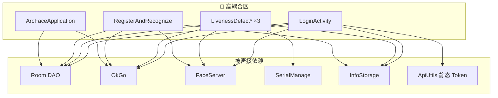

# 05 · 技术债评估

> 基于 `doc/`（57 篇）与源码扫描整理，为重构优先级提供量化依据。  
> 评估日期：2026-06-26 · 版本基准：`1.0.72`

---

## 1. 评估维度

| 维度 | 说明 | 权重 |
|------|------|------|
| **影响面** | 改动波及模块数、生产路径是否必经 | 高 |
| **重复度** | 复制粘贴代码量、维护成本 | 高 |
| **耦合度** | 跨层直接依赖、God Object | 高 |
| **可测性** | 能否单元测试、mock 难度 | 中 |
| **风险** | 硬件/SDK/离线场景回归成本 | 高 |
| **收益** | 新需求接入效率、缺陷修复速度 | 中 |

风险等级：🔴 高 · 🟡 中 · 🟢 低

---

## 2. 技术债清单

### TD-01 · 巨型查验 Activity（🔴 最高优先级）

| 项 | 内容 |
|----|------|
| **现状** | 4 个 Activity 合计 ~12,600 行，业务/UI/硬件/网络/DB 混写 |
| **文件** | `LivenessDetectJinActivity`（~3,116）、`LivenessDetectYuanActivity`（~3,364）、`LivenessDetectYuanAndJinActivity`（~3,633）、`RegisterAndRecognizeActivity`（~2,459） |
| **重复块** | `checkCard()`、`saveLongTermRecords`、`saveTemporaryRecords`、上传、Fragment 切换、Handler 定时、相机初始化、人脸回调 |
| **doc/** | [05-check/](../doc/05-check/)、[06-card-read-validate.md](../doc/05-check/06-card-read-validate.md) |
| **后果** | 修一处 bug 需改 4 份；新渠道/新读卡器接入成本极高 |
| **重构方向** | 抽取 `BaseCheckActivity` + `CheckViewModel` + `CardReaderStrategy` + `CheckResultHandler` |

---

### TD-02 · ArcFaceApplication God Object（🔴）

| 项 | 内容 |
|----|------|
| **现状** | ~980 行，承担初始化、记录上传、通行证增量同步、心跳、日任务、人脸分页 |
| **耦合** | 直接 OkGo、Room DAO、ImageUploader、FaceRepository |
| **doc/** | [02-arcface-application.md](../doc/03-architecture/02-arcface-application.md)、[14-background/](../doc/14-background/) |
| **后果** | 后台逻辑与 UI 生命周期无关却挤在 Application；难以单测与替换调度策略 |
| **重构方向** | 拆为 `RecordUploadScheduler`、`PassSyncScheduler`、`HeartbeatService`、`DailyMaintenanceJob` |

---

### TD-03 · LoginActivity 初始化链过重（🔴）

| 项 | 内容 |
|----|------|
| **现状** | ~1,320 行：零信任 VPN + 登录 + 设备配置 + 全量通行证同步 + 人脸批量注册 + 路由 |
| **doc/** | [04-auth/](../doc/04-auth/)、[03-login-init-chain.md](../doc/04-auth/03-login-init-chain.md) |
| **后果** | 登录页成为「第二 Application」；失败分支复杂、难以分步重试 |
| **重构方向** | `LoginCoordinator` / `InitPipeline`（步骤：VPN → Auth → Device → PassFullSync → FaceRegister → StartJobs） |

---

### TD-04 · 网络双通道（🟡）

| 项 | 内容 |
|----|------|
| **现状** | `ApiUtils` 封装 vs 直接 `OkGo`（Activity、Application、PagingSource 混用） |
| **问题** | Token 在 `ApiUtils` 静态字段；直接 OkGo 需手动拼 Header；无统一 401 刷新 |
| **doc/** | [11-network/](../doc/11-network/)、[01-api-utils.md](../doc/11-network/01-api-utils.md) |
| **后果** | Header 不一致风险；Token 刷新 `TokenRefreshJobService` 已注释未启用 |
| **重构方向** | 统一 `ApiClient`（OkGo 拦截器注入 tenant-id + Bearer + timestamp） |

---

### TD-05 · Repository 层缺失（🟡）

| 项 | 内容 |
|----|------|
| **现状** | 仅 `FaceRepository`、`CheckUnitRepository`；查验 Activity 直接操作 DAO |
| **缺失** | `PassRepository`、`RecordRepository`、`AuthRepository`、`CheckRepository` |
| **doc/** | [01-layered-architecture.md](../doc/03-architecture/01-layered-architecture.md) |
| **后果** | 数据访问散落；Room 主线程读写风险（[03-thread-and-async.md](../doc/03-architecture/03-thread-and-async.md)） |
| **重构方向** | Repository 统一 IO 调度（Kotlin Coroutine / RxJava） |

---

### TD-06 · 查验状态机隐含在 flag 中（🟡）

| 项 | 内容 |
|----|------|
| **现状** | `checking`、`reading`、`checkFailed`、`rfid` 等静态/实例 flag 控制流程 |
| **doc/** | [04-data-flow §11](./04-data-flow-and-interactions.md) |
| **后果** | 状态转换不清晰；并发读卡与人脸比对易出现竞态 |
| **重构方向** | 显式 `CheckState` 枚举 + `CheckFlowCoordinator` |

---

### TD-07 · 串口/读卡与 Activity 生命周期绑定（🟡）

| 项 | 内容 |
|----|------|
| **现状** | 读卡线程在 Activity 内 `ThreadUtils.executeByFixed` 轮询 |
| **doc/** | [09-serial/](../doc/09-serial/)、[17-troubleshooting/03-card-serial.md](../doc/17-troubleshooting/03-card-serial.md) |
| **后果** | Activity 重建时串口泄漏风险；大屏/小屏两套逻辑分散 |
| **重构方向** | `CardReaderManager` + `CardReaderStrategy`（Jin/Yuan/Dual/None） |

---

### TD-08 · 配置存储三件套分散（🟢）

| 项 | 内容 |
|----|------|
| **现状** | SPUtils、InfoStorage、DefaultSharedPreferences 三套，键分散 |
| **doc/** | [00-glossary.md](../doc/00-glossary.md) |
| **后果** | 配置读写无类型安全；运维改模式需 restart |
| **重构方向** | 短期保持；长期可 `AppConfig` 门面类聚合只读访问 |

---

### TD-09 · Room 破坏性迁移（🟡）

| 项 | 内容 |
|----|------|
| **现状** | `fallbackToDestructiveMigration()` |
| **后果** | 升级可能清空通行证/记录；重构 Schema 时需格外谨慎 |
| **重构方向** | 新模块引入前补齐 Migration；或导出/导入补救工具（已有 RemedialMeasures） |

---

### TD-10 · util 包膨胀（🟢）

| 项 | 内容 |
|----|------|
| **现状** | `util/` 约 69 个文件，职责边界模糊 |
| **后果** | 新人难以定位；部分 Utils 实为业务逻辑 |
| **重构方向** | 按域迁入 `domain/`、`data/`、`infra/` 包，util 仅留纯工具 |

---

### TD-11 · 施工人员模块与查验模块架构割裂（🟢 正面参考）

| 项 | 内容 |
|----|------|
| **现状** | Kotlin + ViewModel + Paging3，结构清晰 |
| **doc/** | [08-construction/](../doc/08-construction/) |
| **价值** | **作为查验/登录重构的样板**，新代码优先 Kotlin + Coroutine |

---

### TD-12 · 遗留与死代码（🟢）

| 项 | 内容 |
|----|------|
| **示例** | `ApiUtils.upload()` 空实现；`TokenRefreshJobService` 未启用；`:update` 模块未依赖；`HomeActivity` 非生产 |
| **重构方向** | 阶段 0 清理或标注 `@Deprecated`，避免误导 |

---

## 3. 重复代码热点矩阵

| 逻辑块 | Jin | Yuan | YuanAndJin | Register | 建议抽取类 |
|--------|-----|------|------------|----------|------------|
| `checkCard()` 校验链 | ✓ | ✓ | ✓ | ✓ | `CardValidator` |
| `getLongPassCardInfo` | ✓ | ✓ | ✓ | 部分 | `PassLookupUseCase` |
| `saveLongTermRecords` | ✓ | ✓ | ✓ | ✓ | `RecordRepository` |
| `saveTemporaryRecords` | ✓ | ✓ | ✓ | — | `RecordRepository` |
| `uploadLongTermRecords` | ✓ | ✓ | ✓ | ✓ | `RecordRepository` |
| Fragment 切换 Document2/3 | ✓ | ✓ | ✓ | ✓ | `DocumentNavigator` |
| 相机 RGB/IR 初始化 | ✓ | ✓ | ✓ | ✓ | `BaseCheckActivity` |
| Handler 定时（时钟/隐藏卡面） | ✓ | ✓ | ✓ | ✓ | `CheckUiCoordinator` |
| 读卡轮询 | 短距 | 长距 | 双 | 无 | `CardReaderStrategy` |
| 人脸 1:1 回调 | ✓ | ✓ | ✓ | 1:N | `FaceMatchCoordinator` |

**估算可削减行数**：抽取后 4 Activity 合计可降至 **~4,000–5,000 行**（含基类），减少约 **60%** 重复。

---

## 4. 耦合热点图

---

## 5. 不宜大动的区域

| 区域 | 原因 | 策略 |
|------|------|------|
| `FaceServer` / `FaceHelper` | 引擎管线内聚，生产稳定 | 仅做调用方下沉，不改核心算法 |
| ArcSoft SDK 集成 | 授权与 ABI 绑定 | 保持封装边界 |
| Sangfor VPN | 厂商 AAR | 抽象接口，实现保持 |
| flavor Document2/3 覆盖 | 四渠道 UI 差异 | 抽取基类后保留 flavor 覆盖 |
| `EncryptedFileModelLoader` | Glide 管道独立 | 迁入 `infra/image` 即可 |
| `:xupdate-lib` | 已模块化 | 维持现状 |

---

## 6. 风险登记

| 风险 ID | 描述 | 缓解措施 |
|---------|------|----------|
| R-01 | 读卡器硬件差异（大屏 BasicOper / 小屏 SerialPort / 长距 EC_API） | 策略模式 + 真机分 flavor 回归 |
| R-02 | 离线场景记录积压上传 | 重构前后对比上传队列行为 |
| R-03 | 洛阳渠道无临时证 | `ChannelConfig` 校验逻辑单测 |
| R-04 | 人脸注册与通行证 nickname 关联 | 同步流程集成测试 |
| R-05 | 生产 Kiosk 不可频繁发版 | 分阶段发版，每阶段可独立回滚 |

---

## 7. 技术债汇总评分

| ID | 名称 | 影响 | 难度 | 优先级 |
|----|------|------|------|--------|
| TD-01 | 巨型查验 Activity | 🔴 | 🟡 | P0 |
| TD-02 | Application God Object | 🔴 | 🟡 | P1 |
| TD-03 | Login 初始化链 | 🔴 | 🟡 | P1 |
| TD-04 | 网络双通道 | 🟡 | 🟢 | P1 |
| TD-05 | Repository 缺失 | 🟡 | 🟢 | P1 |
| TD-06 | 隐含状态机 | 🟡 | 🟡 | P0（与 TD-01 同步） |
| TD-07 | 读卡生命周期 | 🟡 | 🔴 | P2 |
| TD-08 | 配置分散 | 🟢 | 🟢 | P3 |
| TD-09 | 破坏性迁移 | 🟡 | 🔴 | P2 |
| TD-10 | util 膨胀 | 🟢 | 🟢 | P3 |
| TD-11 | 架构割裂 | — | — | 参考样板 |
| TD-12 | 死代码 | 🟢 | 🟢 | P0（清理） |

详见 [06-refactor-priority-matrix.md](./06-refactor-priority-matrix.md)。
