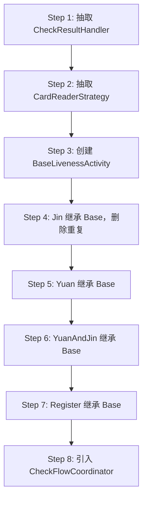

# 06 · 重构优先级矩阵与阶段建议

基于 [05-technical-debt-assessment.md](./05-technical-debt-assessment.md) 的技术债分析，给出重构优先级排序与分阶段实施建议。

---

## 1. 优先级矩阵

评估公式：**优先级 = 业务影响 × 重构收益 / 实施风险**

| ID | 重构项 | 业务影响 | 重构收益 | 实施风险 | 优先级 | 阶段 |
|----|--------|----------|----------|----------|--------|------|
| R01 | 查验 Activity 去重与抽取 | 🔴 极高 | 🔴 极高 | 🟠 中高 | **P0** | Phase 2 |
| R02 | 统一网络层（ApiClient） | 🟠 高 | 🟠 高 | 🟡 中 | **P0** | Phase 1 |
| R03 | 新建 Repository 层 | 🟠 高 | 🟠 高 | 🟡 中 | **P0** | Phase 1 |
| R04 | Application 职责拆分 | 🟡 中 | 🟠 高 | 🟡 中 | **P1** | Phase 2 |
| R05 | 查验 ViewModel 下沉 | 🟠 高 | 🟠 高 | 🟠 中高 | **P1** | Phase 2 |
| R06 | LoginActivity 初始化链抽取 | 🟡 中 | 🟡 中 | 🟡 中 | **P1** | Phase 3 |
| R07 | Token 刷新机制 | 🟡 中 | 🟡 中 | 🟢 低 | **P1** | Phase 1 |
| R08 | CardReaderStrategy 抽象 | 🟠 高 | 🟠 高 | 🟠 中高 | **P1** | Phase 2 |
| R09 | 记录写入统一 RecordRepository | 🟡 中 | 🟡 中 | 🟢 低 | **P2** | Phase 2 |
| R10 | Room 操作移 IO 线程 | 🟡 中 | 🟡 中 | 🟢 低 | **P2** | Phase 1 |
| R11 | 调试页隔离到 debug flavor | 🟢 低 | 🟢 低 | 🟢 低 | **P3** | Phase 4 |
| R12 | SQLCipher 接入或移除依赖 | 🟢 低 | 🟢 低 | 🟡 中 | **P3** | Phase 4 |
| R13 | ALog 精简/替换 | 🟢 低 | 🟢 低 | 🟡 中 | **P3** | Phase 4 |
| R14 | Java → Kotlin 渐进迁移 | 🟡 中 | 🟡 中 | 🟠 中高 | **P2** | 持续 |

---

## 2. 分阶段实施计划

### Phase 0 · 准备（1-2 周）

**目标**：建立重构安全网，不改变业务行为。

| 任务 | 产出 | 说明 |
|------|------|------|
| 建立回归测试清单 | 测试用例文档 | 基于 doc/05-check 联调清单 |
| 引入架构测试 | 包依赖规则 | 如 ArchUnit（可选） |
| 建立 refactor 分支策略 | Git 规范 | feature/refactor-* 分支 |
| 代码冻结窗口协调 | 发布计划 | 与业务方对齐 |

**不改代码**，仅准备。

---

### Phase 1 · 基础设施统一（2-3 周）

**目标**：统一底层，为上层重构铺路。风险低，可独立验证。

#### R02 · 统一网络层

```
目标结构：
network/
├── ApiClient.java          # 统一入口
├── AuthInterceptor.java    # Token + tenant-id 自动注入
├── ApiService.java         # 接口定义（或保留 UrlConstants）
└── ApiUtils.java           # 逐步 deprecated
```

**步骤**：
1. 新建 OkGo 拦截器，自动注入 Header
2. 将 ApiUtils 逻辑迁入 ApiClient
3. 逐文件替换直接 OkGo 调用（先 Application，再 LoginActivity，最后 Liveness）
4. 每个文件替换后验证对应 API

**验收**：所有 HTTP 请求经过统一拦截器；grep `OkGo.` 仅在 network 包出现。

#### R03 · 新建 Repository 层

```
data/
├── PassRepository.java     # 通行证 CRUD + 同步
├── RecordRepository.java   # 记录写入 + 待上传查询
├── AuthRepository.java     # Token + 用户信息
├── FaceRepository.java     # 已有，补充
└── CheckUnitRepository.kt  # 已有
```

**步骤**：
1. 从 ArcFaceApplication 抽取 PassRepository（同步逻辑）
2. 从 Activity 抽取 RecordRepository（写入/查询）
3. 从 ApiUtils 静态字段抽取 AuthRepository
4. Activity 改为调用 Repository

#### R07 · Token 刷新

- 启用 TokenRefreshJobService 或在拦截器中实现 401 → refresh → retry

#### R10 · Room IO 线程

- Repository 内使用 Executor / Coroutine Dispatchers.IO

**Phase 1 不改 Activity 结构**，仅改调用链。

---

### Phase 2 · 查验核心重构（4-6 周）★ 核心阶段

**目标**：消除 4 个巨型 Activity 的重复代码。这是收益最大、风险最高的阶段。

#### R01 · 查验 Activity 去重

**目标结构**：

```
ui/check/
├── BaseLivenessActivity.java       # 抽象基类（~800行）
├── LivenessDetectJinActivity.java  # 仅短距读卡差异（~300行）
├── LivenessDetectYuanActivity.java # 仅长距读卡差异（~400行）
├── LivenessDetectYuanAndJinActivity.java  # 双读卡（~500行）
├── RegisterAndRecognizeActivity.java      # 纯人脸（~400行）
│
├── coordinator/
│   └── CheckFlowCoordinator.java   # 查验状态机
│
├── strategy/
│   ├── CardReaderStrategy.java     # 接口
│   ├── ShortRangeCardReader.java   # 短距
│   ├── LongRangeCardReader.java    # 长距
│   ├── DualCardReader.java         # 双读卡
│   └── NoCardReader.java           # 纯人脸
│
└── handler/
    └── CheckResultHandler.java     # 比对结果 → 记录/UI
```

**实施策略（Strangler Fig 绞杀者模式）**：



**每一步**：
- 独立 PR，可编译可运行
- 先用 Jin Activity 验证，再推广到其他
- 保留原 Activity 备份（git history）

#### R05 · 查验 ViewModel 下沉

```
ui/viewmodel/
├── CheckViewModel.java         # 查验流程状态
├── RecognizeViewModel.java     # 已有，不变
└── LivenessDetectViewModel.java # 合并到 CheckViewModel
```

**CheckViewModel 状态**：

| LiveData | 类型 | 说明 |
|----------|------|------|
| checkState | CheckState enum | Idle/WaitingCard/Recognizing/Success/Failed |
| currentPass | LongTermPass | 当前通行证 |
| compareResult | CompareResult | 比对结果 |
| tipsText | String | 提示文案 |

#### R08 · CardReaderStrategy

- 读卡差异完全隔离到 Strategy 实现
- Activity 只调用 `cardReaderStrategy.startListening(callback)`

#### R09 · RecordRepository 统一写入

- 4 个 Activity 的 save*Records 统一到 RecordRepository.saveCheckResult()

**Phase 2 验收标准**：
- [ ] 4 个 Activity 各 < 500 行
- [ ] 共享逻辑只在 BaseLivenessActivity 一处
- [ ] 四种查验模式回归测试通过
- [ ] 四渠道 flavor 编译通过

---

### Phase 3 · 登录与后台任务（2-3 周）

#### R04 · Application 职责拆分

```
background/
├── UploadScheduler.java       # 30s 上传（从 Application 抽取）
├── PassSyncWorker.java        # 增量同步
├── HeartbeatWorker.java       # 心跳
└── DailyMaintenanceWorker.java # 日任务
```

#### R06 · LoginActivity 初始化链

```
auth/
├── LoginCoordinator.java      # 编排初始化步骤
├── InitStep.java              # 接口
├── VpnInitStep.java
├── LoginInitStep.java
├── PassSyncInitStep.java
└── FaceRegisterInitStep.java
```

**验收**：LoginActivity < 500 行；初始化链可独立测试。

---

### Phase 4 · 清理与优化（持续）

| 任务 | 说明 |
|------|------|
| R11 | 调试页移到 debug buildType |
| R12 | SQLCipher 决策（接入或移除依赖） |
| R13 | ALog 评估 |
| R14 | 新代码 Kotlin 优先；老代码按需迁移 |
| 移除 `:update` 模块 | 无引用测试包 |
| 启用 ProGuard | 评估混淆规则 |

---

## 3. 风险缓解策略

| 风险 | 缓解措施 |
|------|----------|
| 重构引入回归 bug | 每步独立 PR；基于 doc/ 联调清单手工回归 |
| 硬件环境难以自动化测试 | 保留真机测试窗口；Strategy 模式便于 mock |
| 四渠道 flavor 破坏 | 每 Phase 结束四渠道编译验证 |
| 重构周期过长 | Phase 1-2 可独立交付价值 |
| 业务需求并行 | Phase 1 与业务改动冲突最小 |
| SDK/硬件接口变更 | FaceServer/SerialManage 接口保持稳定 |

---

## 4. PR 拆分建议

### Phase 1 可拆 PR

| PR | 范围 | 预估 |
|----|------|------|
| PR-1.1 | AuthInterceptor + ApiClient 骨架 | 2d |
| PR-1.2 | Application 中 OkGo → ApiClient | 1d |
| PR-1.3 | LoginActivity 中 OkGo → ApiClient | 2d |
| PR-1.4 | PassRepository 抽取 | 2d |
| PR-1.5 | RecordRepository 抽取 | 1d |
| PR-1.6 | AuthRepository + Token 刷新 | 2d |

### Phase 2 可拆 PR

| PR | 范围 | 预估 |
|----|------|------|
| PR-2.1 | CheckResultHandler 抽取 | 3d |
| PR-2.2 | CardReaderStrategy 接口 + Jin 实现 | 3d |
| PR-2.3 | BaseLivenessActivity 骨架 + Jin 迁移 | 5d |
| PR-2.4 | Yuan 迁移 | 3d |
| PR-2.5 | YuanAndJin 迁移 | 3d |
| PR-2.6 | Register 迁移 | 2d |
| PR-2.7 | CheckViewModel + CheckFlowCoordinator | 3d |

---

## 5. 不建议重构的区域

| 区域 | 原因 |
|------|------|
| FaceServer / FaceHelper 内部 | SDK 封装成熟，变动风险 > 收益 |
| ArcSoft SDK 集成方式 | 厂商绑定 |
| 硬件读卡器 SDK 调用 | 设备绑定，仅做 Strategy 包装 |
| Document2/3 flavor 覆盖机制 | 渠道 UI 差异，改动影响面大 |
| Glide 加密图片加载链 | 独立且稳定 |
| xupdate-lib 模块 | 已独立，工作正常 |
| 施工模块（Kotlin） | 架构已规范，作为参考即可 |

---

## 6. 成功指标

| 指标 | 当前 | Phase 2 目标 | 最终目标 |
|------|------|-------------|----------|
| 最大 Activity 行数 | 3,633 | < 800 | < 500 |
| 查验 Activity 总行数 | ~12,600 | ~2,500 | ~2,000 |
| 直接 OkGo 调用点 | ~30+ | 0 | 0 |
| Repository 数量 | 2 | 5 | 5+ |
| 直接 DAO 调用（Activity 内） | 4 处 | 0 | 0 |
| 单元测试覆盖 | ~0% | 10%（Repository/Strategy） | 30% |

---

## 7. 下一步行动

1. **评审本文档体系** — 团队确认模块划分与优先级
2. **选择 Phase 1 启动** — 建议从 R02（网络统一）开始，风险最低
3. **建立回归测试清单** — 基于 doc/05-check 各 Activity 联调清单
4. **创建 `refactor/07-target-architecture.md`** — 细化目标包结构（待 Phase 0 完成后）
5. **创建 `refactor/08-migration-plan.md`** — 具体任务排期与负责人（待评审后）

---

## 8. 参考样板

项目中 **施工人员模块**（M09）已是较规范架构，重构其他模块时可参考：

| 模式 | 施工模块示例 | 应推广到 |
|------|-------------|----------|
| Kotlin + Coroutine | AccessRecordViewModel | 新 Repository |
| Paging3 | AccessRecordPagingSource | 通行证列表（可选） |
| ViewModel 驱动 UI | 筛选 → search() → PagingData | CheckViewModel |
| Fragment 职责单一 | 每个 Tab 独立 Fragment | 查验页 Document 管理 |

```kotlin
// 施工模块典型模式（参考）
class AccessRecordViewModel : ViewModel() {
    private val _filters = MutableStateFlow(Filters())
    val records = _filters.flatMapLatest { filters ->
        Pager(PagingConfig(20)) {
            AccessRecordPagingSource(filters)
        }.flow
    }.cachedIn(viewModelScope)
}
```

此模式应作为查验模块 ViewModel 重构的目标范式。
