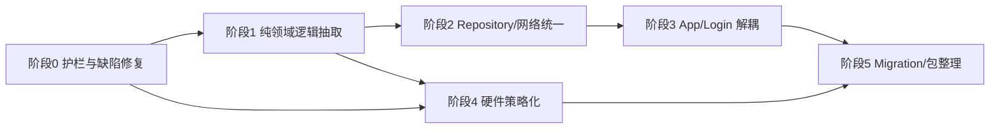

# 06 · 重构优先级矩阵与分阶段计划

> 在 [05-technical-debt-assessment.md](./05-technical-debt-assessment.md) 基础上，给出可执行的分阶段重构路线图。
> 原则：**先建立护栏并修复已知生命周期缺陷，再抽取纯逻辑，之后解耦基础设施，最后才考虑模块化**；每阶段可独立发版、可回滚。

---

## 1. 目标架构（终态）

```
┌──────────────────────────────────────────────────────────────┐
│ UI Layer（薄 Activity / Fragment + ViewModel）                │
│  CheckScreenDelegate · LoginActivity · ConstructionWorkers*   │
├──────────────────────────────────────────────────────────────┤
│ Domain Layer（用例 / 协调器 / 策略）                          │
│  CheckFlowCoordinator · CardReaderStrategy · CardValidator   │
│  LoginInitPipeline · PassSyncUseCase · RecordUploadUseCase     │
├──────────────────────────────────────────────────────────────┤
│ Data Layer（Repository 统一入口）                             │
│  PassRepository · RecordRepository · AuthRepository          │
│  FaceRepository · CheckUnitRepository                        │
├──────────────────────────────────────────────────────────────┤
│ Infrastructure（可替换实现）                                  │
│  ApiClient · FaceEngineFacade · CardReaderManager · Room     │
└──────────────────────────────────────────────────────────────┘
```

### 包结构目标（单模块内先行，Gradle 拆分为可选）

```
com.arcsoft.arcfacedemo/
├── ui/                    # L1 表现层（保持）
├── domain/
│   ├── check/             # 查验用例、校验、状态机
│   ├── auth/              # 登录初始化管道
│   ├── pass/              # 通行证同步用例
│   └── record/            # 记录写入/上传用例
├── data/
│   ├── repository/        # 统一 Repository
│   ├── local/             # DAO 封装
│   └── remote/            # ApiClient、DTO
├── infra/
│   ├── network/
│   ├── serial/
│   ├── face/
│   └── scheduler/         # 从 Application 拆出的定时任务
└── config/                # ChannelConfig（flavor）
```

---

## 2. 优先级矩阵

| 优先级 | 主题 | 技术债 | 预期收益 | 风险 | 工期（人周） |
|--------|------|--------|----------|------|--------------|
| **P0** | 行为护栏 + 已知读卡缺陷修复 | TD-07, TD-13, TD-15 | 建立可回归基线；澄清上传主路径；消除读卡生命周期不对称 | 中（需真机） | 1–2 |
| **P0–P1** | 网络/签名/权限安全治理 | TD-14 | 降低凭据、证书与权限风险 | 中（可能影响联网/发布） | 1–2 |
| **P1** | 查验纯逻辑抽取与显式状态机 | TD-01, TD-06, TD-16 | 规则单点维护、可单测；消除静态流程状态 | 中 | 4–6 |
| **P1** | 数据层 Repository + 网络统一 | TD-04, TD-05 | 可测性提升；Header/Token 一致 | 中 | 2–4 |
| **P2** | Application / Login 职责拆分 | TD-02, TD-03, TD-17 | 后台任务可测；登录可重试；运维入口不回归 | 中 | 3–4 |
| **P2** | 读卡硬件策略化 | TD-07 | 新读卡器易接入；生命周期集中管理 | 高（硬件） | 2–3 |
| **P2** | Room Migration 治理 | TD-09 | 升级不丢数据 | 中 | 1–2 |
| **P3** | util 整理 / 配置门面 | TD-08, TD-10 | 可读性 ↑ | 低 | 1–2 |
| **P3** | Gradle 多模块（可选） | — | 编译隔离、依赖强制 | 中 | 3–5 |

**总估算**：约 **18–30 人周**。这是架构级粗估，实际排期应在阶段 0 基线完成后按真机矩阵与人员熟悉度重新评估。

---

## 3. 分阶段执行计划

### 阶段 0 · 行为基线与已知缺陷收敛（1–2 周）

**目标**：建立重构安全网，并用独立 bugfix PR 收敛已确认的读卡生命周期缺陷；不进行大规模结构调整。

| 任务 | 产出 | doc 参考 |
|------|------|----------|
| 固化关键路径行为与真机矩阵 | [07-refactor-safety-baseline.md](./07-refactor-safety-baseline.md) | [17-troubleshooting/](../doc/17-troubleshooting/) |
| 给 `checkCard`/区域/时间规则加特征测试 | 测试锁定当前输入输出 | [05-check/06](../doc/05-check/06-card-read-validate.md) |
| 修复 Yuan 短距未 `dc_open`、德卡未 `dc_exit` | 独立 bugfix PR，禁止与架构抽取混合 | [09-serial/01](../doc/09-serial/01-rfid-card-reader.md) |
| 确认四 flavor Debug/Release 可编译 | 8 个构建变体矩阵 | [构建发布](../doc/01-overview/04-build-release.md) |
| 盘点证书信任、签名 Secret 与权限 | 安全整改清单；暂不混入领域重构 | [运行时权限](../doc/16-device/02-runtime-permissions.md) |
| 标注死代码 / 空方法 | 明确 Activity `if (true)` 即时上传分支不可达；仅建立调用图和弃用候选，不在无测试时删除 | TD-12、TD-15 |

**验收**：四渠道构建通过；登录→查验→成功/失败记录→离线重传均有可重复基线；三个硬件模式的打开/停止/释放日志可观测。

---

### 阶段 1 · 领域逻辑抽取（P1，4–6 周）

**目标**：消灭 4 个查验 Activity 间最大重复块，**不改变对外行为**。

#### 1.1 新建 domain/check 包

| 类 | 职责 | 自 Activity 迁出 |
|----|------|------------------|
| `CardValidator` | `checkCard` 公共规则；用显式输入适配 Liveness 无参版本与 Register 参数版本 | 四 Activity |
| `AreaPermissionChecker` | `isAreaPass` 区域树匹配 | 三个 Liveness Activity（Register 无该方法） |
| `PassLookupUseCase` | 短距 `getByCardId`、长距 `getBycardIdLong`、applyId 查询与引领人校验 | Jin/Yuan/YuanAndJin |
| `CheckState` / `CheckFlowCoordinator` | 显式状态机：Idle→CardRead→Validating→Face→Result | 四 Activity |

**doc 锚点**：[06-card-read-validate.md](../doc/05-check/06-card-read-validate.md)、[07-face-match-pipeline.md](../doc/05-check/07-face-match-pipeline.md)

#### 1.2 通过组合瘦身 Activity

优先抽取可独立持有和测试的委托对象，暂不建立承载全部能力的巨型基类：

- `CheckCameraController`：RGB/IR 初始化与生命周期。
- `CheckUiCoordinator`：Handler、卡面隐藏、时钟、音效与结果提示。
- `CheckFaceCoordinator`：ViewModel 绑定和 `FaceFeatureCallback` 统一入口。
- `DocumentNavigator`：Document1/2/3 切换。

各 Activity 仅保留模式编排与 Android 生命周期转发：

| 子类 | 独有逻辑 |
|------|----------|
| `LivenessDetectJinActivity` | 短距读卡 + 临时证扫码 |
| `LivenessDetectYuanActivity` | 长距 EC_API + 德卡短距/PSAM |
| `LivenessDetectYuanAndJinActivity` | 双读卡器编排 |
| `RegisterAndRecognizeActivity` | 无读卡、1:N 模式 |

#### 1.3 定义读卡输入契约（暂不迁移硬件）

```java
public interface CardReaderStrategy {
    void start();
    void stop();
    void close();
    void setOnCardReadListener(OnCardReadListener listener);
}
```

阶段 1 只定义领域层可消费的接口和 Fake，用于状态机测试；`BasicOper`、`AndroidSerialPort`、`EC_API` 实现仍留在原 Activity。硬件迁移统一放到阶段 4，避免业务抽取与串口改造同一个 PR。

#### 1.4 阶段 1 验收标准

- [ ] 规则逻辑不再复制；行数下降作为结果指标，不设“一次降到 1,500 行”的硬门槛
- [ ] `CardValidator` 单测覆盖当前全部规则，四渠道临时证均通过开关契约
- [ ] 四 flavor 真机：长期证刷卡+人脸通过/失败路径一致
- [ ] 临时证 + C 类引领人路径（银川/重庆/石河子/洛阳）

---

### 阶段 2 · 数据层统一（P1，2–4 周）

**目标**：Activity 不再直接访问 DAO / OkGo。

#### 2.1 Repository 建设

| Repository | 方法（示例） | 替代调用点 |
|------------|--------------|------------|
| `PassRepository` | `getByCardId`、`getByApplyId`、`syncPage`、`upsertAll` | Activity、Application、Login |
| `RecordRepository` | `saveLongTerm`、`saveTemporary`、`getPending`、`markUploaded` | 四 Activity、Application |
| `AuthRepository` | `login`、`refreshToken`、`getUserDetail` | LoginActivity |
| `FaceRepository` | 已有，扩展 `registerFromPass` | Login、Application |

所有写操作：`ThreadUtils` / `Dispatchers.IO` 统一调度。

`RecordRepository` 必须先从 `ArcFaceApplication.startUpDataToServer()` 的真实 30 秒 CAS 上传链抽取；Activity 中 `if (true)` 后的即时上传分支不可达，不作为迁移来源。

**doc 锚点**：[01-local-record-write.md](../doc/07-records/01-local-record-write.md)、[02-record-upload.md](../doc/07-records/02-record-upload.md)

#### 2.2 网络层统一 ApiClient

```
OkGo 全局拦截器：
  → 注入 tenant-id（UrlConstants.TENANT_ID）
  → 注入 Authorization: Bearer {TokenStore.accessToken}
  → GET 自动追加 timestamp
  → 401 触发单飞 TokenRefresh（并发请求只刷新一次）
```

- `ApiUtils` 标记 `@Deprecated`，内部委托 `ApiClient`
- 逐步将 Activity/Application 内 `OkGo.get` 替换为 `ApiClient`
- `TokenStore` 明确内存/安全持久化边界；不默认恢复周期 JobService
- 若复用 Token Job 的刷新实现，必须补齐刷新后原子写回 `TokenStore` / `ApiUtils.accessToken`
- 在独立安全 PR 中移除全局 trust-all 与不必要明文流量，先验证生产证书链

**doc 锚点**：[01-api-utils.md](../doc/11-network/01-api-utils.md)、[03-http-callbacks.md](../doc/11-network/03-http-callbacks.md)

#### 2.3 阶段 2 验收标准

- [ ] 查验 Activity 内无 `longTermPassDao` / `OkGo` 直接引用
- [ ] `RecordRepository` 单测：写入 → 待上传队列 → 上传成功删除
- [ ] 离线写入记录 → 联网后 30s 任务上传成功（与重构前一致）
- [ ] 并发 401 只触发一次刷新，刷新失败统一回登录
- [ ] Activity 即时上传死分支未被恢复或迁移

---

### 阶段 3 · 后台任务与登录解耦（P2，3–4 周）

**目标**：瘦身 `ArcFaceApplication` 与 `LoginActivity`。

#### 3.1 从 Application 拆出 infra/scheduler

| 类 | 原方法 | 职责 |
|----|--------|------|
| `RecordUploadScheduler` | `startUpDataToServer()` | 30s CAS 上传 |
| `PassSyncScheduler` | `startPeriodicTask()`、`getLongPassCardsUpdate()` | 增量分页同步 |
| `HeartbeatScheduler` | Ping 逻辑 | 离线标记 `isOffLine` |
| `DailyMaintenanceJob` | 1点/2点/10点任务 | 日志清理等 |

`ArcFaceApplication.onCreate()` 仅保留 SDK 初始化、DB 构建与依赖装配；Scheduler 仍由登录初始化管道在鉴权成功后显式启动。

#### 3.2 LoginInitPipeline

```kotlin
// 推荐新代码用 Kotlin（对齐施工模块）
sealed class InitStep {
    object VpnConnect : InitStep()
    object Login : InitStep()
    object DeviceConfig : InitStep()
    object PassFullSync : InitStep()
    object FaceRegister : InitStep()
    object StartBackgroundJobs : InitStep()
}
```

- 每步可独立重试、失败 UI 提示
- `LoginActivity` 仅负责 UI 绑定与步骤观察

**doc 锚点**：[03-login-init-chain.md](../doc/04-auth/03-login-init-chain.md)、[14-background/](../doc/14-background/)

#### 3.3 阶段 3 验收标准

- [ ] `ArcFaceApplication` < 400 行
- [ ] `LoginActivity` < 600 行
- [ ] 冷启动登录 → 全量同步 → 进入查验页流程不变
- [ ] 杀进程重启后不会误用已丢失的内存 Token；按既定登录/初始化规则恢复
- [ ] ReInit、RemedialMeasures、DuplicateFaceCleanup 的抽屉入口与互斥行为不变

---

### 阶段 4 · 读卡与硬件抽象（P2，2–3 周）

**目标**：读卡生命周期与 Activity 解耦。

| 任务 | 说明 |
|------|------|
| 生命周期感知的 `CardReaderManager` | 由查验页面作用域持有，不保存 Activity 静态引用；Activity 只订阅事件 |
| 完成 Yuan / Dual 策略实现 | 从 Activity 迁入 |
| 打开/关闭对称 | `start/open`、`stop`、`close/dc_exit` 状态可观测且幂等 |
| 串口配置边界 | `CardSerialConfigUtil` 只控制短距；长距 `EC_API` 枚举策略保持独立 |
| QR 扫码串口 | 独立 `QrCardReaderStrategy` |
| 静态状态清理 | 消除 `static rfid`，卡号与轮询状态归页面作用域 |

**doc 锚点**：[09-serial/](../doc/09-serial/)、[03-card-serial.md](../doc/17-troubleshooting/03-card-serial.md)

**验收**：冷启动直达 Yuan 短距可用；Activity 重建/模式切换不重复打开串口；线程停止后端口与 native 资源释放；连续运行 2 小时无句柄增长。

---

### 阶段 5 · 巩固与可选模块化（P2–P3，2–5 周）

#### 5.1 Room Migration

- 为 `YinchuanAirportDB` v19 → v20 编写首个非破坏性 Migration
- 移除或缩小 `fallbackToDestructiveMigration` 使用范围
- 用包含待上传长期/临时记录的 v19 数据库做升级测试，确认队列与图片引用不丢失

#### 5.2 包整理

- `util/face` → `infra/face`
- `util/glide` → `infra/image`
- `Serial/` → `infra/serial`
- `network/` → `data/remote/`

#### 5.3 Gradle 多模块（可选，按需）

| 模块 | 内容 | 依赖方向 |
|------|------|----------|
| `:core-domain` | 纯规则、状态机、UseCase 接口 | 不依赖 Android/厂商 SDK |
| `:core-data` | Repository、Room、网络实现 | `:core-domain` |
| `:hardware` | ArcFace、德卡/华大/EC_API、相机适配 | `:core-domain` |
| `:check` | 查验 UI + 组合式 Controller/Coordinator | `:core-domain`、`:core-data`、`:hardware` |
| `:app` | Application、Login、渠道、Manifest | `:check`、`:xupdate-lib` |

> 硬件绑定深、渠道 flavor 多，**建议阶段 1–4 完成后再评估**是否拆 Gradle 模块，避免过早增加构建复杂度。

---

## 4. 实施原则

### 4.1 绞杀者模式（Strangler Fig）

不新建平行 Activity 一套，而是：

1. 先抽类 → Activity 委托调用
2. 再抽 Controller/Coordinator → Activity 变薄
3. 最后删重复代码

### 4.2 参考样板

| 场景 | 参考实现 |
|------|----------|
| ViewModel + Paging | `ConstructionWorkersActivity` 系列 |
| Repository | `CheckUnitRepository.kt` |
| 网络分页 | `AccessRecordPagingSource` |

新写的 `PassRepository`、`RecordRepository` 优先 **Kotlin + Coroutine**。

### 4.3 渠道兼容

- `ChannelConfig.SUPPORTS_TEMPORARY_PASS` 仅在 `CardValidator` 一处判断；当前四个 flavor 均为 `true`，仍保留未来关闭能力
- Document2/3 flavor 覆盖机制阶段 1 不动，仅抽取导航逻辑
- 为 BASE_URL、TENANT_PREFIX、TENANT_ID、临时证开关建立四 flavor 契约测试

### 4.4 PR 粒度建议

| 类型 | 规模 | 示例 |
|------|------|------|
| 纯抽取 | 1–3 文件 | 抽出 `CardValidator` |
| 委托替换 | 单 Activity | Jin 改用 `CardValidator` |
| 基础设施 | 横切 | `ApiClient` 拦截器 |
| 禁止 | 一次改 4 Activity + Application | 难以 review 与回滚 |

---

## 5. 阶段依赖关系



阶段 4 可以在阶段 2/3 期间由硬件专项人员并行推进，但必须依赖阶段 0 的真机基线，并与领域逻辑 PR 分开。

---

## 6. 阶段与发版映射

不预绑定具体版本号；当前基线已经是 `1.0.75`。每个阶段按以下发布单元拆分：

| 发布单元 | 内容 | 用户可见变化 |
|----------|------|--------------|
| A | 基线、测试、可观测性 | 无 |
| B | Yuan/dc_exit 等已知缺陷 | 串口稳定性提升 |
| C | 纯逻辑抽取 | 无 |
| D | Repository/网络统一 | Token 与错误处理更一致 |
| E | App/Login/硬件解耦 | 失败重试和硬件稳定性提升 |
| F | Migration/包整理/可选模块化 | 无或仅维护性变化 |

---

## 7. 第一阶段立即行动项（本周可启动）

| # | 任务 | 负责人建议 | 产出文件 |
|---|------|------------|----------|
| 1 | 执行并补齐重构安全基线 | QA / 开发 | [07-refactor-safety-baseline.md](./07-refactor-safety-baseline.md) |
| 2 | 给 `checkCard`、区域、时间规则加特征测试 | 查验模块 owner | `CardValidatorCharacterizationTest` |
| 3 | 独立修复 Yuan `dc_open` / 德卡 `dc_exit` | 硬件模块 owner | 小型 bugfix PR + 真机记录 |
| 4 | 创建纯 `domain/check/CardValidator` | 熟悉业务规则同学 | 单测 `CardValidatorTest` |
| 5 | 盘点 trust-all、签名 Secret、权限 | 网络/发布 owner | 安全整改拆分清单 |
| 6 | 标注 Activity 即时上传死分支 | 记录模块 owner | 注释真实入口为 Application 30 秒任务 |

---

## 8. 成功度量

| 指标 | 当前 | 阶段 1 目标 | 终态目标 |
|------|------|-------------|----------|
| 查验 Activity 总行数 | 12,332 | < 8,000 | < 6,000 |
| 直接访问 DAO 的查验 Activity | 4 个 | 4 个 | 0 |
| 网络调用通道 | 3+（ApiUtils/OkGo/裸 OkHttp） | 3+ | 1 |
| ArcFaceApplication 行数 | 1,003 | 1,003 | < 400 |
| LoginActivity 行数 | 1,413 | 1,413 | < 600 |
| checkCard 单测覆盖率 | 0% | 80%+ | 90%+ |
| 核心硬件冒烟矩阵 | 无固定基线 | 100% 记录 | CI + 真机门禁 |

---

## 9. 相关文档索引

| 主题 | refactor | doc |
|------|----------|-----|
| 架构总览 | [01](./01-architecture-overview.md) | [03-architecture/](../doc/03-architecture/) |
| 功能模块 | [02](./02-functional-modules.md) | 各业务目录 |
| 分层依赖 | [03](./03-layer-and-dependencies.md) | [01-layered-architecture.md](../doc/03-architecture/01-layered-architecture.md) |
| 数据流 | [04](./04-data-flow-and-interactions.md) | 各流程文档 |
| 技术债 | [05](./05-technical-debt-assessment.md) | — |
| 本计划 | [06](./06-refactor-priority-matrix.md) | — |
