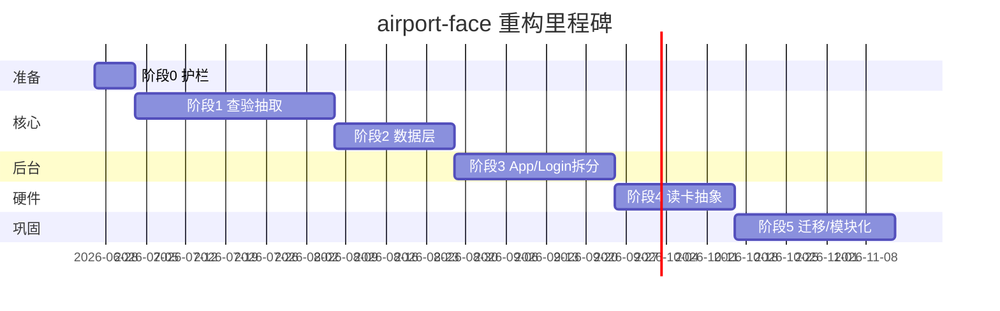

# 06 · 重构优先级矩阵与分阶段计划

> 在 [05-technical-debt-assessment.md](./05-technical-debt-assessment.md) 基础上，给出可执行的分阶段重构路线图。  
> 原则：**先抽取、后解耦、再模块化**；每阶段可独立发版、可回滚。

---

## 1. 目标架构（终态）

```
┌──────────────────────────────────────────────────────────────┐
│ UI Layer（薄 Activity / Fragment + ViewModel）                │
│  BaseCheckActivity · LoginActivity · ConstructionWorkers*     │
├──────────────────────────────────────────────────────────────┤
│ Domain Layer（用例 / 协调器 / 策略）                          │
│  CheckFlowCoordinator · CardReaderStrategy · CardValidator   │
│  LoginInitPipeline · PassSyncUseCase · RecordUploadUseCase     │
├──────────────────────────────────────────────────────────────┤
│ Data Layer（Repository 统一入口）                             │
│  PassRepository · RecordRepository · AuthRepository          │
│  FaceRepository · CheckUnitRepository                        │
├──────────────────────────────────────────────────────────────┤
│ Infrastructure（可替换实现）                                  │
│  ApiClient · FaceEngineFacade · CardReaderManager · Room     │
└──────────────────────────────────────────────────────────────┘
```

### 包结构目标（单模块内先行，Gradle 拆分为可选）

```
com.arcsoft.arcfacedemo/
├── ui/                    # L1 表现层（保持）
├── domain/
│   ├── check/             # 查验用例、校验、状态机
│   ├── auth/              # 登录初始化管道
│   ├── pass/              # 通行证同步用例
│   └── record/            # 记录写入/上传用例
├── data/
│   ├── repository/        # 统一 Repository
│   ├── local/             # DAO 封装
│   └── remote/            # ApiClient、DTO
├── infra/
│   ├── network/
│   ├── serial/
│   ├── face/
│   └── scheduler/         # 从 Application 拆出的定时任务
└── config/                # ChannelConfig（flavor）
```

---

## 2. 优先级矩阵

| 优先级 | 主题 | 技术债 | 预期收益 | 风险 | 工期（人周） |
|--------|------|--------|----------|------|--------------|
| **P0** | 查验逻辑抽取与去重 | TD-01, TD-06, TD-12 | 维护成本 ↓60%；bug 修复一处生效 | 中（硬件回归） | 4–6 |
| **P1** | 数据层 Repository + 网络统一 | TD-04, TD-05 | 可测性 ↑；Header/Token 一致 | 低 | 2–3 |
| **P1** | Application / Login 职责拆分 | TD-02, TD-03 | 后台任务可测；登录可重试 | 中 | 3–4 |
| **P2** | 读卡生命周期统一 | TD-07 | 串口泄漏 ↓；新读卡器易接入 | 高（硬件） | 2–3 |
| **P2** | Room Migration 治理 | TD-09 | 升级不丢数据 | 中 | 1–2 |
| **P3** | util 整理 / 配置门面 | TD-08, TD-10 | 可读性 ↑ | 低 | 1–2 |
| **P3** | Gradle 多模块（可选） | — | 编译隔离、依赖强制 | 中 | 3–5 |

**总估算**：约 **16–25 人周**（1 人全职约 4–6 个月，可并行压缩）。

---

## 3. 分阶段执行计划

### 阶段 0 · 准备与护栏（1 周）

**目标**：建立重构安全网，零业务行为变更。

| 任务 | 产出 | doc 参考 |
|------|------|----------|
| 固化关键路径手工测试清单 | `refactor/checklist-smoke.md` | [17-troubleshooting/](../doc/17-troubleshooting/) |
| 标注死代码 / 空方法 | `@Deprecated` 或删除 | TD-12 |
| 统一代码格式化与 import | 无逻辑变更 PR | — |
| 确认四 flavor CI 可编译 | 构建矩阵 | [02-channel/](../doc/02-channel/) |

**验收**：四渠道 Release 包可构建；冒烟清单覆盖登录→查验→记录上传。

---

### 阶段 1 · 领域逻辑抽取（P0，4–6 周）

**目标**：消灭 4 个查验 Activity 间最大重复块，**不改变对外行为**。

#### 1.1 新建 domain/check 包

| 类 | 职责 | 自 Activity 迁出 |
|----|------|------------------|
| `CardValidator` | `checkCard()` 全规则链 | 四 Activity |
| `AreaPermissionChecker` | `isAreaPass` 区域树匹配 | 四 Activity |
| `PassLookupUseCase` | RFID/applyId → LongTermPass 查询 + 引领人校验 | Jin/Yuan/YuanAndJin |
| `CheckState` / `CheckFlowCoordinator` | 显式状态机：Idle→CardRead→Validating→Face→Result | 四 Activity |
| `DocumentNavigator` | Fragment 切换 Document1/2/3 | 四 Activity |

**doc 锚点**：[06-card-read-validate.md](../doc/05-check/06-card-read-validate.md)、[07-face-match-pipeline.md](../doc/05-check/07-face-match-pipeline.md)

#### 1.2 新建 BaseCheckActivity

抽取共有能力（约 1,500–2,000 行）：

- 相机 RGB/IR 初始化与生命周期（`initRgbCamera`、`onResume`/`onPause`）
- `LivenessDetectViewModel` / `RecognizeViewModel` 绑定
- Handler 定时任务（系统时间、证件页隐藏、时钟刷新）
- 音效播放、`CheckLogListAdapter` 底部列表
- `FaceFeatureCallback` 统一入口 → 委托 `CheckFlowCoordinator`

子类仅保留：

| 子类 | 独有逻辑 |
|------|----------|
| `LivenessDetectJinActivity` | 短距读卡 + 临时证扫码 |
| `LivenessDetectYuanActivity` | 长距 EC_API + PSAM |
| `LivenessDetectYuanAndJinActivity` | 双读卡器编排 |
| `RegisterAndRecognizeActivity` | 无读卡、1:N 模式 |

#### 1.3 引入 CardReaderStrategy（接口先行）

```java
public interface CardReaderStrategy {
    void start(Context scope);
    void stop();
    void setOnCardReadListener(OnCardReadListener listener);
}
```

实现：`ShortRangeCardReader`、`LongRangeCardReader`、`DualCardReader`、`NoCardReader`。

阶段 1 可先 **接口 + Jin 实现**，Yuan 系列下一阶段迁入。

#### 1.4 阶段 1 验收标准

- [ ] 四 Activity 行数各 < 1,500 行
- [ ] `CardValidator` 单测覆盖 checkCard 9 条规则 + 洛阳临时证拒绝
- [ ] 四 flavor 真机：长期证刷卡+人脸通过/失败路径一致
- [ ] 临时证 + C 类引领人路径（银川/重庆/石河子）

---

### 阶段 2 · 数据层统一（P1，2–3 周）

**目标**：Activity 不再直接访问 DAO / OkGo。

#### 2.1 Repository 建设

| Repository | 方法（示例） | 替代调用点 |
|------------|--------------|------------|
| `PassRepository` | `getByCardId`、`getByApplyId`、`syncPage`、`upsertAll` | Activity、Application、Login |
| `RecordRepository` | `saveLongTerm`、`saveTemporary`、`getPending`、`markUploaded` | 四 Activity、Application |
| `AuthRepository` | `login`、`refreshToken`、`getUserDetail` | LoginActivity |
| `FaceRepository` | 已有，扩展 `registerFromPass` | Login、Application |

所有写操作：`ThreadUtils` / `Dispatchers.IO` 统一调度。

**doc 锚点**：[01-local-record-write.md](../doc/07-records/01-local-record-write.md)、[02-record-upload.md](../doc/07-records/02-record-upload.md)

#### 2.2 网络层统一 ApiClient

```
OkGo 全局拦截器：
  → 注入 tenant-id（UrlConstants.TENANT_ID）
  → 注入 Authorization: Bearer {TokenStore.accessToken}
  → GET 自动追加 timestamp
  → 401 触发 TokenRefresh（恢复 TokenRefreshJobService 或同步刷新）
```

- `ApiUtils` 标记 `@Deprecated`，内部委托 `ApiClient`
- 逐步将 Activity/Application 内 `OkGo.get` 替换为 `ApiClient`

**doc 锚点**：[01-api-utils.md](../doc/11-network/01-api-utils.md)、[03-http-callbacks.md](../doc/11-network/03-http-callbacks.md)

#### 2.3 阶段 2 验收标准

- [ ] 查验 Activity 内无 `longTermPassDao` / `OkGo` 直接引用
- [ ] `RecordRepository` 单测：写入 → 待上传队列 → 上传成功删除
- [ ] 离线写入记录 → 联网后 30s 任务上传成功（与重构前一致）

---

### 阶段 3 · 后台任务与登录解耦（P1，3–4 周）

**目标**：瘦身 `ArcFaceApplication` 与 `LoginActivity`。

#### 3.1 从 Application 拆出 infra/scheduler

| 类 | 原方法 | 职责 |
|----|--------|------|
| `RecordUploadScheduler` | `startUpDataToServer()` | 30s CAS 上传 |
| `PassSyncScheduler` | `startPeriodicTask()`、`getLongPassCardsUpdate()` | 增量分页同步 |
| `HeartbeatScheduler` | Ping 逻辑 | 离线标记 `isOffLine` |
| `DailyMaintenanceJob` | 1点/2点/10点任务 | 日志清理等 |

`ArcFaceApplication.onCreate()` 仅保留：SDK 初始化、DB 构建、Scheduler 注册。

#### 3.2 LoginInitPipeline

```kotlin
// 推荐新代码用 Kotlin（对齐施工模块）
sealed class InitStep {
    object VpnConnect : InitStep()
    object Login : InitStep()
    object DeviceConfig : InitStep()
    object PassFullSync : InitStep()
    object FaceRegister : InitStep()
    object StartBackgroundJobs : InitStep()
}
```

- 每步可独立重试、失败 UI 提示
- `LoginActivity` 仅负责 UI 绑定与步骤观察

**doc 锚点**：[03-login-init-chain.md](../doc/04-auth/03-login-init-chain.md)、[14-background/](../doc/14-background/)

#### 3.3 阶段 3 验收标准

- [ ] `ArcFaceApplication` < 400 行
- [ ] `LoginActivity` < 600 行
- [ ] 冷启动登录 → 全量同步 → 进入查验页流程不变
- [ ] 杀进程重启后 Token 有效时跳过全量同步路径正确

---

### 阶段 4 · 读卡与硬件抽象（P2，2–3 周）

**目标**：读卡生命周期与 Activity 解耦。

| 任务 | 说明 |
|------|------|
| `CardReaderManager` 单例 | 绑定 Application 生命周期，Activity 只 subscribe |
| 完成 Yuan / Dual 策略实现 | 从 Activity 迁入 |
| 串口配置统一入口 | 运维抽屉 → `CardSerialConfigUtil` 不变，读卡器从配置读取 |
| QR 扫码串口 | 独立 `QrCardReaderStrategy` |

**doc 锚点**：[09-serial/](../doc/09-serial/)、[03-card-serial.md](../doc/17-troubleshooting/03-card-serial.md)

**验收**：Activity 旋转/重建不重复打开串口；读卡线程 `onDestroy` 必停。

---

### 阶段 5 · 巩固与可选模块化（P2–P3，2–5 周）

#### 5.1 Room Migration

- 为 `YinchuanAirportDB` v19 → v20 编写首个非破坏性 Migration
- 移除或缩小 `fallbackToDestructiveMigration` 使用范围

#### 5.2 包整理

- `util/face` → `infra/face`
- `util/glide` → `infra/image`
- `Serial/` → `infra/serial`
- `network/` → `data/remote/`

#### 5.3 Gradle 多模块（可选，按需）

| 模块 | 内容 | 依赖方向 |
|------|------|----------|
| `:core` | domain + data + infra | 无 Android UI |
| `:check` | 查验 UI + BaseCheckActivity | `:core` |
| `:app` | Application、Login、渠道、Manifest | `:check`、`:xupdate-lib` |

> 硬件绑定深、渠道 flavor 多，**建议阶段 1–4 完成后再评估**是否拆 Gradle 模块，避免过早增加构建复杂度。

---

## 4. 实施原则

### 4.1 绞杀者模式（Strangler Fig）

不新建平行 Activity 一套，而是：

1. 先抽类 → Activity 委托调用
2. 再抽基类 → 子类变薄
3. 最后删重复代码

### 4.2 参考样板

| 场景 | 参考实现 |
|------|----------|
| ViewModel + Paging | `ConstructionWorkersActivity` 系列 |
| Repository | `CheckUnitRepository.kt` |
| 网络分页 | `AccessRecordPagingSource` |

新写的 `PassRepository`、`RecordRepository` 优先 **Kotlin + Coroutine**。

### 4.3 渠道兼容

- `ChannelConfig.SUPPORTS_TEMPORARY_PASS` 仅在 `CardValidator` 一处判断
- Document2/3 flavor 覆盖机制阶段 1 不动，仅抽取导航逻辑

### 4.4 PR 粒度建议

| 类型 | 规模 | 示例 |
|------|------|------|
| 纯抽取 | 1–3 文件 | 抽出 `CardValidator` |
| 委托替换 | 单 Activity | Jin 改用 `CardValidator` |
| 基础设施 | 横切 | `ApiClient` 拦截器 |
| 禁止 | 一次改 4 Activity + Application | 难以 review 与回滚 |

---

## 5. 里程碑时间线（示意）



---

## 6. 阶段与发版映射

| 发版 | 包含阶段 | 用户可见变化 |
|------|----------|--------------|
| v1.0.73 | 0 + 1.1–1.2 | 无（内部重构） |
| v1.0.74 | 1.3–1.4 | 无 |
| v1.0.75 | 2 | 无；网络更稳定 |
| v1.0.76 | 3 | 登录失败重试体验可优化 |
| v1.0.77 | 4 | 无；串口稳定性提升 |
| v1.1.0 | 5 | 可选 Architecture 里程碑 |

---

## 7. 第一阶段立即行动项（本周可启动）

| # | 任务 | 负责人建议 | 产出文件 |
|---|------|------------|----------|
| 1 | 创建 `domain/check/CardValidator` | 后端熟悉业务同学 | 单测 `CardValidatorTest` |
| 2 | 创建 `domain/check/DocumentNavigator` | UI 同学 | 减少 Fragment 重复 |
| 3 | Jin Activity 接入 CardValidator | 查验模块 owner | PR < 500 行 |
| 4 | 编写冒烟测试清单 | QA / 开发 | `refactor/checklist-smoke.md` |
| 5 | ApiClient 拦截器 POC | 网络层 owner | 仅 Login 一条链路试用 |

---

## 8. 成功度量

| 指标 | 当前 | 阶段 1 目标 | 终态目标 |
|------|------|-------------|----------|
| 查验 Activity 总行数 | ~12,600 | < 6,000 | < 5,000 |
| Activity 直接 DAO 调用 | 4 处 | 4 处 | 0 |
| 网络调用通道 | 2 | 2 | 1 |
| ArcFaceApplication 行数 | ~980 | ~980 | < 400 |
| LoginActivity 行数 | ~1,320 | ~1,320 | < 600 |
| checkCard 单测覆盖率 | 0% | 80%+ | 90%+ |

---

## 9. 相关文档索引

| 主题 | refactor | doc |
|------|----------|-----|
| 架构总览 | [01](./01-architecture-overview.md) | [03-architecture/](../doc/03-architecture/) |
| 功能模块 | [02](./02-functional-modules.md) | 各业务目录 |
| 分层依赖 | [03](./03-layer-and-dependencies.md) | [01-layered-architecture.md](../doc/03-architecture/01-layered-architecture.md) |
| 数据流 | [04](./04-data-flow-and-interactions.md) | 各流程文档 |
| 技术债 | [05](./05-technical-debt-assessment.md) | — |
| 本计划 | [06](./06-refactor-priority-matrix.md) | — |
